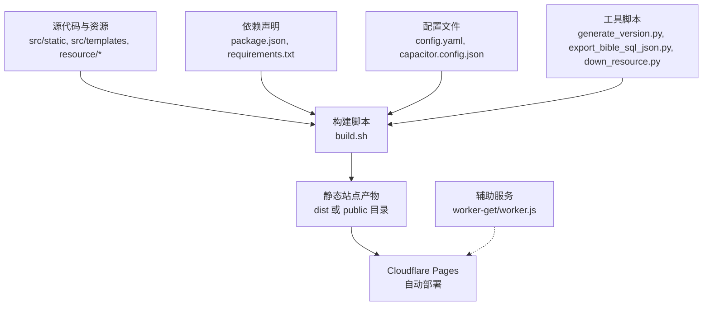
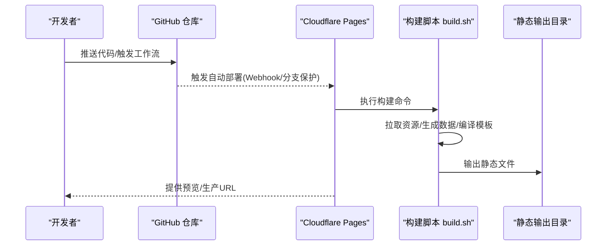
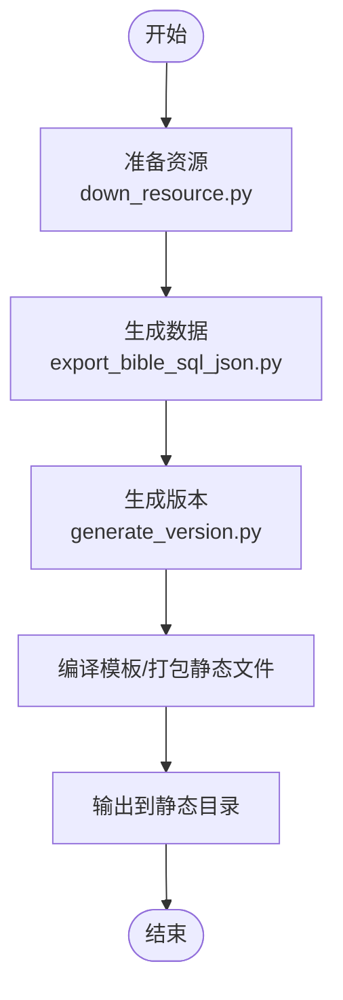
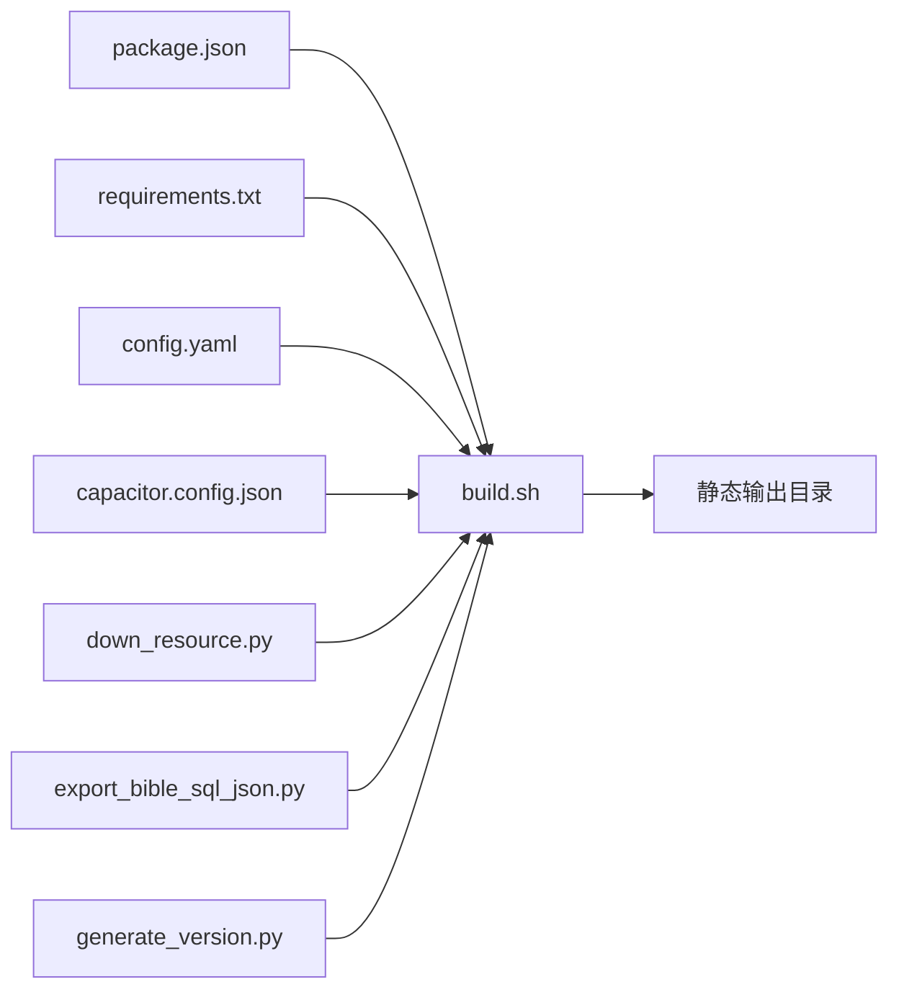

# Web部署

<cite>
**本文引用的文件**
- [DEPLOYMENT.md](file://DEPLOYMENT.md)
- [build.sh](file://build.sh)
- [.cfignore](file://.cfignore)
- [package.json](file://package.json)
- [requirements.txt](file://requirements.txt)
- [config.yaml](file://config.yaml)
- [main.py](file://main.py)
- [down_resource.py](file://down_resource.py)
- [export_bible_sql_json.py](file://export_bible_sql_json.py)
- [generate_version.py](file://generate_version.py)
- [update_changelog.py](file://update_changelog.py)
- [encrypt_app_update.py](file://encrypt_app_update.py)
- [run.bat](file://run.bat)
- [run.ps1](file://run.ps1)
- [release.bat](file://release.bat)
- [worker-get/worker.js](file://worker-get/worker.js)
</cite>

## 目录
1. [简介](#简介)
2. [项目结构](#项目结构)
3. [核心组件](#核心组件)
4. [架构总览](#架构总览)
5. [详细组件分析](#详细组件分析)
6. [依赖关系分析](#依赖关系分析)
7. [性能考虑](#性能考虑)
8. [故障排除指南](#故障排除指南)
9. [结论](#结论)
10. [附录](#附录)

## 简介
本指南面向需要在Cloudflare Pages上部署CX项目Web前端的工程师与运维人员。内容涵盖从GitHub仓库连接到自动部署、构建命令与环境变量配置、静态资源生成与输出目录、自定义域名与回滚策略、预览部署、常见问题排查以及部署后验证与监控建议。同时对项目中的build.sh脚本执行流程进行深入解析，帮助读者理解静态文件生成过程与输出目录的作用。

## 项目结构
该项目采用多语言混合架构：前端静态资源由构建脚本生成；后端逻辑用于数据导出与资源准备；工具脚本负责版本管理、更新加密与发布流程。与Web部署直接相关的关键文件包括：
- 构建与部署：build.sh、DEPLOYMENT.md
- 静态资源与忽略规则：.cfignore、src/static、src/templates
- 依赖与运行：package.json（前端）、requirements.txt（Python）
- 配置：config.yaml、capacitor.config.json
- 工具链：generate_version.py、export_bible_sql_json.py、down_resource.py、update_changelog.py、encrypt_app_update.py
- 运行脚本：run.bat、run.ps1、release.bat
- 辅助服务：worker-get/worker.js

**图表来源**
- [build.sh](file://build.sh)
- [DEPLOYMENT.md](file://DEPLOYMENT.md)
- [package.json](file://package.json)
- [requirements.txt](file://requirements.txt)
- [config.yaml](file://config.yaml)

**章节来源**
- [DEPLOYMENT.md](file://DEPLOYMENT.md)
- [build.sh](file://build.sh)
- [.cfignore](file://.cfignore)

## 核心组件
- 构建脚本：负责拉取资源、生成JSON数据、编译模板、打包静态文件，最终输出至Cloudflare Pages可识别的静态目录。
- 依赖管理：前端依赖通过package.json管理，Python工具链通过requirements.txt管理。
- 配置中心：config.yaml集中管理应用配置，capacitor.config.json用于移动端/跨平台配置。
- 工具链：版本生成、圣经数据导出、资源下载、变更日志更新、更新加密与发布脚本。
- 运行与发布：run.bat/run.ps1用于本地开发运行，release.bat用于发布流程。

**章节来源**
- [build.sh](file://build.sh)
- [package.json](file://package.json)
- [requirements.txt](file://requirements.txt)
- [config.yaml](file://config.yaml)
- [generate_version.py](file://generate_version.py)
- [export_bible_sql_json.py](file://export_bible_sql_json.py)
- [down_resource.py](file://down_resource.py)
- [update_changelog.py](file://update_changelog.py)
- [encrypt_app_update.py](file://encrypt_app_update.py)
- [run.bat](file://run.bat)
- [run.ps1](file://run.ps1)
- [release.bat](file://release.bat)

## 架构总览
下图展示了从代码提交到Cloudflare Pages静态站点上线的端到端流程，包括资源准备、构建、输出与部署触发。

**图表来源**
- [DEPLOYMENT.md](file://DEPLOYMENT.md)
- [build.sh](file://build.sh)

## 详细组件分析

### Cloudflare Pages 自动部署配置
- 仓库连接
  - 在Cloudflare Pages中选择对应GitHub仓库，确保已授权访问。
  - 分支选择：通常为main或master，确保受保护分支策略开启以阻止直接推送。
  - 预览部署：启用“启用预览”以在Pull Request时自动生成预览链接。
- 构建命令
  - 使用项目提供的构建脚本作为统一入口，避免硬编码路径差异导致的失败。
  - 构建命令示例参考：[DEPLOYMENT.md](file://DEPLOYMENT.md) 中的“部署”部分。
- 环境变量
  - 若构建脚本或工具链需要访问外部资源（如API密钥、数据库连接），请在Cloudflare Pages设置中添加环境变量，并在脚本中安全读取。
  - 注意：不要在仓库中提交敏感信息，使用Cloudflare Pages的加密环境变量功能。
- 输出目录
  - 构建脚本应将静态文件输出到Cloudflare Pages可识别的目录（如dist或public），并在Pages设置中正确配置。
  - 可通过.gitignore或.cfignore控制哪些文件不被上传到Pages。

**章节来源**
- [DEPLOYMENT.md](file://DEPLOYMENT.md)
- [.cfignore](file://.cfignore)

### build.sh 脚本执行流程与作用
build.sh是Web部署的核心自动化脚本，其职责包括：
- 资源准备：调用down_resource.py下载或同步所需资源。
- 数据生成：调用export_bible_sql_json.py生成JSON数据，供前端使用。
- 版本管理：调用generate_version.py生成版本号或版本元数据。
- 模板编译与静态打包：根据config.yaml配置，编译模板并生成静态文件。
- 输出目录：将最终静态文件写入指定输出目录，供Cloudflare Pages托管。

**图表来源**
- [build.sh](file://build.sh)
- [down_resource.py](file://down_resource.py)
- [export_bible_sql_json.py](file://export_bible_sql_json.py)
- [generate_version.py](file://generate_version.py)

**章节来源**
- [build.sh](file://build.sh)
- [down_resource.py](file://down_resource.py)
- [export_bible_sql_json.py](file://export_bible_sql_json.py)
- [generate_version.py](file://generate_version.py)

### 静态文件生成与输出目录
- 生成过程
  - 构建脚本按顺序执行资源下载、数据导出、版本生成与模板编译，最终形成完整的静态站点。
- 输出目录
  - 输出目录需与Cloudflare Pages的“构建产物目录”一致。若Pages未找到静态文件，请检查输出目录名称与路径是否正确。
  - 可通过.cfignore排除不必要的文件，减少上传体积与构建时间。

**章节来源**
- [build.sh](file://build.sh)
- [.cfignore](file://.cfignore)

### 自定义域名与回滚机制
- 自定义域名
  - 在Cloudflare Pages设置中绑定自定义域名，并在Cloudflare DNS中配置CNAME或记录指向Pages提供的域。
  - 启用HTTPS证书自动签发，确保全站HTTPS。
- 回滚机制
  - Cloudflare Pages支持基于提交历史的回滚操作。若新版本出现严重问题，可在Pages控制台选择之前的成功构建进行回滚。
  - 建议每次发布前保留最近一次成功的构建版本，便于快速回滚。

**章节来源**
- [DEPLOYMENT.md](file://DEPLOYMENT.md)

### 预览部署
- Pull Request预览
  - 启用预览后，每次PR都会生成独立的预览URL，便于在合并前进行联调与验收。
- 本地预览
  - 在本地运行构建脚本后，使用静态服务器预览输出目录，确保与Pages环境一致。

**章节来源**
- [DEPLOYMENT.md](file://DEPLOYMENT.md)

## 依赖关系分析
- 构建脚本依赖关系
  - build.sh依赖多个工具脚本与配置文件，形成一条清晰的执行链。
  - package.json与requirements.txt分别管理前端与后端依赖，确保构建环境一致性。
- 关键依赖链
  - 资源准备 → 数据导出 → 版本生成 → 模板编译 → 静态输出
  - 配置文件（config.yaml、capacitor.config.json）贯穿整个流程，影响输出结构与行为。

**图表来源**
- [build.sh](file://build.sh)
- [package.json](file://package.json)
- [requirements.txt](file://requirements.txt)
- [config.yaml](file://config.yaml)
- [down_resource.py](file://down_resource.py)
- [export_bible_sql_json.py](file://export_bible_sql_json.py)
- [generate_version.py](file://generate_version.py)

**章节来源**
- [build.sh](file://build.sh)
- [package.json](file://package.json)
- [requirements.txt](file://requirements.txt)
- [config.yaml](file://config.yaml)

## 性能考虑
- 构建优化
  - 使用缓存策略减少重复下载与编译时间，例如缓存node_modules与Python虚拟环境。
  - 将大型资源外置到CDN或单独托管，降低Pages构建压力。
- 静态资源优化
  - 启用压缩与Gzip/Brotli传输，合理拆分与懒加载资源。
  - 利用Cloudflare的缓存策略与边缘加速提升访问速度。
- 监控与告警
  - 通过Cloudflare Analytics与Pages日志监控构建成功率与访问异常。
  - 对关键页面设置健康检查，及时发现可用性问题。

[本节为通用指导，无需列出具体文件来源]

## 故障排除指南
- Python版本不匹配
  - 症状：构建过程中出现Python模块导入错误或语法不兼容。
  - 解决：在Cloudflare Pages的构建环境中固定Python版本，或在本地使用与项目一致的Python版本运行构建脚本。
- 依赖安装失败
  - 症状：pip install或npm install超时或报错。
  - 解决：检查网络连通性与代理设置；清理缓存并重试；必要时使用国内镜像源。
- 构建命令未生效
  - 症状：Pages未执行构建或找不到静态文件。
  - 解决：确认Pages设置中的“构建命令”与“构建产物目录”与项目实际一致；检查build.sh权限与shebang。
- 输出目录不正确
  - 症状：静态文件未被Pages识别。
  - 解决：核对build.sh输出目录名称与Pages配置一致；使用.cfignore排除无关文件。
- 预览失败
  - 症状：PR未生成预览URL或预览页面空白。
  - 解决：检查构建日志中的错误；确保模板编译与静态资源生成成功；确认自定义域名与DNS配置正确。

**章节来源**
- [DEPLOYMENT.md](file://DEPLOYMENT.md)
- [build.sh](file://build.sh)
- [.cfignore](file://.cfignore)

## 结论
通过规范化的Cloudflare Pages自动部署配置与build.sh脚本的统一执行，CX项目的Web前端可以稳定、高效地交付到全球边缘网络。建议在团队内固化部署流程文档，明确环境变量与输出目录约定，并建立预览与回滚机制，以保障发布质量与应急响应能力。

[本节为总结性内容，无需列出具体文件来源]

## 附录

### 附录A：常用文件与用途速览
- 构建与部署
  - build.sh：统一构建入口，生成静态文件
  - DEPLOYMENT.md：部署说明与流程
- 依赖与运行
  - package.json：前端依赖
  - requirements.txt：Python依赖
- 配置
  - config.yaml：应用配置
  - capacitor.config.json：跨平台配置
- 工具链
  - generate_version.py：版本生成
  - export_bible_sql_json.py：数据导出
  - down_resource.py：资源下载
  - update_changelog.py：变更日志更新
  - encrypt_app_update.py：更新加密
- 运行与发布
  - run.bat / run.ps1：本地运行
  - release.bat：发布脚本
- 辅助服务
  - worker-get/worker.js：辅助服务

**章节来源**
- [build.sh](file://build.sh)
- [DEPLOYMENT.md](file://DEPLOYMENT.md)
- [package.json](file://package.json)
- [requirements.txt](file://requirements.txt)
- [config.yaml](file://config.yaml)
- [generate_version.py](file://generate_version.py)
- [export_bible_sql_json.py](file://export_bible_sql_json.py)
- [down_resource.py](file://down_resource.py)
- [update_changelog.py](file://update_changelog.py)
- [encrypt_app_update.py](file://encrypt_app_update.py)
- [run.bat](file://run.bat)
- [run.ps1](file://run.ps1)
- [release.bat](file://release.bat)
- [worker-get/worker.js](file://worker-get/worker.js)