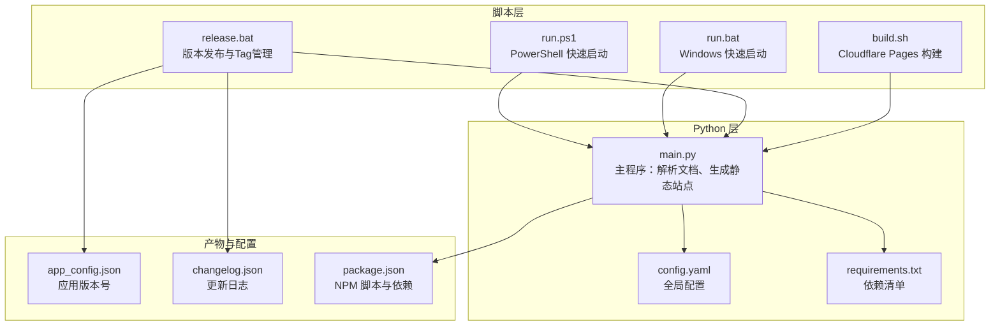
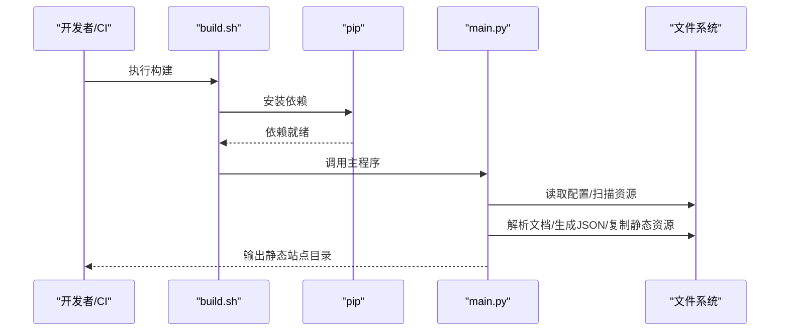
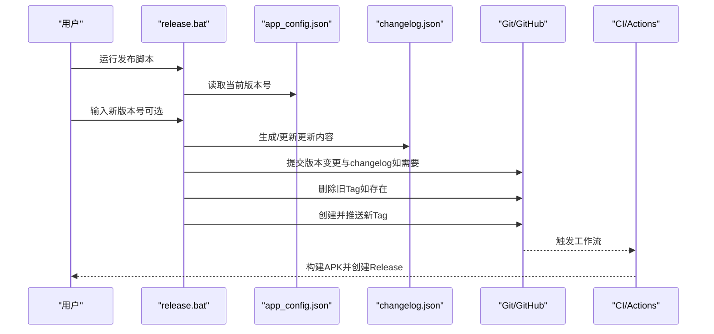
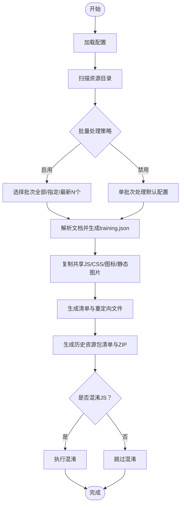
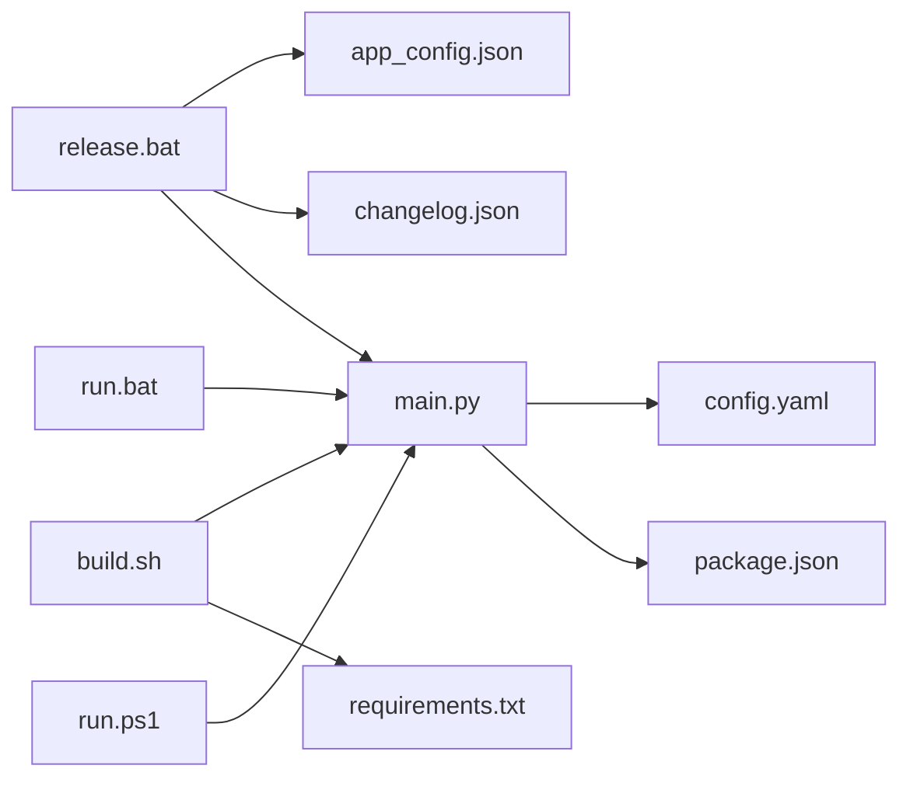

# 自动化部署脚本

<cite>
**本文引用的文件**
- [build.sh](file://build.sh)
- [release.bat](file://release.bat)
- [run.bat](file://run.bat)
- [run.ps1](file://run.ps1)
- [requirements.txt](file://requirements.txt)
- [main.py](file://main.py)
- [config.yaml](file://config.yaml)
- [app_config.json](file://app_config.json)
- [update_changelog.py](file://update_changelog.py)
- [package.json](file://package.json)
</cite>

## 目录
1. [简介](#简介)
2. [项目结构](#项目结构)
3. [核心组件](#核心组件)
4. [架构总览](#架构总览)
5. [详细组件分析](#详细组件分析)
6. [依赖分析](#依赖分析)
7. [性能考虑](#性能考虑)
8. [故障排查指南](#故障排查指南)
9. [结论](#结论)
10. [附录](#附录)

## 简介
本指南面向CX项目的自动化部署脚本，重点围绕以下目标展开：
- 深入解释build.sh脚本的功能与实现细节（Python环境准备、依赖安装、文档处理、静态文件生成等）
- 说明release.bat脚本的作用与使用场景
- 提供不同操作系统下的脚本执行方法与注意事项
- 解释脚本中的关键参数配置与环境变量设置
- 给出脚本的自定义与扩展方法，帮助根据项目需求修改
- 提供脚本执行的日志分析与错误排查方法
- 总结CI/CD集成的最佳实践与配置要点

## 项目结构
本项目采用“脚本驱动 + Python主程序 + 配置文件”的组织方式：
- Shell/Batch脚本：负责环境准备、版本管理、发布流程与快速启动
- Python主程序：负责文档解析、静态站点生成、资源打包与清单生成
- 配置文件：集中管理构建参数、输出目录、远程服务地址等
- 依赖清单：声明运行期所需的Python包

图表来源
- [build.sh](file://build.sh)
- [release.bat](file://release.bat)
- [run.bat](file://run.bat)
- [run.ps1](file://run.ps1)
- [main.py](file://main.py)
- [config.yaml](file://config.yaml)
- [requirements.txt](file://requirements.txt)
- [app_config.json](file://app_config.json)
- [package.json](file://package.json)

章节来源
- [build.sh](file://build.sh)
- [release.bat](file://release.bat)
- [run.bat](file://run.bat)
- [run.ps1](file://run.ps1)
- [main.py](file://main.py)
- [config.yaml](file://config.yaml)
- [requirements.txt](file://requirements.txt)
- [app_config.json](file://app_config.json)
- [package.json](file://package.json)

## 核心组件
- build.sh：Cloudflare Pages专用构建脚本，负责安装依赖与执行主程序生成静态站点
- release.bat：发布流程脚本，负责版本号读取/更新、changelog生成、Git Tag创建与推送、最终触发CI自动化
- run.bat/run.ps1：本地开发快速启动脚本，校验虚拟环境并运行主程序，支持一键打开输出页面
- main.py：核心逻辑，解析训练文档、生成training.json与SPA入口、复制静态资源、生成清单与资源包
- config.yaml：全局配置，控制批量处理、输出目录、默认训练、远程服务器等
- requirements.txt：运行期依赖清单
- app_config.json：应用版本号（Android/应用侧）
- update_changelog.py：交互式/非交互式更新changelog.json
- package.json：NPM脚本（与Capacitor/Android构建相关）

章节来源
- [build.sh](file://build.sh)
- [release.bat](file://release.bat)
- [run.bat](file://run.bat)
- [run.ps1](file://run.ps1)
- [main.py](file://main.py)
- [config.yaml](file://config.yaml)
- [requirements.txt](file://requirements.txt)
- [app_config.json](file://app_config.json)
- [update_changelog.py](file://update_changelog.py)
- [package.json](file://package.json)

## 架构总览
下图展示从脚本到主程序再到产物的整体流程：

图表来源
- [build.sh](file://build.sh)
- [main.py](file://main.py)
- [config.yaml](file://config.yaml)
- [requirements.txt](file://requirements.txt)

## 详细组件分析

### build.sh：Cloudflare Pages 构建脚本
- 功能概述
  - 设置严格退出模式，遇到错误立即终止
  - 安装Python依赖（基于requirements.txt）
  - 调用主程序生成静态站点
  - 输出构建完成提示
- 关键点
  - Cloudflare Pages构建环境无sudo权限，无法安装LibreOffice，需确保文档为.docx格式
  - 构建完成后生成output目录（由主程序决定），供Pages托管
- 适用场景
  - 云端静态站点托管（如Cloudflare Pages）
  - 与CI联动，自动部署

章节来源
- [build.sh](file://build.sh)
- [requirements.txt](file://requirements.txt)
- [main.py](file://main.py)

### release.bat：版本发布与Tag管理
- 功能概述
  - 读取当前版本号（来自app_config.json）
  - 支持输入新版本号，或复用当前版本
  - 自动生成/更新changelog.json（调用update_changelog.py）
  - Git提交版本变更与changelog（如需要）
  - 删除并重新创建同名Tag，推送至远端
  - 最终提示后续由CI自动构建APK、创建GitHub Release并上传
- 关键流程（序列图）

图表来源
- [release.bat](file://release.bat)
- [app_config.json](file://app_config.json)
- [update_changelog.py](file://update_changelog.py)

- 关键参数与环境
  - app_config.json中的version字段用于读取/更新版本号
  - changelog.json用于记录各版本更新内容
  - Git标签命名规范：v{version}
- 使用建议
  - 发布前确保本地已提交并推送最新变更
  - 如为重发场景，脚本会检测已存在标签并允许更新changelog
  - 确保网络可访问GitHub并具备推送权限

章节来源
- [release.bat](file://release.bat)
- [app_config.json](file://app_config.json)
- [update_changelog.py](file://update_changelog.py)

### run.bat / run.ps1：本地快速启动
- 功能概述
  - 校验Python虚拟环境是否存在
  - 调用主程序生成静态站点
  - 成功后询问是否在浏览器中打开首页
- 关键点
  - run.bat适用于CMD，run.ps1适用于PowerShell
  - 两者均指向同一主程序入口
- 使用建议
  - 首次运行前先创建虚拟环境并安装依赖
  - 输出目录为output，首页为output/index.html

章节来源
- [run.bat](file://run.bat)
- [run.ps1](file://run.ps1)
- [main.py](file://main.py)

### main.py：静态站点生成核心
- 功能概述
  - 加载配置（config.yaml）
  - 扫描资源目录，批量处理训练批次
  - 解析听抄、经文、晨兴文档，生成training.json
  - 生成SPA入口、复制静态资源（JS/CSS/图标）、生成清单与重定向文件
  - 生成历史资源包清单与ZIP（按10年分组，不含图片）
  - 可选混淆（CI环境默认开启，可通过环境变量控制）
- 关键流程（流程图）

图表来源
- [main.py](file://main.py)
- [config.yaml](file://config.yaml)

- 关键参数与环境变量
  - batch_processing.enabled：是否启用批量处理
  - batch_processing.max_latest_trainings：限制打包的最新批次数量
  - remote_servers：远程服务地址（生成remote-config.js）
  - OBFUSCATE_JS：强制开启/关闭混淆（1/0或true/false）
  - CI/GITHUB_ACTIONS：未显式设置时，CI环境默认开启混淆
- 输出产物
  - output/trainings.json：训练列表与统计
  - output/index.html：SPA入口
  - output/js/*、output/css/*、output/icons/*、output/vendor/*：静态资源
  - output/resource-packs.json、output/resource-packs/*.zip：历史资源包

章节来源
- [main.py](file://main.py)
- [config.yaml](file://config.yaml)

### 配置与依赖
- config.yaml
  - 控制批量处理开关、输出目录、默认训练、远程服务器等
- requirements.txt
  - 运行期依赖（python-docx、PyYAML、Jinja2、Pillow、requests、beautifulsoup4、lxml、playwright、cryptography等）
- app_config.json
  - 应用版本号（用于release.bat读取/更新）
- package.json
  - NPM脚本（与Capacitor/Android构建相关）

章节来源
- [config.yaml](file://config.yaml)
- [requirements.txt](file://requirements.txt)
- [app_config.json](file://app_config.json)
- [package.json](file://package.json)

## 依赖分析
- 脚本与主程序的耦合
  - build.sh依赖main.py生成静态站点
  - release.bat依赖app_config.json与update_changelog.py
  - run.bat/run.ps1依赖main.py与Python虚拟环境
- 外部依赖
  - Python生态：依赖requirements.txt声明的包
  - Node工具链：用于历史合辑处理（tools/build-trainings-json.js）
  - Git：release.bat进行版本控制与Tag管理
- 潜在风险
  - Cloudflare Pages无法安装LibreOffice，需保证文档为.docx
  - CI环境混淆策略依赖环境变量，本地开发默认跳过混淆

图表来源
- [release.bat](file://release.bat)
- [build.sh](file://build.sh)
- [run.bat](file://run.bat)
- [run.ps1](file://run.ps1)
- [main.py](file://main.py)
- [config.yaml](file://config.yaml)
- [requirements.txt](file://requirements.txt)
- [app_config.json](file://app_config.json)
- [package.json](file://package.json)

章节来源
- [release.bat](file://release.bat)
- [build.sh](file://build.sh)
- [run.bat](file://run.bat)
- [run.ps1](file://run.ps1)
- [main.py](file://main.py)
- [config.yaml](file://config.yaml)
- [requirements.txt](file://requirements.txt)
- [app_config.json](file://app_config.json)
- [package.json](file://package.json)

## 性能考虑
- 批量处理裁剪
  - 通过config.yaml的max_latest_trainings限制最新批次数量，降低打包体积与CI耗时
- 资源包压缩
  - 历史资源包按10年分组且不包含图片，显著减少体积
- 混淆策略
  - CI环境默认混淆，本地开发跳过以提升调试效率
- I/O与并行
  - 主程序对文件系统的读写较多，建议在SSD上运行以提升I/O性能

## 故障排查指南
- build.sh执行失败
  - 检查requirements.txt依赖是否齐全
  - 确认Cloudflare Pages环境无sudo权限，文档必须为.docx
- release.bat执行失败
  - 确认Git可推送，网络可达GitHub
  - 如重复发布，脚本会删除旧Tag并重新创建
  - 若changelog写入失败，脚本会继续发布流程（不影响Tag创建）
- run.bat/run.ps1执行失败
  - 检查虚拟环境是否已创建并安装依赖
  - 确认主程序返回码为0
- main.py运行异常
  - 检查config.yaml配置项是否正确
  - 确认资源目录结构符合预期（按批次文件夹存放）
  - 关注输出目录权限与磁盘空间

章节来源
- [build.sh](file://build.sh)
- [release.bat](file://release.bat)
- [run.bat](file://run.bat)
- [run.ps1](file://run.ps1)
- [main.py](file://main.py)
- [config.yaml](file://config.yaml)

## 结论
本指南系统性地梳理了CX项目的自动化部署脚本与核心生成逻辑，覆盖了：
- build.sh的云端构建流程
- release.bat的发布与Tag管理
- run.bat/run.ps1的本地快速启动
- main.py的静态站点生成与资源打包
- 关键配置与环境变量的使用
- 日志分析与常见问题排查
- CI/CD集成的实践建议

通过遵循本文档，团队可在不同平台高效、稳定地完成构建与发布。

## 附录

### 不同操作系统下的执行方法与注意事项
- Linux/macOS
  - 使用build.sh进行云端构建
  - 确保Python虚拟环境与依赖安装完成
- Windows（CMD）
  - 使用run.bat进行本地快速启动
  - 使用release.bat进行发布流程
- Windows（PowerShell）
  - 使用run.ps1进行本地快速启动
  - 使用release.bat进行发布流程

章节来源
- [build.sh](file://build.sh)
- [run.bat](file://run.bat)
- [run.ps1](file://run.ps1)
- [release.bat](file://release.bat)

### 关键参数与环境变量一览
- config.yaml
  - batch_processing.enabled：是否启用批量处理
  - batch_processing.max_latest_trainings：限制最新批次数量
  - output_dir：输出目录
  - remote_servers：远程服务地址集合
- 环境变量
  - OBFUSCATE_JS：强制开启/关闭混淆（1/0或true/false）
  - CI/GITHUB_ACTIONS：未显式设置时，CI环境默认开启混淆
- app_config.json
  - version：应用版本号（release.bat读取/更新）

章节来源
- [config.yaml](file://config.yaml)
- [main.py](file://main.py)
- [app_config.json](file://app_config.json)

### CI/CD集成最佳实践
- Cloudflare Pages
  - 使用build.sh作为构建脚本，确保依赖安装与主程序执行
  - 注意无sudo权限，文档需为.docx
- GitHub Actions
  - release.bat触发后，Actions自动构建APK、创建Release并上传
  - 建议在工作流中包含依赖安装与构建步骤，与build.sh保持一致
- 本地开发
  - 使用run.bat/run.ps1快速验证生成结果
  - 通过config.yaml调整批量处理策略与输出目录

章节来源
- [build.sh](file://build.sh)
- [release.bat](file://release.bat)
- [run.bat](file://run.bat)
- [run.ps1](file://run.ps1)
- [config.yaml](file://config.yaml)