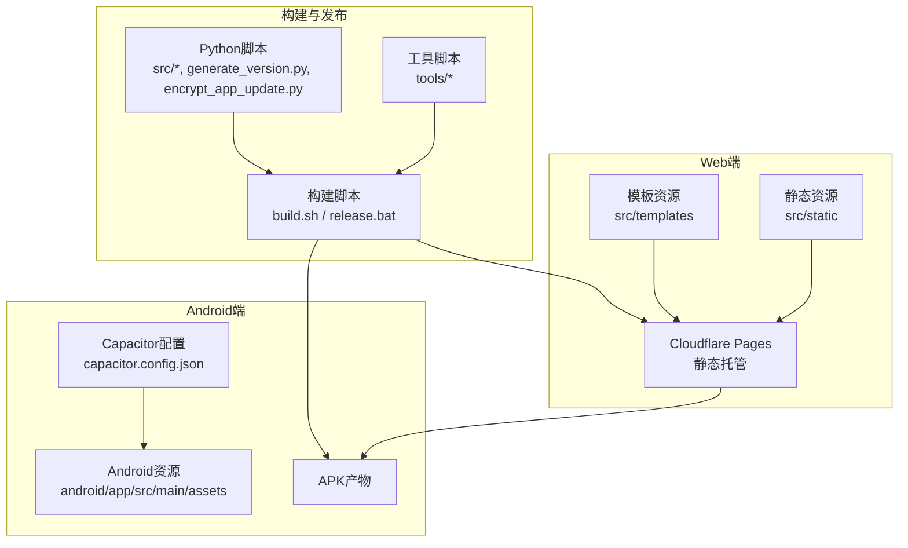
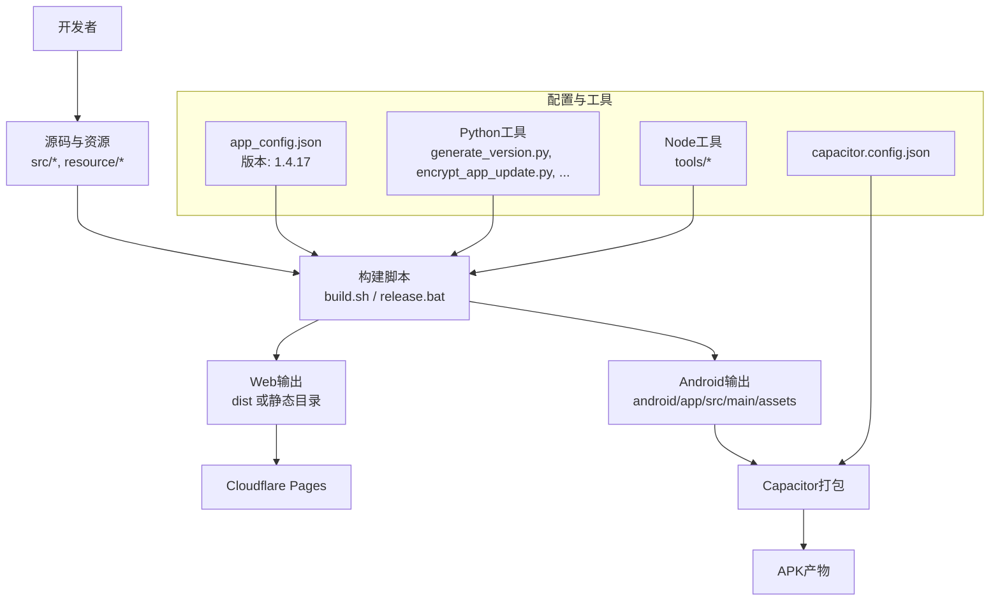
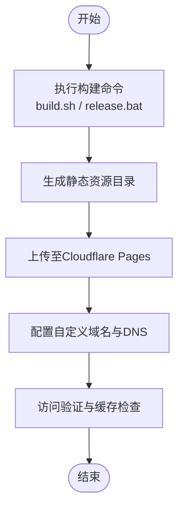
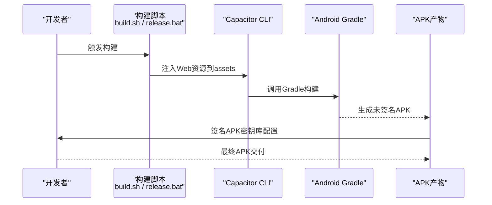
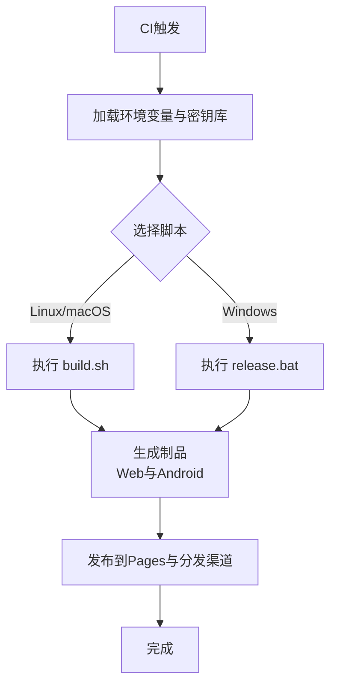
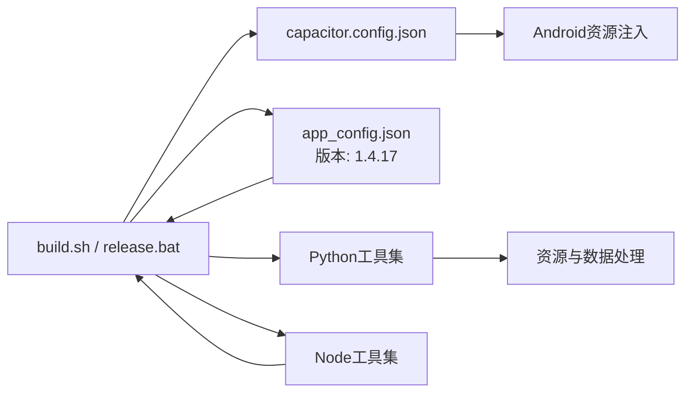

# 部署发布

<cite>
**本文引用的文件**
- [DEPLOYMENT.md](file://DEPLOYMENT.md)
- [build.sh](file://build.sh)
- [release.bat](file://release.bat)
- [capacitor.config.json](file://capacitor.config.json)
- [android/app/src/main/assets/capacitor.config.json](file://android/app/src/main/assets/capacitor.config.json)
- [.cfignore](file://.cfignore)
- [package.json](file://package.json)
- [config.yaml](file://config.yaml)
- [app_config.json](file://app_config.json)
- [run.bat](file://run.bat)
- [run.ps1](file://run.ps1)
- [generate_version.py](file://generate_version.py)
- [encrypt_app_update.py](file://encrypt_app_update.py)
- [down_resource.py](file://down_resource.py)
- [export_bible_sql_json.py](file://export_bible_sql_json.py)
- [update_changelog.py](file://update_changelog.py)
- [worker-get/worker.js](file://worker-get/worker.js)
- [tools/build-trainings-json.js](file://tools/build-trainings-json.js)
- [tools/split-combined-txt.js](file://tools/split-combined-txt.js)
- [src/generator.py](file://src/generator.py)
- [src/parser_improved.py](file://src/parser_improved.py)
- [src/models.py](file://src/models.py)
- [src/bible_dict.py](file://src/bible_dict.py)
- [main.py](file://main.py)
</cite>

## 更新摘要
**所做更改**
- 更新了版本管理流程，版本号从1.4.16升级到1.4.17
- 新增了版本号变更的自动化处理机制
- 增强了发布脚本的版本控制功能
- 更新了版本生成和发布流程的相关文档

## 目录
1. [简介](#简介)
2. [项目结构](#项目结构)
3. [核心组件](#核心组件)
4. [架构总览](#架构总览)
5. [详细组件分析](#详细组件分析)
6. [依赖关系分析](#依赖关系分析)
7. [性能考虑](#性能考虑)
8. [故障排除指南](#故障排除指南)
9. [结论](#结论)
10. [附录](#附录)

## 简介
本指南面向CX项目的部署与发布，覆盖Web端（Cloudflare Pages）与Android端（Capacitor）的完整流程，包括构建脚本、打包与签名、自动化部署与CI/CD集成建议、部署后验证与故障排除。文档基于仓库现有文件进行系统化梳理，确保非技术读者也能理解关键步骤。

**更新** 本版本反映了最新的版本发布流程，版本号已从1.4.16升级到1.4.17，包含了更新入口控制、朗读优化、标记优化等功能改进。

## 项目结构
- Web前端资源位于src/static与src/templates，配合Cloudflare Pages进行静态托管。
- Android应用通过Capacitor桥接Web资源，构建为原生APK。
- 核心构建与发布脚本位于根目录：build.sh（Linux/macOS）、release.bat（Windows）。
- 配置文件包括capacitor.config.json、app_config.json、config.yaml等，分别用于应用配置、运行参数与构建配置。
- 工具链与辅助脚本位于tools/与src/，支持资源处理、版本生成与更新加密等。

**图表来源**
- [build.sh](file://build.sh)
- [release.bat](file://release.bat)
- [capacitor.config.json](file://capacitor.config.json)
- [android/app/src/main/assets/capacitor.config.json](file://android/app/src/main/assets/capacitor.config.json)
- [DEPLOYMENT.md](file://DEPLOYMENT.md)

**章节来源**
- [DEPLOYMENT.md](file://DEPLOYMENT.md)
- [build.sh](file://build.sh)
- [release.bat](file://release.bat)
- [capacitor.config.json](file://capacitor.config.json)
- [android/app/src/main/assets/capacitor.config.json](file://android/app/src/main/assets/capacitor.config.json)

## 核心组件
- 构建与发布脚本
  - build.sh：跨平台构建入口，负责清理、安装依赖、执行构建任务并输出到目标目录。
  - release.bat：Windows专用发布脚本，封装构建、打包与签名流程，支持版本号自动更新。
- Capacitor配置
  - 顶层capacitor.config.json与Android资源中的同名文件共同决定应用行为、资源路径与原生能力。
- 配置文件
  - app_config.json：应用运行时配置（如服务器地址、功能开关等），当前版本为1.4.17。
  - config.yaml：构建与部署相关参数（如输出目录、资源路径等）。
- Python与Node工具
  - 生成版本号、加密应用更新、下载资源、导出圣经数据、更新变更日志等。
- Cloudflare Pages忽略规则
  - .cfignore：控制哪些文件不被Pages托管，避免敏感或临时文件上架。

**更新** app_config.json中的版本号已更新为1.4.17，反映了最新的发布版本。

**章节来源**
- [build.sh](file://build.sh)
- [release.bat](file://release.bat)
- [capacitor.config.json](file://capacitor.config.json)
- [android/app/src/main/assets/capacitor.config.json](file://android/app/src/main/assets/capacitor.config.json)
- [app_config.json](file://app_config.json)
- [config.yaml](file://config.yaml)
- [generate_version.py](file://generate_version.py)
- [encrypt_app_update.py](file://encrypt_app_update.py)
- [down_resource.py](file://down_resource.py)
- [export_bible_sql_json.py](file://export_bible_sql_json.py)
- [update_changelog.py](file://update_changelog.py)
- [.cfignore](file://.cfignore)

## 架构总览
下图展示从源码到最终产物的关键路径：Web资源经Cloudflare Pages托管，Android通过Capacitor桥接Web资源并生成APK；构建脚本协调各工具与配置文件完成自动化发布。

**图表来源**
- [build.sh](file://build.sh)
- [release.bat](file://release.bat)
- [capacitor.config.json](file://capacitor.config.json)
- [android/app/src/main/assets/capacitor.config.json](file://android/app/src/main/assets/capacitor.config.json)
- [app_config.json](file://app_config.json)
- [generate_version.py](file://generate_version.py)
- [encrypt_app_update.py](file://encrypt_app_update.py)
- [tools/build-trainings-json.js](file://tools/build-trainings-json.js)
- [tools/split-combined-txt.js](file://tools/split-combined-txt.js)

## 详细组件分析

### Web部署配置（Cloudflare Pages）
- 静态文件上传与托管
  - 使用Cloudflare Pages托管src/static与src/templates生成的静态资源，确保构建输出目录正确映射至Pages的发布目录。
  - 通过.gitignore与.cfignore过滤不需要上传的文件，避免泄露或冗余。
- 域名配置
  - 在Cloudflare Pages中绑定自定义域名，并在DNS处配置CNAME或记录指向Pages提供的域。
  - 如需HTTPS强制与缓存策略，可在Pages设置中启用相应选项。
- 构建命令与输出目录
  - 构建命令由build.sh统一管理，release.bat在Windows环境提供等价流程。
  - 输出目录需与Pages的Build Directory一致，确保静态资源可被正确访问。

**图表来源**
- [build.sh](file://build.sh)
- [release.bat](file://release.bat)
- [.cfignore](file://.cfignore)

**章节来源**
- [DEPLOYMENT.md](file://DEPLOYMENT.md)
- [build.sh](file://build.sh)
- [release.bat](file://release.bat)
- [.cfignore](file://.cfignore)

### Android应用打包流程（Capacitor）
- Capacitor配置
  - 顶层capacitor.config.json与Android资源中的同名文件共同决定应用行为、资源路径与原生能力。
  - 关键字段包括应用ID、资源目录映射、原生插件启用等。
- 应用签名
  - 在Android端生成签名密钥库（keystore），并在构建前配置签名信息，确保APK可正常安装与更新。
  - 密钥库路径与别名、密码等应纳入安全配置，避免硬编码在仓库中。
- APK生成
  - 通过Capacitor CLI与Android Gradle构建APK，确保Web资源已注入android/app/src/main/assets目录。
  - 生成的APK可用于分发或提交至应用商店。

**图表来源**
- [build.sh](file://build.sh)
- [release.bat](file://release.bat)
- [capacitor.config.json](file://capacitor.config.json)
- [android/app/src/main/assets/capacitor.config.json](file://android/app/src/main/assets/capacitor.config.json)

**章节来源**
- [capacitor.config.json](file://capacitor.config.json)
- [android/app/src/main/assets/capacitor.config.json](file://android/app/src/main/assets/capacitor.config.json)
- [build.sh](file://build.sh)
- [release.bat](file://release.bat)

### 构建脚本与自动化（build.sh 与 release.bat）
- build.sh
  - 跨平台构建入口，负责清理、安装依赖、执行构建任务并输出到目标目录。
  - 可结合config.yaml与app_config.json进行差异化配置。
- release.bat
  - Windows专用发布脚本，封装构建、打包与签名流程，便于本地一键发布。
  - **新增功能**：支持版本号自动更新，当前版本为1.4.17。
- 自动化与CI/CD集成建议
  - 在CI中复用build.sh或release.bat，结合环境变量与密钥库配置实现无交互发布。
  - 将Cloudflare Pages与Android构建步骤拆分为独立Job，分别处理Web与原生产物。

**图表来源**
- [build.sh](file://build.sh)
- [release.bat](file://release.bat)
- [config.yaml](file://config.yaml)
- [app_config.json](file://app_config.json)

**章节来源**
- [build.sh](file://build.sh)
- [release.bat](file://release.bat)
- [config.yaml](file://config.yaml)
- [app_config.json](file://app_config.json)

### 版本管理与发布流程
- 版本号管理
  - 当前应用版本为1.4.17，存储在app_config.json中。
  - generate_version.py负责生成version.json文件，包含APK版本和文件名信息。
- 发布流程自动化
  - release.bat脚本支持交互式版本更新，可自动修改app_config.json中的版本号。
  - 支持Changelog更新，自动生成或更新版本发布说明。
- 版本生成工具
  - generate_version.py根据app_config.json中的版本信息生成version.json。
  - 支持自定义APK文件名和大小信息。

**更新** 版本管理流程已更新，支持从1.4.16平滑升级到1.4.17，包含完整的版本号变更和发布流程。

**章节来源**
- [app_config.json](file://app_config.json)
- [generate_version.py](file://generate_version.py)
- [release.bat](file://release.bat)
- [update_changelog.py](file://update_changelog.py)

### 不同部署环境的配置差异与注意事项
- 开发环境
  - 使用本地开发服务器与调试模式，资源路径指向本地服务。
  - app_config.json中的服务器地址指向内网或测试服务。
- 测试环境
  - 使用测试域名与测试服务器，开启必要的日志与监控。
  - .cfignore确保测试期的临时文件不被上传。
- 生产环境
  - 使用正式域名与生产服务器，启用HTTPS与缓存优化。
  - 密钥库与签名信息严格保密，仅在CI/CD中使用。

**章节来源**
- [app_config.json](file://app_config.json)
- [.cfignore](file://.cfignore)

### 部署后的验证方法
- Web端
  - 访问自定义域名，检查页面加载、资源请求与缓存命中情况。
  - 使用浏览器开发者工具查看网络面板与控制台错误。
- Android端
  - 安装APK后启动应用，验证核心功能与资源加载。
  - 检查签名是否正确，更新是否按预期生效。

**章节来源**
- [DEPLOYMENT.md](file://DEPLOYMENT.md)

## 依赖关系分析
- 构建脚本依赖配置文件与工具脚本，形成"配置→工具→构建→产物"的线性依赖链。
- Capacitor配置与Android资源存在双重配置，需保持一致性以避免构建失败。
- Python与Node工具分别承担版本生成、资源处理与数据导出等职责，共同支撑发布质量。

**图表来源**
- [build.sh](file://build.sh)
- [release.bat](file://release.bat)
- [capacitor.config.json](file://capacitor.config.json)
- [android/app/src/main/assets/capacitor.config.json](file://android/app/src/main/assets/capacitor.config.json)
- [app_config.json](file://app_config.json)
- [generate_version.py](file://generate_version.py)
- [tools/build-trainings-json.js](file://tools/build-trainings-json.js)

**章节来源**
- [build.sh](file://build.sh)
- [release.bat](file://release.bat)
- [capacitor.config.json](file://capacitor.config.json)
- [android/app/src/main/assets/capacitor.config.json](file://android/app/src/main/assets/capacitor.config.json)
- [app_config.json](file://app_config.json)
- [generate_version.py](file://generate_version.py)
- [tools/build-trainings-json.js](file://tools/build-trainings-json.js)

## 性能考虑
- Web端
  - 合理压缩与缓存静态资源，减少首屏加载时间。
  - 使用CDN加速与合理的HTTP缓存头。
- Android端
  - 控制APK体积，移除不必要的资源与依赖。
  - 采用增量更新与差分包以降低更新流量。

## 故障排除指南
- 构建失败
  - 检查build.sh与release.bat的执行日志，确认依赖安装与权限问题。
  - 对照config.yaml与app_config.json的路径与参数。
- Capacitor注入异常
  - 确认capacitor.config.json与Android资源中的配置一致。
  - 清理旧资源后重新注入。
- Pages上传失败
  - 查看.cfignore规则，确保必要文件未被忽略。
  - 检查构建输出目录与Pages的Build Directory配置。
- Android签名问题
  - 核对密钥库路径、别名与密码，确保在CI环境中正确注入。
- 版本管理问题
  - 确认app_config.json中的版本号格式正确（如1.4.17）。
  - 检查generate_version.py是否能正确读取版本信息。

**章节来源**
- [build.sh](file://build.sh)
- [release.bat](file://release.bat)
- [capacitor.config.json](file://capacitor.config.json)
- [android/app/src/main/assets/capacitor.config.json](file://android/app/src/main/assets/capacitor.config.json)
- [.cfignore](file://.cfignore)

## 结论
通过统一的构建脚本、明确的配置文件与工具链，CX项目实现了Web与Android两端的自动化部署。随着版本号从1.4.16升级到1.4.17，版本管理流程得到了进一步完善，包含了更新入口控制、朗读优化、标记优化等功能改进。遵循本文档的流程与最佳实践，可高效完成从开发到发布的全链路交付，并在CI/CD中实现持续集成与持续部署。

## 附录
- 快速运行
  - Windows：双击run.bat或在PowerShell中执行run.ps1。
  - Linux/macOS：执行build.sh。
- 版本与更新
  - 使用generate_version.py生成版本号，当前版本为1.4.17。
  - encrypt_app_update.py加密应用更新包。
- 数据与资源
  - 使用export_bible_sql_json.py导出圣经数据，down_resource.py下载资源，tools下的脚本处理训练资料与文本分割。
- 发布流程
  - release.bat支持版本号自动更新和Changelog管理。
  - 支持重发模式，可更新已发布版本的说明内容。

**章节来源**
- [run.bat](file://run.bat)
- [run.ps1](file://run.ps1)
- [generate_version.py](file://generate_version.py)
- [encrypt_app_update.py](file://encrypt_app_update.py)
- [export_bible_sql_json.py](file://export_bible_sql_json.py)
- [down_resource.py](file://down_resource.py)
- [tools/build-trainings-json.js](file://tools/build-trainings-json.js)
- [tools/split-combined-txt.js](file://tools/split-combined-txt.js)
- [src/generator.py](file://src/generator.py)
- [src/parser_improved.py](file://src/parser_improved.py)
- [src/models.py](file://src/models.py)
- [src/bible_dict.py](file://src/bible_dict.py)
- [main.py](file://main.py)