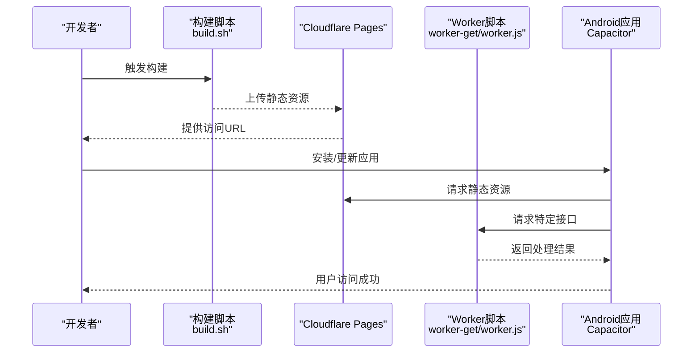
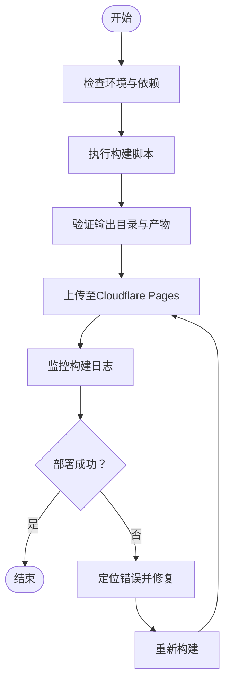
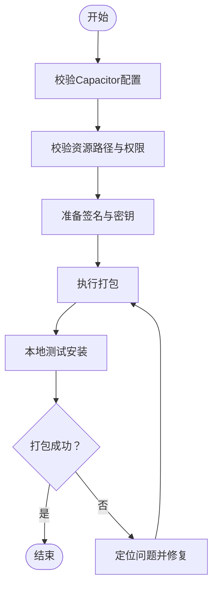
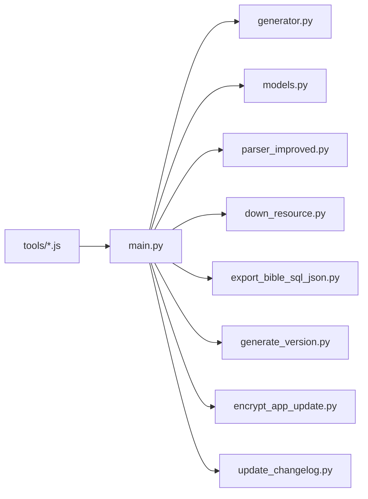
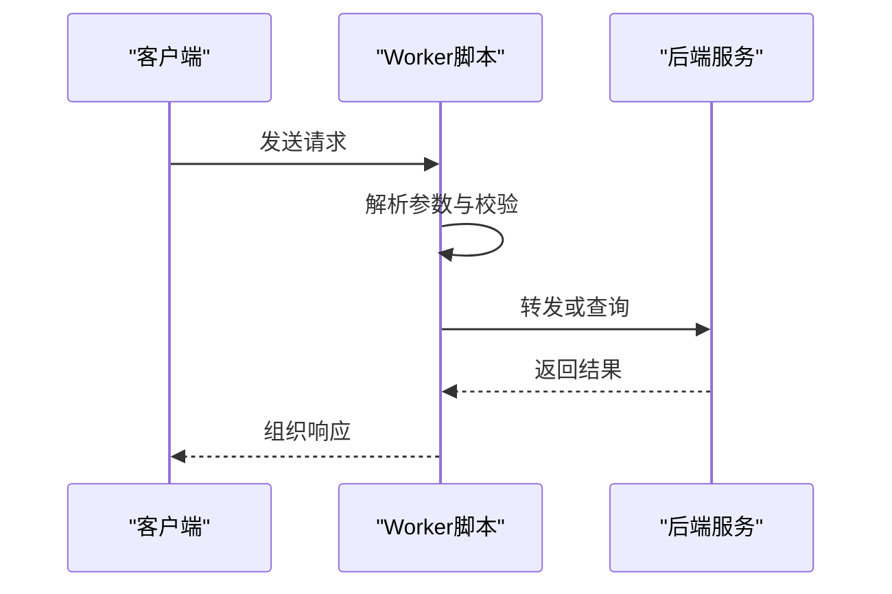
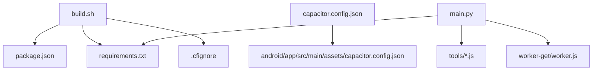

# 部署故障排除

<cite>
**本文引用的文件**
- [DEPLOYMENT.md](file://DEPLOYMENT.md)
- [build.sh](file://build.sh)
- [requirements.txt](file://requirements.txt)
- [capacitor.config.json](file://capacitor.config.json)
- [android/app/src/main/assets/capacitor.config.json](file://android/app/src/main/assets/capacitor.config.json)
- [.cfignore](file://.cfignore)
- [.gitignore](file://.gitignore)
- [package.json](file://package.json)
- [main.py](file://main.py)
- [worker-get/worker.js](file://worker-get/worker.js)
- [down_resource.py](file://down_resource.py)
- [encrypt_app_update.py](file://encrypt_app_update.py)
- [export_bible_sql_json.py](file://export_bible_sql_json.py)
- [generate_version.py](file://generate_version.py)
- [update_changelog.py](file://update_changelog.py)
- [src/generator.py](file://src/generator.py)
- [src/models.py](file://src/models.py)
- [src/parser_improved.py](file://src/parser_improved.py)
- [tools/build-trainings-json.js](file://tools/build-trainings-json.js)
- [tools/split-combined-txt.js](file://tools/split-combined-txt.js)
</cite>

## 目录
1. [简介](#简介)
2. [项目结构](#项目结构)
3. [核心组件](#核心组件)
4. [架构总览](#架构总览)
5. [详细组件分析](#详细组件分析)
6. [依赖关系分析](#依赖关系分析)
7. [性能考虑](#性能考虑)
8. [故障排除指南](#故障排除指南)
9. [结论](#结论)
10. [附录](#附录)

## 简介
本指南面向CX项目的部署与运维团队，聚焦于Cloudflare Pages前端静态资源部署、Capacitor Android应用打包、后端Python服务与Worker脚本的运行稳定性。文档提供系统化的问题排查流程、日志解读方法、Android打包失败的常见原因与修复策略、部署前检查清单、性能优化与加速技巧，以及紧急回滚与恢复方案。

## 项目结构
该项目采用多模块混合架构：
- 前端静态资源与Cloudflare Pages部署：通过构建脚本生成静态产物，配合忽略规则与环境配置进行发布。
- Capacitor Android应用：基于Capacitor配置与Android工程集成，支持本地资源与更新机制。
- 后端与工具链：Python脚本用于数据处理、版本生成、资源下载与SQL导出；Node工具用于训练数据JSON构建与文本拆分。
- Worker脚本：Cloudflare Worker用于特定请求处理。

```mermaid
graph TB
subgraph "前端与静态资源"
CF["Cloudflare Pages<br/>静态站点"]
Build["构建脚本<br/>build.sh"]
Cfg["Capacitor配置<br/>capacitor.config.json"]
AAsset["Android资产配置<br/>android/app/src/main/assets/capacitor.config.json"]
end
subgraph "后端与工具"
PyMain["后端入口<br/>main.py"]
PyGen["生成器<br/>src/generator.py"]
PyModels["模型定义<br/>src/models.py"]
PyParser["解析器<br/>src/parser_improved.py"]
ToolsJS["工具脚本<br/>tools/*.js"]
DownRes["资源下载<br/>down_resource.py"]
Encrypt["应用更新加密<br/>encrypt_app_update.py"]
Export["SQL导出<br/>export_bible_sql_json.py"]
GenVer["版本生成<br/>generate_version.py"]
Changelog["变更记录<br/>update_changelog.py"]
end
subgraph "边缘计算"
Worker["Worker脚本<br/>worker-get/worker.js"]
end
Build --> CF
Cfg --> CF
AAsset --> CF
PyMain --> CF
PyGen --> CF
PyModels --> CF
PyParser --> CF
ToolsJS --> CF
DownRes --> CF
Encrypt --> CF
Export --> CF
GenVer --> CF
Changelog --> CF
Worker --> CF
```

**图表来源**
- [build.sh](file://build.sh)
- [capacitor.config.json](file://capacitor.config.json)
- [android/app/src/main/assets/capacitor.config.json](file://android/app/src/main/assets/capacitor.config.json)
- [main.py](file://main.py)
- [src/generator.py](file://src/generator.py)
- [src/models.py](file://src/models.py)
- [src/parser_improved.py](file://src/parser_improved.py)
- [tools/build-trainings-json.js](file://tools/build-trainings-json.js)
- [tools/split-combined-txt.js](file://tools/split-combined-txt.js)
- [worker-get/worker.js](file://worker-get/worker.js)

**章节来源**
- [DEPLOYMENT.md](file://DEPLOYMENT.md)
- [build.sh](file://build.sh)
- [capacitor.config.json](file://capacitor.config.json)
- [android/app/src/main/assets/capacitor.config.json](file://android/app/src/main/assets/capacitor.config.json)
- [main.py](file://main.py)
- [src/generator.py](file://src/generator.py)
- [src/models.py](file://src/models.py)
- [src/parser_improved.py](file://src/parser_improved.py)
- [tools/build-trainings-json.js](file://tools/build-trainings-json.js)
- [tools/split-combined-txt.js](file://tools/split-combined-txt.js)
- [worker-get/worker.js](file://worker-get/worker.js)

## 核心组件
- 构建与发布
  - 构建脚本负责产出静态资源，确保路径与资源正确打包。
  - Cloudflare Pages忽略规则控制哪些文件不参与发布。
- Capacitor配置
  - 顶层与Android资产目录的配置文件共同决定应用行为与资源加载策略。
- 后端与工具
  - Python主入口与生成器、模型、解析器协同完成内容处理。
  - 工具脚本负责训练数据JSON构建与文本拆分。
- 边缘Worker
  - Worker脚本在边缘节点执行，响应特定请求。

**章节来源**
- [build.sh](file://build.sh)
- [.cfignore](file://.cfignore)
- [capacitor.config.json](file://capacitor.config.json)
- [android/app/src/main/assets/capacitor.config.json](file://android/app/src/main/assets/capacitor.config.json)
- [main.py](file://main.py)
- [src/generator.py](file://src/generator.py)
- [src/models.py](file://src/models.py)
- [src/parser_improved.py](file://src/parser_improved.py)
- [tools/build-trainings-json.js](file://tools/build-trainings-json.js)
- [tools/split-combined-txt.js](file://tools/split-combined-txt.js)
- [worker-get/worker.js](file://worker-get/worker.js)

## 架构总览
下图展示从开发机到用户访问的关键路径：本地构建→Cloudflare Pages静态托管→边缘Worker处理→Android应用加载资源。

**图表来源**
- [build.sh](file://build.sh)
- [worker-get/worker.js](file://worker-get/worker.js)
- [capacitor.config.json](file://capacitor.config.json)
- [android/app/src/main/assets/capacitor.config.json](file://android/app/src/main/assets/capacitor.config.json)

## 详细组件分析

### 构建与发布流程
- 构建脚本负责生成静态产物，需确保输出目录结构与资源完整性。
- 发布前应校验忽略规则，避免敏感或冗余文件进入生产环境。
- Cloudflare Pages的构建日志是定位问题的关键，需关注构建阶段、依赖安装、资源拷贝与最终产物状态。

**图表来源**
- [build.sh](file://build.sh)
- [.cfignore](file://.cfignore)

**章节来源**
- [build.sh](file://build.sh)
- [.cfignore](file://.cfignore)

### Capacitor Android配置与打包
- 顶层配置与Android资产配置共同决定应用的Web资源根路径、服务器地址与安全策略。
- 打包失败通常与签名、资源路径、权限声明、Gradle版本或依赖冲突有关。
- 建议在本地先完成调试构建，再进行生产签名打包。

**图表来源**
- [capacitor.config.json](file://capacitor.config.json)
- [android/app/src/main/assets/capacitor.config.json](file://android/app/src/main/assets/capacitor.config.json)

**章节来源**
- [capacitor.config.json](file://capacitor.config.json)
- [android/app/src/main/assets/capacitor.config.json](file://android/app/src/main/assets/capacitor.config.json)

### 后端与工具链
- Python主入口与各模块协同工作，生成内容、处理数据与导出资源。
- 工具脚本负责训练数据JSON构建与文本拆分，需保证输入数据格式与编码正确。
- 资源下载、版本生成与更新加密等脚本应按顺序执行，确保一致性。

**图表来源**
- [main.py](file://main.py)
- [src/generator.py](file://src/generator.py)
- [src/models.py](file://src/models.py)
- [src/parser_improved.py](file://src/parser_improved.py)
- [down_resource.py](file://down_resource.py)
- [export_bible_sql_json.py](file://export_bible_sql_json.py)
- [generate_version.py](file://generate_version.py)
- [encrypt_app_update.py](file://encrypt_app_update.py)
- [update_changelog.py](file://update_changelog.py)
- [tools/build-trainings-json.js](file://tools/build-trainings-json.js)
- [tools/split-combined-txt.js](file://tools/split-combined-txt.js)

**章节来源**
- [main.py](file://main.py)
- [src/generator.py](file://src/generator.py)
- [src/models.py](file://src/models.py)
- [src/parser_improved.py](file://src/parser_improved.py)
- [down_resource.py](file://down_resource.py)
- [export_bible_sql_json.py](file://export_bible_sql_json.py)
- [generate_version.py](file://generate_version.py)
- [encrypt_app_update.py](file://encrypt_app_update.py)
- [update_changelog.py](file://update_changelog.py)
- [tools/build-trainings-json.js](file://tools/build-trainings-json.js)
- [tools/split-combined-txt.js](file://tools/split-combined-txt.js)

### 边缘Worker
- Worker脚本在边缘节点执行，需关注请求处理逻辑、错误返回与日志输出。
- 与前端交互时注意CORS、缓存与超时设置，避免跨域与网络抖动导致的失败。

**图表来源**
- [worker-get/worker.js](file://worker-get/worker.js)

**章节来源**
- [worker-get/worker.js](file://worker-get/worker.js)

## 依赖关系分析
- 构建与发布
  - 构建脚本依赖Node与Python生态，需确保版本兼容性与依赖安装。
  - 忽略规则影响发布范围，需与发布策略一致。
- Capacitor
  - 配置文件决定资源路径与安全策略，需与实际部署路径匹配。
- 后端与工具
  - Python依赖清单决定安装顺序与兼容性。
  - 工具脚本与后端模块存在调用关系，需保持版本同步。

**图表来源**
- [build.sh](file://build.sh)
- [package.json](file://package.json)
- [requirements.txt](file://requirements.txt)
- [.cfignore](file://.cfignore)
- [capacitor.config.json](file://capacitor.config.json)
- [android/app/src/main/assets/capacitor.config.json](file://android/app/src/main/assets/capacitor.config.json)
- [main.py](file://main.py)
- [worker-get/worker.js](file://worker-get/worker.js)
- [tools/build-trainings-json.js](file://tools/build-trainings-json.js)
- [tools/split-combined-txt.js](file://tools/split-combined-txt.js)

**章节来源**
- [build.sh](file://build.sh)
- [package.json](file://package.json)
- [requirements.txt](file://requirements.txt)
- [.cfignore](file://.cfignore)
- [capacitor.config.json](file://capacitor.config.json)
- [android/app/src/main/assets/capacitor.config.json](file://android/app/src/main/assets/capacitor.config.json)
- [main.py](file://main.py)
- [worker-get/worker.js](file://worker-get/worker.js)
- [tools/build-trainings-json.js](file://tools/build-trainings-json.js)
- [tools/split-combined-txt.js](file://tools/split-combined-txt.js)

## 性能考虑
- 构建优化
  - 缓存依赖安装结果，减少重复安装时间。
  - 分离开发与生产构建，避免在CI中执行不必要的测试。
  - 使用增量构建与产物压缩，缩短上传与传输时间。
- 资源优化
  - 合理划分静态资源，启用CDN缓存与持久化缓存策略。
  - 对图片与媒体进行压缩与格式优化，降低首屏加载时间。
- 运行时优化
  - 在Worker中复用连接与缓存，减少冷启动开销。
  - 控制并发与超时，避免边缘节点过载。
- Android应用
  - 启用ProGuard/R8混淆与资源压缩，减小APK体积。
  - 将大资源放在应用内或按需下载，避免首次安装体积过大。

[本节为通用指导，无需具体文件来源]

## 故障排除指南

### 一、环境与依赖检查
- 检查Node与Python版本是否满足项目要求。
- 确认依赖安装成功且版本兼容，必要时清理缓存后重装。
- 校验构建脚本可执行权限与环境变量。

**章节来源**
- [build.sh](file://build.sh)
- [package.json](file://package.json)
- [requirements.txt](file://requirements.txt)

### 二、Cloudflare Pages构建日志分析
- 登录Cloudflare Pages控制台，查看构建日志的“构建阶段”、“依赖安装”、“资源拷贝”与“产物状态”。
- 关注以下常见错误类型：
  - 依赖安装失败：检查依赖版本与网络连通性。
  - 资源缺失：核对构建输出目录与忽略规则。
  - 构建超时：优化依赖安装与构建步骤。
- 日志解读要点：
  - 错误堆栈与行号定位具体文件。
  - 依赖冲突提示对应包名与版本范围。
  - 资源路径错误指向具体文件路径。

**章节来源**
- [DEPLOYMENT.md](file://DEPLOYMENT.md)
- [.cfignore](file://.cfignore)

### 三、Android应用打包失败
- 常见原因
  - 签名配置错误或密钥丢失。
  - 资源路径与配置不一致，导致加载失败。
  - Gradle或插件版本不兼容。
  - 权限声明缺失或冲突。
- 修复步骤
  - 校验签名与密钥配置，确保与发布策略一致。
  - 对照Capacitor配置与Android资产配置，统一资源根路径。
  - 更新Gradle与插件版本，清理缓存后重试。
  - 补充缺失权限并解决冲突。

**章节来源**
- [capacitor.config.json](file://capacitor.config.json)
- [android/app/src/main/assets/capacitor.config.json](file://android/app/src/main/assets/capacitor.config.json)

### 四、后端与工具链问题
- Python依赖安装失败
  - 清理虚拟环境，使用纯净索引重装。
  - 校验依赖清单与平台兼容性。
- 数据处理异常
  - 检查输入数据格式与编码，确保解析器与生成器正常。
  - 对工具脚本进行单测，确认输入输出符合预期。
- 版本与更新
  - 生成版本号与变更记录，确保与发布计划一致。
  - 应用更新加密需与客户端解密逻辑匹配。

**章节来源**
- [requirements.txt](file://requirements.txt)
- [main.py](file://main.py)
- [src/generator.py](file://src/generator.py)
- [src/models.py](file://src/models.py)
- [src/parser_improved.py](file://src/parser_improved.py)
- [tools/build-trainings-json.js](file://tools/build-trainings-json.js)
- [tools/split-combined-txt.js](file://tools/split-combined-txt.js)
- [generate_version.py](file://generate_version.py)
- [update_changelog.py](file://update_changelog.py)
- [encrypt_app_update.py](file://encrypt_app_update.py)

### 五、Worker脚本问题
- 请求处理失败
  - 检查请求参数与返回值格式，确保与前端约定一致。
  - 关注超时与重试策略，避免边缘节点不稳定。
- 日志与监控
  - 在Worker中输出关键日志，便于定位问题。
  - 结合Cloudflare日志与指标进行分析。

**章节来源**
- [worker-get/worker.js](file://worker-get/worker.js)

### 六、部署前检查清单
- 环境与依赖
  - Node与Python版本确认；依赖安装成功。
- 构建与产物
  - 构建脚本执行成功；输出目录完整。
  - 忽略规则与发布范围一致。
- 配置与安全
  - Capacitor配置与Android资产配置一致。
  - 签名与密钥准备就绪。
- 后端与工具
  - Python脚本可独立运行；工具脚本无语法错误。
  - 版本与更新流程已演练。
- 测试与验证
  - 本地预览通过；关键功能验证通过。
  - Worker接口可用，日志可追踪。

**章节来源**
- [build.sh](file://build.sh)
- [.cfignore](file://.cfignore)
- [capacitor.config.json](file://capacitor.config.json)
- [android/app/src/main/assets/capacitor.config.json](file://android/app/src/main/assets/capacitor.config.json)
- [main.py](file://main.py)
- [worker-get/worker.js](file://worker-get/worker.js)

### 七、紧急回滚与恢复
- 回滚策略
  - 回退到上一个稳定版本的静态资源与配置。
  - 撤销最近一次发布，恢复Worker脚本到上一个版本。
- 恢复步骤
  - 临时关闭新版本发布通道，切换回旧版本。
  - 修复问题后，重新执行部署前检查清单并发布。
- 监控与告警
  - 建立发布后的健康检查与错误率告警，快速发现异常。

**章节来源**
- [DEPLOYMENT.md](file://DEPLOYMENT.md)
- [worker-get/worker.js](file://worker-get/worker.js)

## 结论
通过系统化的环境检查、日志分析、配置校验与回滚策略，可以有效降低CX项目在Cloudflare Pages与Android平台的部署风险。建议将本文的检查清单与流程固化为标准操作程序，并结合自动化工具提升部署效率与稳定性。

## 附录
- 参考文件路径与用途概览
  - 构建与发布：build.sh、DEPLOYMENT.md、.cfignore
  - 配置：capacitor.config.json、android/app/src/main/assets/capacitor.config.json
  - 后端与工具：main.py、requirements.txt、tools/*.js、各Python脚本
  - 边缘：worker-get/worker.js

**章节来源**
- [DEPLOYMENT.md](file://DEPLOYMENT.md)
- [build.sh](file://build.sh)
- [.cfignore](file://.cfignore)
- [capacitor.config.json](file://capacitor.config.json)
- [android/app/src/main/assets/capacitor.config.json](file://android/app/src/main/assets/capacitor.config.json)
- [main.py](file://main.py)
- [requirements.txt](file://requirements.txt)
- [tools/build-trainings-json.js](file://tools/build-trainings-json.js)
- [tools/split-combined-txt.js](file://tools/split-combined-txt.js)
- [worker-get/worker.js](file://worker-get/worker.js)