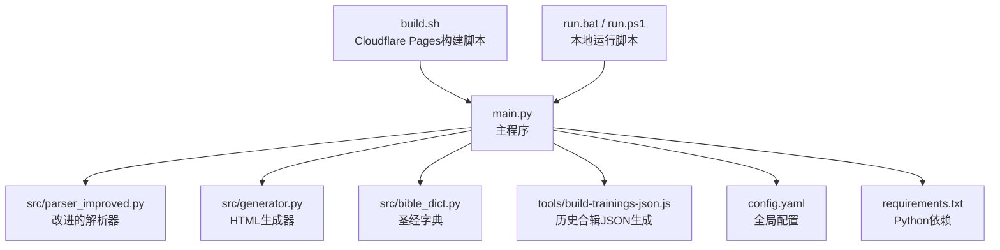
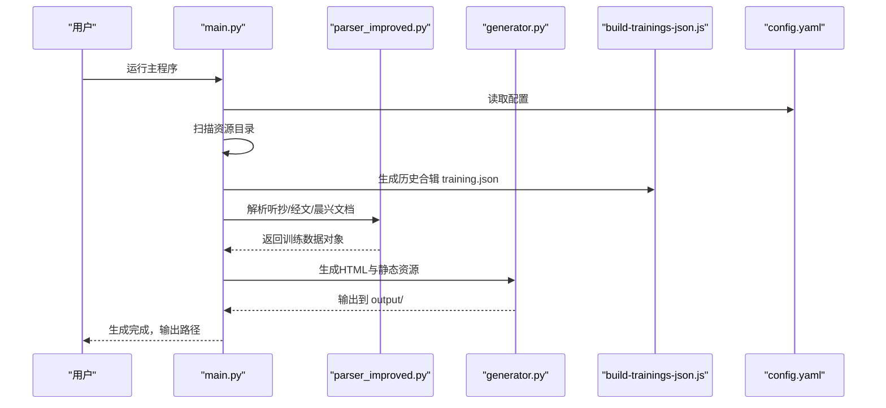
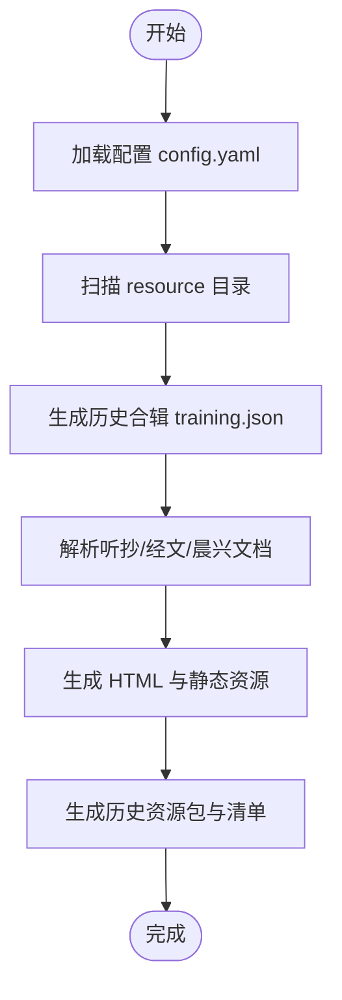
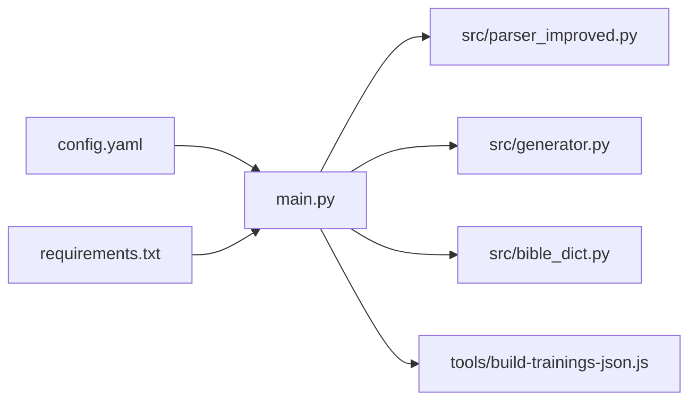

# 快速开始

<cite>
**本文引用的文件**
- [QUICK_START.md](file://QUICK_START.md)
- [requirements.txt](file://requirements.txt)
- [config.yaml](file://config.yaml)
- [main.py](file://main.py)
- [run.bat](file://run.bat)
- [run.ps1](file://run.ps1)
- [build.sh](file://build.sh)
- [src/parser_improved.py](file://src/parser_improved.py)
- [src/generator.py](file://src/generator.py)
- [src/bible_dict.py](file://src/bible_dict.py)
- [tools/build-trainings-json.js](file://tools/build-trainings-json.js)
- [app_config.json](file://app_config.json)
</cite>

## 目录
1. [简介](#简介)
2. [项目结构](#项目结构)
3. [核心组件](#核心组件)
4. [架构总览](#架构总览)
5. [详细组件分析](#详细组件分析)
6. [依赖关系分析](#依赖关系分析)
7. [性能考虑](#性能考虑)
8. [故障排除指南](#故障排除指南)
9. [结论](#结论)
10. [附录](#附录)

## 简介
本指南面向首次接触 CX 项目的用户，目标是在约 30 分钟内完成环境搭建、准备 Word 训练文档、运行生成器并查看静态网站。文档涵盖：
- 环境准备（Python、依赖、Node.js）
- 配置文件说明与关键参数
- Word 训练文档的准备与目录结构
- 首次运行步骤（命令行、参数、预期输出）
- 常见问题与排错
- 从准备文档到生成静态网站的完整示例流程

## 项目结构
该项目采用“Python 主程序 + Node.js 工具脚本”的混合架构，核心文件与职责如下：
- Python 主程序：负责扫描资源目录、解析 Word 文档、生成静态站点与清单文件
- Node.js 工具：解析历史合辑 TXT，生成历史训练的 training.json
- 配置文件：集中管理输出目录、模板目录、资源目录、默认训练参数、远端服务器等
- 批量构建脚本：Cloudflare Pages 构建时自动安装依赖并运行主程序

**图表来源**
- [main.py:655-800](file://main.py#L655-L800)
- [src/parser_improved.py:114-200](file://src/parser_improved.py#L114-L200)
- [src/generator.py:22-120](file://src/generator.py#L22-L120)
- [src/bible_dict.py:19-96](file://src/bible_dict.py#L19-L96)
- [tools/build-trainings-json.js:1-120](file://tools/build-trainings-json.js#L1-L120)
- [config.yaml:1-42](file://config.yaml#L1-L42)
- [requirements.txt:1-16](file://requirements.txt#L1-L16)
- [build.sh:1-20](file://build.sh#L1-L20)
- [run.bat:1-44](file://run.bat#L1-L44)
- [run.ps1:1-48](file://run.ps1#L1-L48)

**章节来源**
- [main.py:655-800](file://main.py#L655-L800)
- [config.yaml:1-42](file://config.yaml#L1-L42)
- [build.sh:1-20](file://build.sh#L1-L20)
- [run.bat:1-44](file://run.bat#L1-L44)
- [run.ps1:1-48](file://run.ps1#L1-L48)

## 核心组件
- 配置系统（config.yaml）
  - 控制输出目录、模板目录、静态资源目录、批量处理策略、默认训练参数、远端服务器列表等
  - 关键字段：batch_processing、output_dir、resource_base_dir、template_dir、static_dir、default_training、remote_servers
- 解析器（src/parser_improved.py）
  - 支持 .doc/.docx，.doc 通过 LibreOffice 转换或手动转换
  - 识别章节标题、纲目层级、经文引用，抽取晨兴与听抄内容
- HTML 生成器（src/generator.py）
  - 使用 Jinja2 模板渲染页面，复制共享静态资源（JS/CSS/图片）
  - 生成训练清单与搜索索引
- 历史合辑处理（tools/build-trainings-json.js）
  - 解析历史合辑 TXT，生成历史训练的 training.json
- 主程序（main.py）
  - 扫描资源目录、批量处理训练、生成 SPA 主页与清单、复制静态资源、生成 remote-config.js、打包历史资源包

**章节来源**
- [config.yaml:1-42](file://config.yaml#L1-L42)
- [src/parser_improved.py:15-120](file://src/parser_improved.py#L15-L120)
- [src/generator.py:22-120](file://src/generator.py#L22-L120)
- [tools/build-trainings-json.js:1-120](file://tools/build-trainings-json.js#L1-L120)
- [main.py:205-314](file://main.py#L205-L314)

## 架构总览
下图展示了从输入 Word 文档到输出静态站点的整体流程。

**图表来源**
- [main.py:655-800](file://main.py#L655-L800)
- [src/parser_improved.py:114-200](file://src/parser_improved.py#L114-L200)
- [src/generator.py:22-120](file://src/generator.py#L22-L120)
- [tools/build-trainings-json.js:1-120](file://tools/build-trainings-json.js#L1-L120)
- [config.yaml:1-42](file://config.yaml#L1-L42)

## 详细组件分析

### 环境与依赖准备
- Python 环境
  - 建议使用 Python 3.10+，创建虚拟环境并安装依赖
  - 依赖清单参见 requirements.txt，包含 python-docx、PyYAML、Jinja2、Pillow、requests、beautifulsoup4、lxml、playwright、cryptography 等
- Node.js 环境
  - 用于解析历史合辑 TXT，生成历史训练 JSON
- Cloudflare Pages（可选）
  - 提供一键部署，构建命令为 chmod +x build.sh && ./build.sh，输出目录为 output

**章节来源**
- [requirements.txt:1-16](file://requirements.txt#L1-L16)
- [build.sh:1-20](file://build.sh#L1-L20)

### 配置文件说明（config.yaml）
- 全局配置
  - output_dir：输出目录（默认 output）
  - resource_base_dir：资源根目录（默认 resource）
  - template_dir：模板目录（默认 src/templates）
  - static_dir：静态资源目录（默认 src/static）
- 批量处理
  - enabled：是否启用批量处理（默认 true）
  - skip_existing：是否跳过已存在输出
  - strict_exit_on_batch_failure：是否在批量失败时严格退出
  - max_latest_trainings：限制 GitHub 打包的最新训练数量
  - specific_trainings：指定处理的训练集合（可选）
- 默认训练参数
  - year、season：当无法从文件夹名推断时的后备值
- 远端服务器
  - remote_servers：包含 Cloudflare、GitHub API、镜像、推送、IP 查询等 URL 列表，最终写入 output/js/remote-config.js

**章节来源**
- [config.yaml:1-42](file://config.yaml#L1-L42)

### 准备 Word 训练文档与目录结构
- 目录结构建议
  - resource/批次名称/
    - 听抄.docx 或 .doc（必需）
    - 经文.docx 或 .doc（必需）
    - 晨兴.doc、晨兴2.doc、…（可选，按编号递增）
- 文件命名规范
  - 批次文件夹名应包含“年-月”前缀，如“2025-04 夏季训练”，以便自动识别年份与季节
  - 若文件夹名不符合规范，将使用 default_training 中的后备值
- 文档格式
  - Cloudflare Pages 环境无法安装 LibreOffice，因此请确保所有文档为 .docx 格式
  - 若为 .doc，需在本地转换为 .docx

**章节来源**
- [main.py:205-314](file://main.py#L205-L314)
- [src/parser_improved.py:15-120](file://src/parser_improved.py#L15-L120)
- [QUICK_START.md:50-54](file://QUICK_START.md#L50-L54)

### 首次运行步骤
- 本地运行（Windows）
  - 使用 run.bat 或 run.ps1 启动，脚本会检查虚拟环境并运行 main.py
  - 成功后可选择在浏览器中打开 output/index.html
- 云构建（Cloudflare Pages）
  - 构建脚本 build.sh 会安装 requirements.txt 并执行 python main.py
  - 输出目录为 output，可在 Pages 项目中配置为静态站点
- 常用参数与行为
  - 批量处理：扫描 resource 下的子目录，按“年-月”排序，可限制最新 N 个训练
  - 历史合辑：调用 tools/build-trainings-json.js 生成历史训练 JSON
  - 静态资源：复制共享 JS/CSS/图片到 output 上级目录，SPA 主页与清单文件生成于 output/

**章节来源**
- [run.bat:1-44](file://run.bat#L1-L44)
- [run.ps1:1-48](file://run.ps1#L1-L48)
- [build.sh:1-20](file://build.sh#L1-L20)
- [main.py:655-800](file://main.py#L655-L800)

### 生成流程与输出
- 主要产物
  - output/trainings.json：训练清单与统计
  - output/index.html：SPA 主页（包含注入的默认缓存策略）
  - output/js/*、output/css/*、output/images/*：共享静态资源
  - output/resource-packs.json 与 resource-packs/*.zip：历史资源包清单与打包
  - output/js/remote-config.js：远端服务器列表（Base64 编码）
- 历史合辑
  - tools/build-trainings-json.js 为历史合辑生成各训练的 training.json，并与批量生成的训练合并

**图表来源**
- [main.py:655-800](file://main.py#L655-L800)
- [tools/build-trainings-json.js:120-140](file://tools/build-trainings-json.js#L120-L140)

**章节来源**
- [main.py:317-546](file://main.py#L317-L546)
- [tools/build-trainings-json.js:120-140](file://tools/build-trainings-json.js#L120-L140)

## 依赖关系分析
- Python 主程序依赖解析器与生成器模块，同时调用 Node.js 脚本生成历史合辑
- 配置文件贯穿整个流程，影响输出目录、模板目录、静态资源复制、批量策略与远端服务器
- 依赖清单 requirements.txt 保证运行时所需库齐全

**图表来源**
- [config.yaml:1-42](file://config.yaml#L1-L42)
- [requirements.txt:1-16](file://requirements.txt#L1-L16)
- [main.py:655-800](file://main.py#L655-L800)
- [src/parser_improved.py:114-200](file://src/parser_improved.py#L114-L200)
- [src/generator.py:22-120](file://src/generator.py#L22-L120)
- [src/bible_dict.py:19-96](file://src/bible_dict.py#L19-L96)
- [tools/build-trainings-json.js:1-120](file://tools/build-trainings-json.js#L1-120)

**章节来源**
- [config.yaml:1-42](file://config.yaml#L1-L42)
- [requirements.txt:1-16](file://requirements.txt#L1-L16)
- [main.py:655-800](file://main.py#L655-L800)

## 性能考虑
- 批量处理策略
  - 通过 max_latest_trainings 限制最新 N 个训练参与打包，降低体积与构建时间
- 静态资源复制
  - 共享 JS/CSS/图片一次性复制到 output 上级目录，避免重复 IO
- 历史资源包
  - 无图片的历史训练按 10 年分组打包，减小包体积并提升下载效率
- 远端服务器
  - remote-config.js 使用 Base64 编码存储 URL，运行时解码，减少模板渲染开销

**章节来源**
- [config.yaml:6-7](file://config.yaml#L6-L7)
- [main.py:548-653](file://main.py#L548-L653)
- [main.py:476-495](file://main.py#L476-L495)

## 故障排除指南
- 无法安装依赖
  - 确认 requirements.txt 中的依赖版本与当前 Python 版本兼容
  - 在 Cloudflare Pages 环境中注意无法安装 LibreOffice，需提前将 .doc 转换为 .docx
- 文档格式错误
  - .doc 文件必须转换为 .docx；若使用 LibreOffice 转换失败，参考解析器提供的替代方案
- 未找到资源目录或训练文件夹
  - 确认 resource 目录结构与文件夹命名包含“年-月”前缀
- 生成失败
  - 查看控制台输出的错误堆栈，定位具体模块（解析器/生成器/历史合辑）
- 部署失败
  - 检查 Cloudflare Pages 构建日志，确认构建命令与输出目录配置正确

**章节来源**
- [requirements.txt:1-16](file://requirements.txt#L1-L16)
- [src/parser_improved.py:82-110](file://src/parser_improved.py#L82-L110)
- [QUICK_START.md:50-54](file://QUICK_START.md#L50-L54)
- [main.py:753-756](file://main.py#L753-L756)

## 结论
通过本快速开始指南，您可以在 30 分钟内完成环境搭建、准备 Word 训练文档、运行生成器并查看静态网站。建议优先使用 Cloudflare Pages 进行一键部署，或在本地使用 run.bat/run.ps1 脚本快速验证流程。遇到问题时，优先检查文档格式、资源目录结构与构建日志。

## 附录

### 本地运行命令与参数
- Windows
  - run.bat：自动检查虚拟环境并运行 main.py，结束后可选择打开浏览器
  - run.ps1：PowerShell 脚本，功能与 run.bat 类似
- 云构建
  - build.sh：安装依赖并运行 main.py，输出目录为 output

**章节来源**
- [run.bat:1-44](file://run.bat#L1-L44)
- [run.ps1:1-48](file://run.ps1#L1-L48)
- [build.sh:1-20](file://build.sh#L1-L20)

### 配置文件关键项速查
- 全局
  - output_dir、resource_base_dir、template_dir、static_dir
- 批量处理
  - enabled、skip_existing、strict_exit_on_batch_failure、max_latest_trainings、specific_trainings
- 默认训练
  - year、season
- 远端服务器
  - cloudflare、github_api、github_mirrors、push、ip_apis

**章节来源**
- [config.yaml:1-42](file://config.yaml#L1-L42)

### 示例：从准备文档到生成静态网站
- 准备文档
  - 在 resource/2025-04 夏季训练/ 下放置 听抄.docx、经文.docx、晨兴.doc、晨兴2.doc 等
- 运行
  - 在本地运行 run.bat 或 run.ps1，或在 Cloudflare Pages 中推送代码触发构建
- 验证
  - 打开 output/index.html，确认页面正常显示
  - 检查 output/trainings.json、output/js/remote-config.js、output/resource-packs.json 等文件是否存在

**章节来源**
- [main.py:655-800](file://main.py#L655-L800)
- [tools/build-trainings-json.js:120-140](file://tools/build-trainings-json.js#L120-L140)