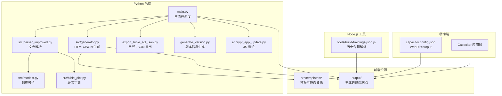
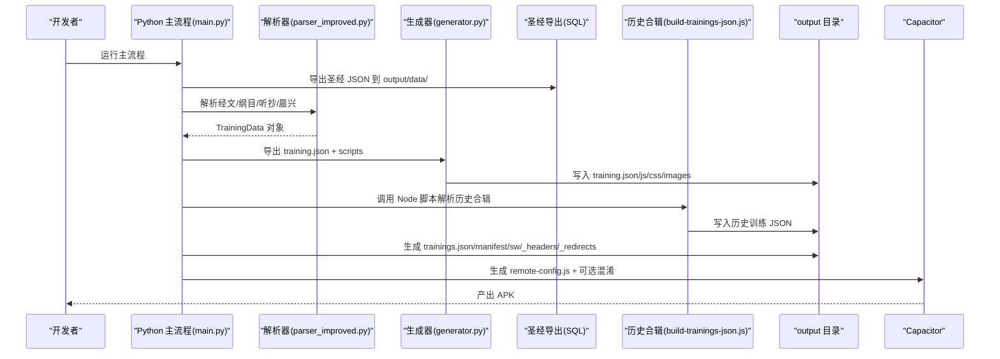
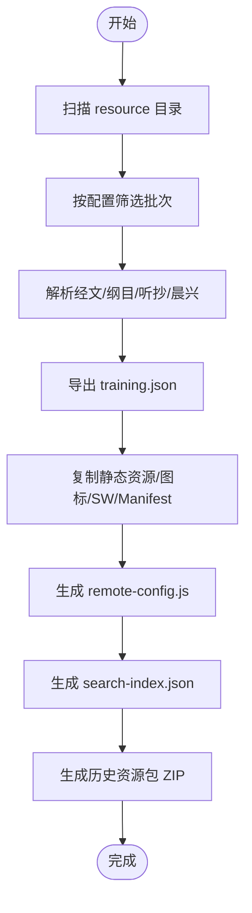
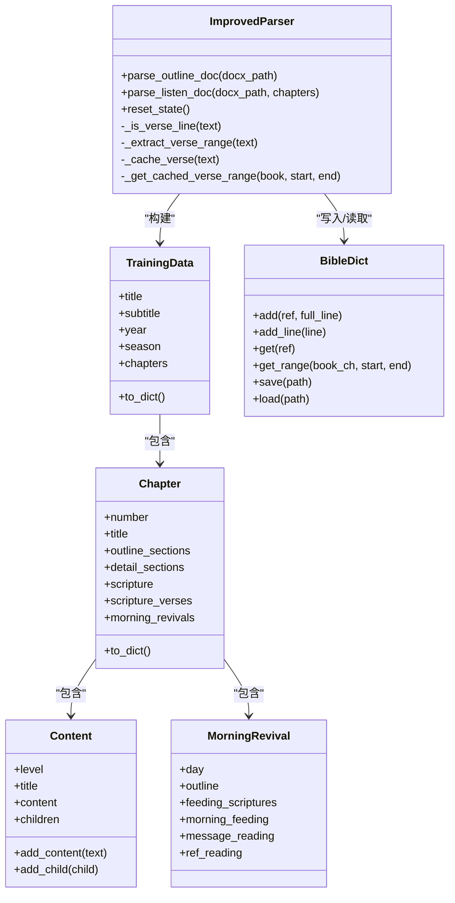
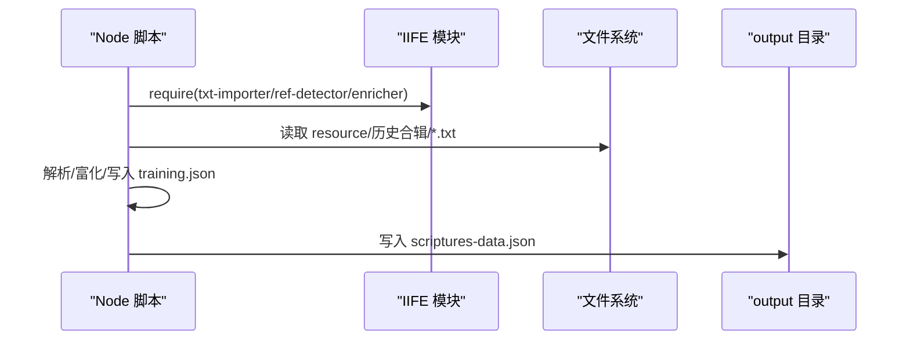
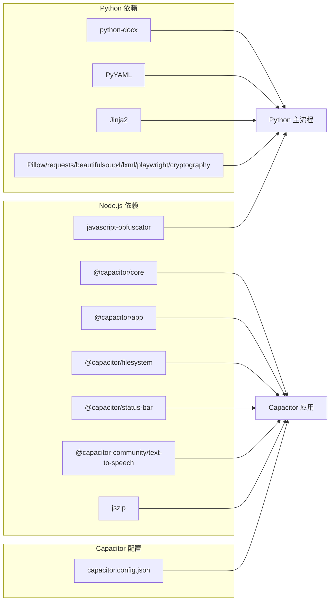

# 技术栈

<cite>
**本文引用的文件**
- [requirements.txt](file://requirements.txt)
- [package.json](file://package.json)
- [capacitor.config.json](file://capacitor.config.json)
- [config.yaml](file://config.yaml)
- [main.py](file://main.py)
- [src/generator.py](file://src/generator.py)
- [src/parser_improved.py](file://src/parser_improved.py)
- [src/models.py](file://src/models.py)
- [src/bible_dict.py](file://src/bible_dict.py)
- [tools/build-trainings-json.js](file://tools/build-trainings-json.js)
- [export_bible_sql_json.py](file://export_bible_sql_json.py)
- [generate_version.py](file://generate_version.py)
- [encrypt_app_update.py](file://encrypt_app_update.py)
</cite>

## 目录
1. [简介](#简介)
2. [项目结构](#项目结构)
3. [核心组件](#核心组件)
4. [架构总览](#架构总览)
5. [详细组件分析](#详细组件分析)
6. [依赖分析](#依赖分析)
7. [性能考虑](#性能考虑)
8. [故障排查指南](#故障排查指南)
9. [结论](#结论)
10. [附录](#附录)

## 简介
本技术栈文档面向 CX 项目，系统梳理其技术选型与实现方式，涵盖 Python 后端（文档解析、静态站点生成、搜索索引）、JavaScript 前端（基于模板的静态网站与 SPA 渲染）、Node.js 工具链（历史合辑解析与资源打包）、Capacitor 跨平台移动应用框架与 Node.js 运行时环境。文档重点说明：
- 技术选择的原因与优势
- 如何支撑批量处理、静态生成、多平台部署等需求
- 依赖版本、兼容性与升级建议
- 组件关系与数据流的可视化架构图

## 项目结构
项目采用“Python 批量处理 + Node.js 工具 + Capacitor 移动端”的混合架构：
- Python 负责 Word 文档解析、训练数据建模、JSON 导出、静态资源复制与 SPA 主页生成
- Node.js 负责历史合辑 TXT 的解析与 training.json 生成
- Capacitor 将 Web 资产打包为 Android 应用，配合远程配置与更新机制

图表来源
- [main.py:655-896](file://main.py#L655-L896)
- [src/parser_improved.py:114-742](file://src/parser_improved.py#L114-L742)
- [src/generator.py:22-115](file://src/generator.py#L22-L115)
- [src/models.py:9-232](file://src/models.py#L9-L232)
- [src/bible_dict.py:19-96](file://src/bible_dict.py#L19-L96)
- [export_bible_sql_json.py:353-477](file://export_bible_sql_json.py#L353-L477)
- [tools/build-trainings-json.js:358-416](file://tools/build-trainings-json.js#L358-L416)
- [capacitor.config.json:1-9](file://capacitor.config.json#L1-L9)

章节来源
- [main.py:655-896](file://main.py#L655-L896)
- [config.yaml:1-42](file://config.yaml#L1-L42)

## 核心组件
- Python 后端
  - 文档解析：支持 .doc/.docx，自动转换 .doc，提取训练标题、纲目、经文、晨兴喂养等内容
  - 数据建模：使用 dataclass 定义 TrainingData/Chapter/Content/MorningRevival 等结构
  - 静态生成：Jinja2 模板渲染、静态资源复制、SPA 主页与清单生成
  - 远程配置：将服务器地址以 base64 存储，运行时解码
  - 搜索索引：从 training.json 生成 search-index.json
  - 圣经数据：从 SQLite 导出带标记的经文、注解与串珠 JSON
  - 版本与混淆：生成版本信息、JS 混淆保护敏感配置
- Node.js 工具
  - 历史合辑解析：从 TXT 文件解析多训练，生成 training.json 与 scriptures-data.json
- Capacitor 移动端
  - WebDir 指向 output，集成应用层能力（文件系统、状态栏、TTS 等）

章节来源
- [src/parser_improved.py:15-112](file://src/parser_improved.py#L15-L112)
- [src/models.py:9-232](file://src/models.py#L9-L232)
- [src/generator.py:22-115](file://src/generator.py#L22-L115)
- [main.py:19-51](file://main.py#L19-L51)
- [tools/build-trainings-json.js:187-355](file://tools/build-trainings-json.js#L187-L355)
- [export_bible_sql_json.py:353-477](file://export_bible_sql_json.py#L353-L477)
- [generate_version.py:10-58](file://generate_version.py#L10-L58)
- [encrypt_app_update.py:155-167](file://encrypt_app_update.py#L155-L167)
- [capacitor.config.json:1-9](file://capacitor.config.json#L1-L9)

## 架构总览
整体流程分为“批量 Word 处理 + 历史合辑解析 + SPA 主页生成 + 移动端打包”，数据在 Python 侧完成建模与 JSON 导出，Node.js 侧完成历史合辑的 JSON 生成，最终由 Capacitor 将 output 目录打包为 APK。

图表来源
- [main.py:771-805](file://main.py#L771-L805)
- [src/parser_improved.py:366-742](file://src/parser_improved.py#L366-L742)
- [src/generator.py:382-424](file://src/generator.py#L382-L424)
- [tools/build-trainings-json.js:358-416](file://tools/build-trainings-json.js#L358-L416)
- [export_bible_sql_json.py:488-507](file://export_bible_sql_json.py#L488-L507)
- [encrypt_app_update.py:155-167](file://encrypt_app_update.py#L155-L167)

## 详细组件分析

### Python 批量处理与静态生成
- 批量扫描 resource 目录，按配置筛选最新 N 个批次，逐个解析并生成 training.json
- 生成 SPA 主页：复制 SPA shell、trainings.json、图标、静态资源、Service Worker、Manifest、Headers/Redirects
- 远程配置注入：将服务器地址列表编码为 JS，运行时解码
- 搜索索引：从 training.json 生成 search-index.json，支持多视图（听抄/纲目/晨兴）
- 资源包：将历史训练按 10 年一组打包为 ZIP，生成 resource-packs.json

图表来源
- [main.py:134-156](file://main.py#L134-L156)
- [main.py:205-313](file://main.py#L205-L313)
- [main.py:317-546](file://main.py#L317-L546)
- [src/generator.py:427-545](file://src/generator.py#L427-L545)

章节来源
- [main.py:683-896](file://main.py#L683-L896)
- [src/generator.py:382-424](file://src/generator.py#L382-L424)

### 文档解析器（Word → 结构化数据）
- 自动识别 .doc/.docx，.doc 通过 LibreOffice 转换
- 样式映射与层级提取，支持大纲层级（壹/一/1/a/㈠）
- 经文解析：支持中文书名、阿拉伯数字、范围与省略标记“从略”
- 晨兴喂养：分离经文与正文，支持长段落截断
- 职事信息摘录：从经文文档中抽取摘要
- 经文字典：持久化经文，跨章节“从略”还原

图表来源
- [src/parser_improved.py:114-742](file://src/parser_improved.py#L114-L742)
- [src/models.py:9-232](file://src/models.py#L9-L232)
- [src/bible_dict.py:19-96](file://src/bible_dict.py#L19-L96)

章节来源
- [src/parser_improved.py:15-112](file://src/parser_improved.py#L15-L112)
- [src/parser_improved.py:366-742](file://src/parser_improved.py#L366-L742)
- [src/models.py:9-232](file://src/models.py#L9-L232)
- [src/bible_dict.py:19-96](file://src/bible_dict.py#L19-L96)

### Node.js 历史合辑解析
- 通过 IIFE 模块加载 txt-importer/ref-detector/training-enricher
- 支持合辑文件与年份子目录文件，自动分割多训练段
- 生成 training.json 与 scriptures-data.json，写入 output/{year}-{seq}/

图表来源
- [tools/build-trainings-json.js:27-60](file://tools/build-trainings-json.js#L27-L60)
- [tools/build-trainings-json.js:187-355](file://tools/build-trainings-json.js#L187-L355)
- [tools/build-trainings-json.js:358-416](file://tools/build-trainings-json.js#L358-L416)

章节来源
- [tools/build-trainings-json.js:1-417](file://tools/build-trainings-json.js#L1-L417)

### 圣经数据导出（SQLite → JSON）
- 从 SQLite/SQL dump 导出三类 JSON：bible-text（带标记）、bible-notes、bible-xrefs
- 支持串珠文本归一化与标记注入（{注解序号} / [串珠字母]）
- 输出到 output/data-sql/，避免覆盖静态数据

章节来源
- [export_bible_sql_json.py:353-477](file://export_bible_sql_json.py#L353-L477)

### 远程配置与更新机制
- Python 生成 remote-config.js，将服务器地址以 base64 存储，运行时 atob 解码
- JS 混淆：对 remote-config.js、app-update.js、theme-toggle.js 进行不同强度混淆
- 版本信息：生成 version.json，包含 APK 版本与文件名

章节来源
- [main.py:19-51](file://main.py#L19-L51)
- [encrypt_app_update.py:155-167](file://encrypt_app_update.py#L155-L167)
- [generate_version.py:10-58](file://generate_version.py#L10-L58)

## 依赖分析
- Python 运行时与库
  - python-docx：解析 .docx；.doc 通过 LibreOffice 转换
  - PyYAML：读取配置
  - Jinja2：模板渲染
  - Pillow/requests/beautifulsoup4/lxml/playwright：图像处理、网络请求、HTML 解析与截图
  - cryptography：加密
- Node.js 与 Capacitor
  - @capacitor/*：应用核心、文件系统、状态栏
  - @capacitor-community/text-to-speech：TTS
  - jszip：ZIP 打包
  - javascript-obfuscator：JS 混淆

图表来源
- [requirements.txt:4-12](file://requirements.txt#L4-L12)
- [package.json:16-28](file://package.json#L16-L28)
- [capacitor.config.json:1-9](file://capacitor.config.json#L1-L9)

章节来源
- [requirements.txt:1-16](file://requirements.txt#L1-L16)
- [package.json:1-30](file://package.json#L1-L30)
- [capacitor.config.json:1-9](file://capacitor.config.json#L1-L9)

## 性能考虑
- 批量处理策略：通过配置限制最新 N 个训练参与打包，降低 GitHub Pages 打包体积
- 资源压缩：生成的 JSON 去缩进，减小体积
- 静态资源复用：共享 JS/CSS/images 复制到根目录，训练页面通过相对路径引用
- 搜索索引：从 JSON 生成，避免解析 HTML 的开销
- 历史资源包：按 10 年分组打包，剔除图片，减小包体
- 混淆策略：CI 环境默认混淆，本地开发可关闭以提升调试效率

章节来源
- [main.py:721-751](file://main.py#L721-L751)
- [src/generator.py:382-424](file://src/generator.py#L382-L424)
- [main.py:548-653](file://main.py#L548-L653)
- [encrypt_app_update.py:155-167](file://encrypt_app_update.py#L155-L167)

## 故障排查指南
- .doc 文件无法解析
  - 现象：提示无法自动转换 .doc
  - 处理：安装 LibreOffice 或手动转换为 .docx 后重试
- 配置加载失败
  - 现象：配置文件加载异常
  - 处理：检查 config.yaml 格式与路径
- 历史合辑解析失败
  - 现象：build-trainings-json.js 返回失败
  - 处理：确认 resource/历史合辑/TXT 文件格式与边界标记
- Capacitor 打包空白页
  - 现象：Android 无法显示内容
  - 处理：确认 capacitor.config.json 的 webDir 指向 output，Capacitor 同步后重新打开
- JS 混淆报错
  - 现象：javascript-obfuscator 未安装或命令失败
  - 处理：安装全局工具后重试，或在本地禁用混淆

章节来源
- [src/parser_improved.py:82-111](file://src/parser_improved.py#L82-L111)
- [main.py:675-681](file://main.py#L675-L681)
- [tools/build-trainings-json.js:358-362](file://tools/build-trainings-json.js#L358-L362)
- [capacitor.config.json:1-9](file://capacitor.config.json#L1-L9)
- [encrypt_app_update.py:57-60](file://encrypt_app_update.py#L57-L60)

## 结论
CX 项目通过 Python + Node.js + Capacitor 的组合，实现了从 Word 文档到静态站点再到移动端应用的完整流水线。Python 负责结构化解析与静态生成，Node.js 负责历史合辑的批量处理，Capacitor 将 Web 资产无缝打包为 APK。该技术栈在保证可维护性的同时，兼顾了性能与可扩展性，满足批量处理、静态生成与多平台部署的需求。

## 附录
- 依赖版本与兼容性
  - Python：3.10+（requirements.txt 明确）
  - Node.js：与 Capacitor CLI 版本匹配（package.json）
  - Capacitor：@capacitor/core 与 @capacitor/cli 保持一致版本
- 升级建议
  - Python：逐步升级至更高版本，注意 python-docx、PyYAML、Jinja2 的兼容性
  - Node.js：升级至长期支持版本，同步更新 @capacitor/* 与 javascript-obfuscator
  - Capacitor：跟随官方发布节奏，关注 webContentsDebuggingEnabled 等安全配置
- 关键配置项
  - config.yaml：batch_processing、output_dir、template_dir、static_dir、remote_servers
  - capacitor.config.json：appId、appName、webDir、android.allowMixedContent

章节来源
- [requirements.txt:2-2](file://requirements.txt#L2-L2)
- [package.json:16-28](file://package.json#L16-L28)
- [config.yaml:1-42](file://config.yaml#L1-L42)
- [capacitor.config.json:1-9](file://capacitor.config.json#L1-L9)