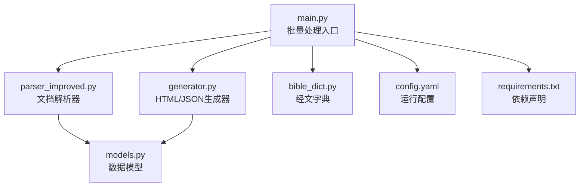
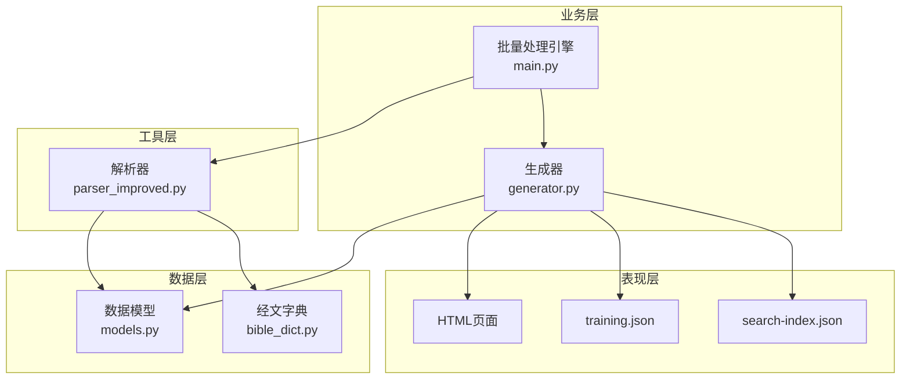
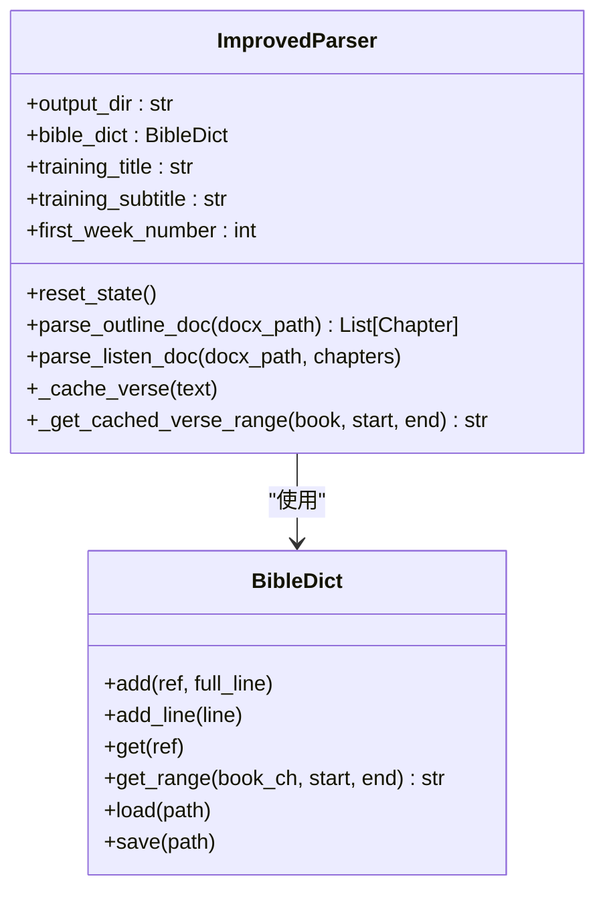
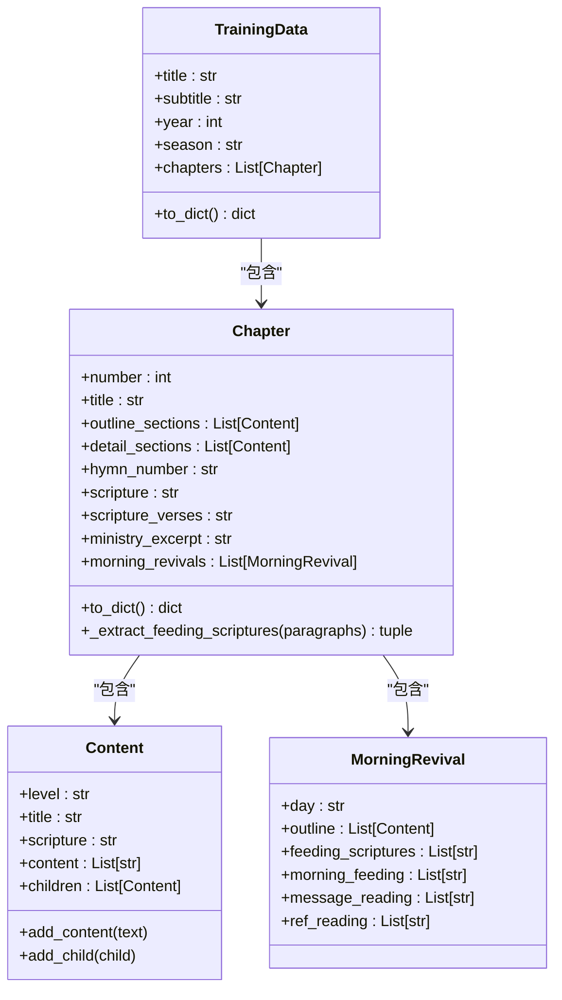
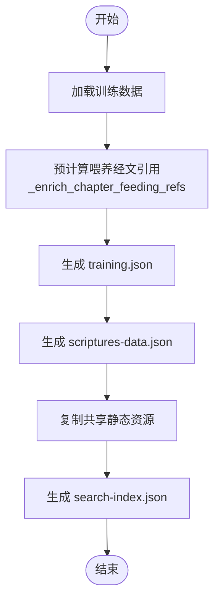
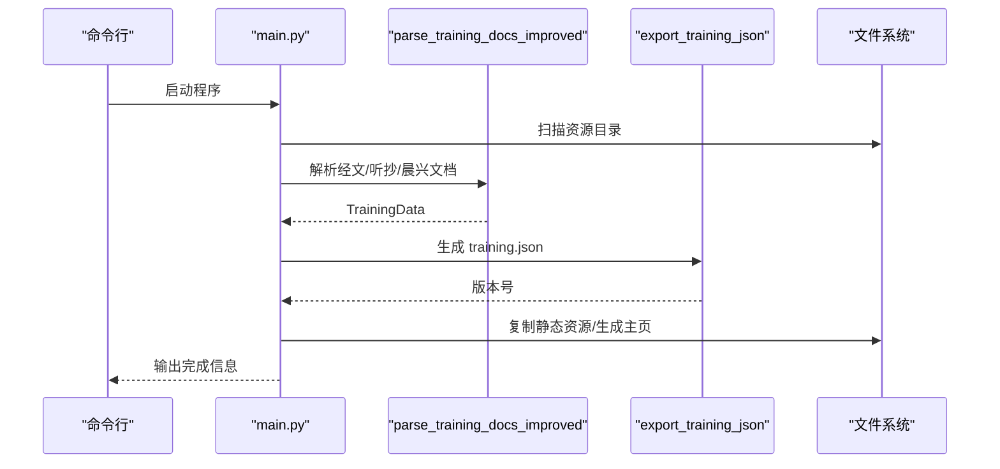
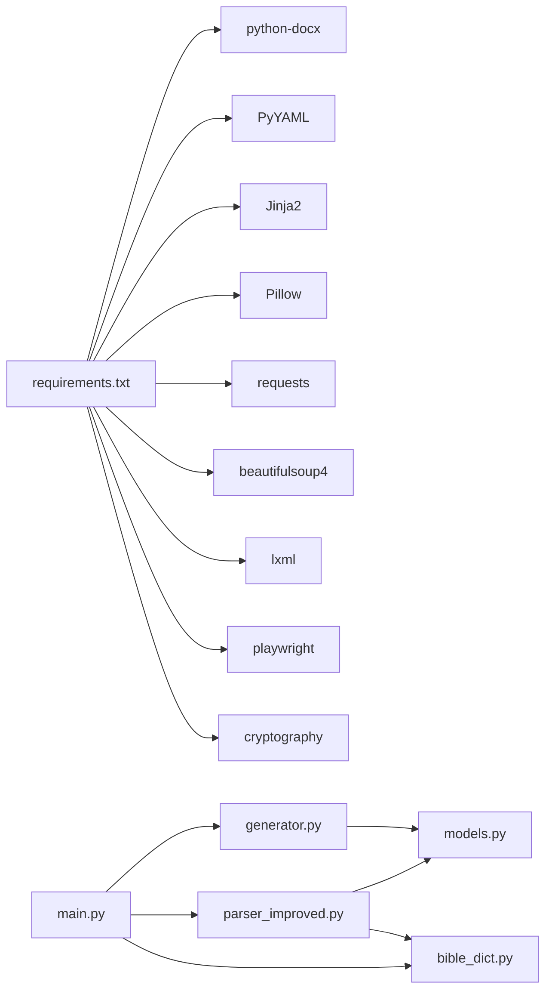

# 架构概览

<cite>
**本文档引用的文件**
- [main.py](file://main.py)
- [parser_improved.py](file://src/parser_improved.py)
- [models.py](file://src/models.py)
- [generator.py](file://src/generator.py)
- [bible_dict.py](file://src/bible_dict.py)
- [config.yaml](file://config.yaml)
- [requirements.txt](file://requirements.txt)
</cite>

## 目录
1. [简介](#简介)
2. [项目结构](#项目结构)
3. [核心组件](#核心组件)
4. [架构总览](#架构总览)
5. [详细组件分析](#详细组件分析)
6. [依赖关系分析](#依赖关系分析)
7. [性能考虑](#性能考虑)
8. [故障排除指南](#故障排除指南)
9. [结论](#结论)

## 简介
本项目是一个面向“训练”文档的静态网站生成系统，目标是从Word文档（.doc/.docx）中提取结构化内容，生成SPA静态站点。系统采用分层架构与模块化设计，核心流程包括：文档扫描、智能解析、数据转换、模板渲染与静态文件生成。本文档聚焦于整体架构、组件职责、数据流与扩展点，帮助开发者快速理解并扩展系统。

## 项目结构
项目采用清晰的模块化组织：
- 核心逻辑位于 src/ 目录：解析器、数据模型、生成器、经文字典
- 批量处理入口位于项目根目录：main.py
- 配置与依赖：config.yaml、requirements.txt
- 模板与静态资源：src/templates、src/static

图表来源
- [main.py:1-901](file://main.py#L1-L901)
- [parser_improved.py:1-2663](file://src/parser_improved.py#L1-L2663)
- [models.py:1-232](file://src/models.py#L1-L232)
- [generator.py:1-545](file://src/generator.py#L1-L545)
- [bible_dict.py:1-96](file://src/bible_dict.py#L1-L96)
- [config.yaml:1-42](file://config.yaml#L1-L42)
- [requirements.txt:1-16](file://requirements.txt#L1-L16)

章节来源
- [main.py:1-901](file://main.py#L1-L901)
- [config.yaml:1-42](file://config.yaml#L1-L42)

## 核心组件
- 文档解析器（parser_improved.py）
  - 负责加载Word文档、识别样式与内容、提取训练标题/副标题、标语、纲目结构、经文范围、职事摘录、晨兴内容等
  - 支持 .doc/.docx，.doc 通过LibreOffice转换
  - 提供经文范围缓存与持久化字典集成，支持“从略”占位符还原
- 数据模型系统（models.py）
  - 定义内容节点、章节、晨兴、训练数据等核心数据结构
  - 提供字典化接口，便于模板渲染与JSON导出
- 静态网站生成器（generator.py）
  - 基于Jinja2模板与自定义过滤器，生成HTML与JSON
  - 生成搜索索引、经文数据JSON、SPA所需资源
- 批量处理引擎（main.py）
  - 扫描资源目录、识别批次、调度解析与生成、汇总主页与静态资源
  - 生成SPA主页、trainings.json、远程配置JS、资源包清单等
- 经文字典（bible_dict.py）
  - 持久化存储经文，支持增量加载与保存，供解析与生成阶段复用

章节来源
- [parser_improved.py:114-800](file://src/parser_improved.py#L114-L800)
- [models.py:9-232](file://src/models.py#L1-L232)
- [generator.py:22-545](file://src/generator.py#L1-L545)
- [main.py:205-314](file://main.py#L205-L314)
- [bible_dict.py:19-96](file://src/bible_dict.py#L1-L96)

## 架构总览
系统采用“分层+模块化”的架构模式：
- 表现层：生成的HTML/JSON与SPA资源
- 业务层：批量处理引擎与生成器
- 数据层：经文字典与训练数据模型
- 工具层：解析器与模板渲染

图表来源
- [main.py:205-314](file://main.py#L205-L314)
- [generator.py:22-545](file://src/generator.py#L1-L545)
- [parser_improved.py:114-800](file://src/parser_improved.py#L114-L800)
- [models.py:9-232](file://src/models.py#L1-L232)
- [bible_dict.py:19-96](file://src/bible_dict.py#L1-L96)

## 详细组件分析

### 文档解析器（ImprovedParser）
职责与能力：
- 文档加载与格式适配（.doc/.docx）
- 标题/副标题/标语提取
- 纲目结构解析（多级标题）
- 经文范围识别与缓存
- 职事摘录与晨兴内容抽取
- 与经文字典协作，还原“从略”占位符

图表来源
- [parser_improved.py:114-800](file://src/parser_improved.py#L114-L800)
- [bible_dict.py:19-96](file://src/bible_dict.py#L1-L96)

章节来源
- [parser_improved.py:15-112](file://src/parser_improved.py#L15-L112)
- [parser_improved.py:366-742](file://src/parser_improved.py#L366-L742)
- [parser_improved.py:744-800](file://src/parser_improved.py#L744-L800)

### 数据模型系统（TrainingData/Chapter/Content）
职责与能力：
- 定义内容树形结构（Content）
- 章节与晨兴数据结构
- 训练数据聚合与字典化
- 经文分离与上下文提取

图表来源
- [models.py:9-232](file://src/models.py#L1-L232)

章节来源
- [models.py:9-175](file://src/models.py#L1-L175)
- [models.py:176-232](file://src/models.py#L176-L232)

### 静态网站生成器（HTMLGenerator）
职责与能力：
- 复制共享静态资源（JS/CSS/图片）
- 生成经文数据JSON（补充经文）
- 生成搜索索引（基于JSON）
- 生成SPA所需的training.json与索引

图表来源
- [generator.py:382-425](file://src/generator.py#L382-L425)
- [generator.py:427-545](file://src/generator.py#L427-L545)
- [generator.py:47-115](file://src/generator.py#L47-L115)

章节来源
- [generator.py:22-202](file://src/generator.py#L1-L202)
- [generator.py:333-372](file://src/generator.py#L333-L372)
- [generator.py:427-545](file://src/generator.py#L427-L545)

### 批量处理引擎（main.py）
职责与能力：
- 扫描资源目录，识别批次与文件
- 调度解析与生成，汇总主页与静态资源
- 生成SPA主页、trainings.json、remote-config.js、资源包清单

图表来源
- [main.py:205-314](file://main.py#L205-L314)
- [main.py:655-901](file://main.py#L655-L901)

章节来源
- [main.py:134-203](file://main.py#L134-L203)
- [main.py:205-314](file://main.py#L205-L314)
- [main.py:317-546](file://main.py#L317-L546)

### 经文字典（BibleDict）
职责与能力：
- 增量存储经文行，避免重复覆盖
- 提供范围查询与持久化读写
- 与解析器协同，支持跨章节“从略”还原

章节来源
- [bible_dict.py:19-96](file://src/bible_dict.py#L1-L96)

## 依赖关系分析
- 运行时依赖：python-docx、PyYAML、Jinja2、Pillow、requests、beautifulsoup4、lxml、playwright、cryptography
- 模块内依赖：main.py 依赖 parser_improved、generator、bible_dict；parser_improved 依赖 models 与 bible_dict；generator 依赖 models

图表来源
- [requirements.txt:1-16](file://requirements.txt#L1-L16)
- [main.py:14-16](file://main.py#L14-L16)
- [parser_improved.py:10-12](file://src/parser_improved.py#L10-L12)
- [generator.py:9-11](file://src/generator.py#L9-L11)

章节来源
- [requirements.txt:1-16](file://requirements.txt#L1-L16)
- [main.py:14-16](file://main.py#L14-L16)

## 性能考虑
- 解析阶段：正则与样式匹配较多，建议在大批量处理时启用“仅处理最新N个批次”策略，减少IO压力
- 生成阶段：静态资源复制与JSON生成为CPU密集型，建议在CI环境下启用JS混淆以优化传输体积
- 经文处理：经文范围缓存与持久化字典可显著减少重复解析成本
- 搜索索引：基于JSON的索引生成避免了HTML解析开销，适合大规模站点

## 故障排除指南
常见问题与定位要点：
- 文档格式问题：.doc 需要LibreOffice转换，若失败请手动转换或安装LibreOffice
- 配置加载失败：检查 config.yaml 格式与字段
- 依赖缺失：确认 requirements.txt 中依赖已安装
- 资源复制失败：生成器会忽略静态资源复制异常，不影响HTML生成
- 批量处理中断：可通过配置项控制严格退出策略

章节来源
- [parser_improved.py:35-112](file://src/parser_improved.py#L35-L112)
- [main.py:54-58](file://main.py#L54-L58)
- [generator.py:112-115](file://src/generator.py#L112-L115)
- [config.yaml:1-42](file://config.yaml#L1-L42)

## 结论
本系统通过清晰的分层与模块化设计，实现了从Word文档到静态网站的自动化流水线。核心在于：
- 解析器对多样文档格式与复杂结构的稳健处理
- 数据模型对内容层次的准确抽象
- 生成器对模板与静态资源的统一管理
- 批量引擎对规模化产出的控制与优化

扩展建议：
- 增加单元测试覆盖关键解析与生成逻辑
- 引入缓存与增量更新机制，提升迭代效率
- 丰富模板与过滤器，增强前端渲染灵活性
- 支持更多文档格式与外部数据源