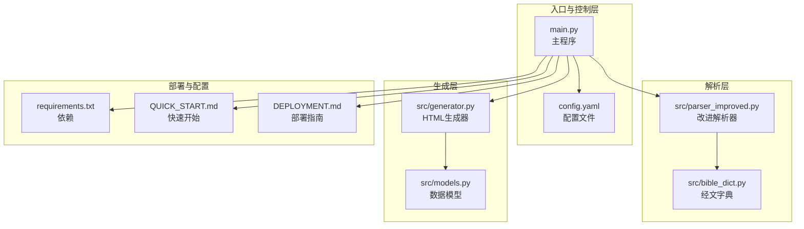
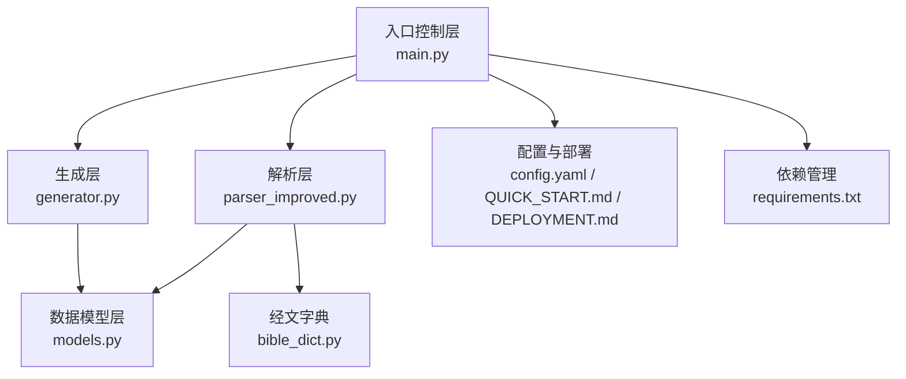
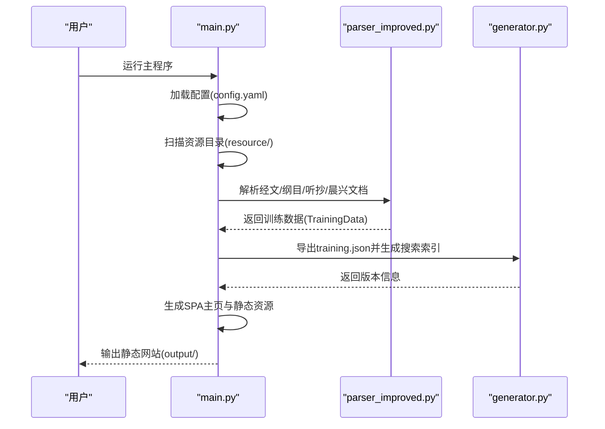
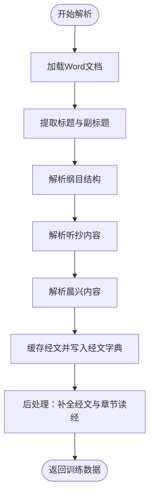
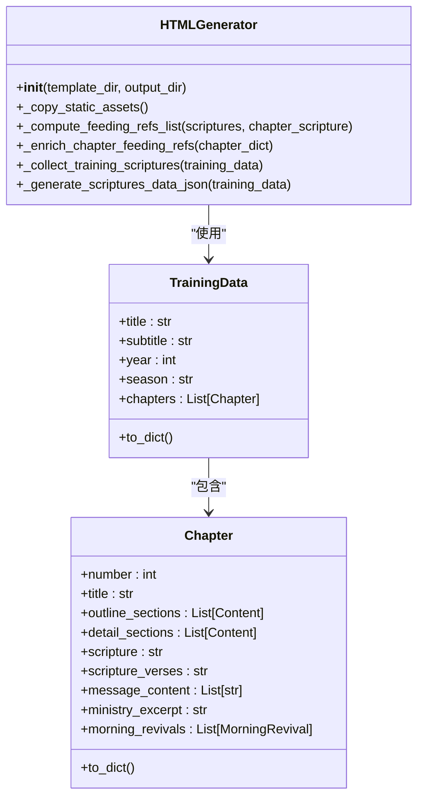
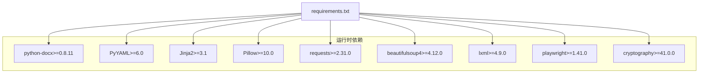

# 项目介绍

<cite>
**本文档引用的文件**
- [main.py](file://main.py)
- [parser_improved.py](file://src/parser_improved.py)
- [generator.py](file://src/generator.py)
- [models.py](file://src/models.py)
- [bible_dict.py](file://src/bible_dict.py)
- [config.yaml](file://config.yaml)
- [requirements.txt](file://requirements.txt)
- [QUICK_START.md](file://QUICK_START.md)
- [DEPLOYMENT.md](file://DEPLOYMENT.md)
</cite>

## 目录
1. [简介](#简介)
2. [项目结构](#项目结构)
3. [核心组件](#核心组件)
4. [架构概览](#架构概览)
5. [详细组件分析](#详细组件分析)
6. [依赖分析](#依赖分析)
7. [性能考量](#性能考量)
8. [故障排除指南](#故障排除指南)
9. [结论](#结论)
10. [附录](#附录)

## 简介
CX项目是一个基于Python的Word文档批量处理与静态网站生成工具，专为自动化处理训练文档并生成完全静态的SPA（单页应用）网站而设计。该项目能够高效处理大量Word文档，自动识别经文、纲目、晨兴等内容结构，最终生成支持离线访问的静态网站，便于在各种平台上部署与分发。

### 核心价值与业务场景
- **自动化文档处理**：通过智能解析Word文档，自动提取经文、纲目、听抄、晨兴等结构化内容，减少人工整理成本。
- **批量处理能力**：支持按批次扫描资源目录，批量生成静态网站，适合大规模训练资料的统一管理与发布。
- **静态SPA网站**：生成完全静态的SPA网站，具备离线访问能力，支持多平台部署（Cloudflare Pages、GitHub Pages等）。
- **多平台部署支持**：提供一键部署脚本与配置，支持Cloudflare Pages等云平台的自动化构建与发布。
- **智能文档解析**：内置改进的解析器，支持多种样式与格式，能够准确识别中文数字、章节范围、经文引用等复杂内容。

### 目标用户群体与使用场景
- **训练组织者**：需要定期整理和发布训练资料的组织者，可通过本工具快速生成静态网站供成员学习。
- **技术团队**：需要自动化构建与部署静态站点的技术团队，可利用本工具实现CI/CD流水线集成。
- **个人用户**：希望将Word文档转换为可离线访问的静态网站的个人用户，便于在无网络环境下学习。

## 项目结构
项目采用模块化设计，主要分为以下几个层次：
- **入口与控制层**：负责加载配置、扫描资源、批量处理与生成静态网站。
- **解析层**：负责解析Word文档，提取结构化内容。
- **生成层**：负责生成静态HTML、JSON与搜索索引。
- **数据模型层**：定义训练、篇章、内容等数据结构。
- **配置与部署**：提供配置文件与部署脚本，支持一键部署到云平台。

**图表来源**
- [main.py:655-800](file://main.py#L655-L800)
- [parser_improved.py:114-800](file://src/parser_improved.py#L114-L800)
- [generator.py:22-545](file://src/generator.py#L22-L545)
- [models.py:9-232](file://src/models.py#L9-L232)
- [bible_dict.py:19-96](file://src/bible_dict.py#L19-L96)
- [config.yaml:1-42](file://config.yaml#L1-L42)
- [requirements.txt:1-16](file://requirements.txt#L1-L16)
- [QUICK_START.md:1-181](file://QUICK_START.md#L1-L181)
- [DEPLOYMENT.md:1-157](file://DEPLOYMENT.md#L1-L157)

**章节来源**
- [main.py:655-800](file://main.py#L655-L800)
- [config.yaml:1-42](file://config.yaml#L1-L42)

## 核心组件
- **主程序（main.py）**：负责加载配置、扫描资源目录、批量处理Word文档、生成静态网站与SPA页面。
- **改进解析器（parser_improved.py）**：解析Word文档，提取经文、纲目、听抄、晨兴等内容，支持多种样式与格式。
- **HTML生成器（generator.py）**：生成静态HTML、JSON与搜索索引，支持SPA模式。
- **数据模型（models.py）**：定义TrainingData、Chapter、Content、MorningRevival等数据结构。
- **经文字典（bible_dict.py）**：持久化存储经文，支持增量累积与查询。
- **配置文件（config.yaml）**：提供批量处理、输出目录、模板目录等配置项。
- **依赖文件（requirements.txt）**：定义运行时依赖，包括python-docx、PyYAML、Jinja2等。
- **部署文档（QUICK_START.md、DEPLOYMENT.md）**：提供一键部署到Cloudflare Pages的详细步骤与配置。

**章节来源**
- [main.py:1-800](file://main.py#L1-L800)
- [parser_improved.py:1-800](file://src/parser_improved.py#L1-L800)
- [generator.py:1-545](file://src/generator.py#L1-L545)
- [models.py:1-232](file://src/models.py#L1-L232)
- [bible_dict.py:1-96](file://src/bible_dict.py#L1-L96)
- [config.yaml:1-42](file://config.yaml#L1-L42)
- [requirements.txt:1-16](file://requirements.txt#L1-L16)
- [QUICK_START.md:1-181](file://QUICK_START.md#L1-L181)
- [DEPLOYMENT.md:1-157](file://DEPLOYMENT.md#L1-L157)

## 架构概览
项目采用“入口控制层-解析层-生成层-数据模型层-配置与部署”的分层架构，通过模块化设计实现高内聚、低耦合。

**图表来源**
- [main.py:655-800](file://main.py#L655-L800)
- [parser_improved.py:114-800](file://src/parser_improved.py#L114-L800)
- [generator.py:22-545](file://src/generator.py#L22-L545)
- [models.py:9-232](file://src/models.py#L9-L232)
- [bible_dict.py:19-96](file://src/bible_dict.py#L19-L96)
- [config.yaml:1-42](file://config.yaml#L1-L42)
- [requirements.txt:1-16](file://requirements.txt#L1-L16)
- [QUICK_START.md:1-181](file://QUICK_START.md#L1-L181)
- [DEPLOYMENT.md:1-157](file://DEPLOYMENT.md#L1-L157)

## 详细组件分析

### 主程序（main.py）
主程序负责整体流程控制，包括配置加载、资源扫描、文档处理、静态网站生成与SPA页面构建。

**图表来源**
- [main.py:655-800](file://main.py#L655-L800)
- [parser_improved.py:366-743](file://src/parser_improved.py#L366-L743)
- [generator.py:382-425](file://src/generator.py#L382-L425)

**章节来源**
- [main.py:655-800](file://main.py#L655-L800)

### 改进解析器（parser_improved.py）
解析器负责从Word文档中提取结构化内容，支持多种样式与格式，能够准确识别中文数字、章节范围、经文引用等。

**图表来源**
- [parser_improved.py:366-743](file://src/parser_improved.py#L366-L743)
- [bible_dict.py:19-96](file://src/bible_dict.py#L19-L96)

**章节来源**
- [parser_improved.py:1-800](file://src/parser_improved.py#L1-L800)
- [bible_dict.py:1-96](file://src/bible_dict.py#L1-L96)

### HTML生成器（generator.py）
HTML生成器负责生成静态HTML、JSON与搜索索引，支持SPA模式，能够处理复杂的模板与静态资源。

**图表来源**
- [generator.py:22-545](file://src/generator.py#L22-L545)
- [models.py:196-232](file://src/models.py#L196-L232)

**章节来源**
- [generator.py:1-545](file://src/generator.py#L1-L545)
- [models.py:1-232](file://src/models.py#L1-L232)

### 数据模型（models.py）
数据模型定义了训练、篇章、内容、晨兴等核心数据结构，支持字典序列化与模板渲染。

**章节来源**
- [models.py:1-232](file://src/models.py#L1-L232)

### 经文字典（bible_dict.py）
经文字典负责持久化存储经文，支持增量累积与查询，确保跨章节的“从略”还原与经文补全。

**章节来源**
- [bible_dict.py:1-96](file://src/bible_dict.py#L1-L96)

## 依赖分析
项目依赖于多个Python库，涵盖文档解析、模板渲染、HTTP请求、加密等功能。

**图表来源**
- [requirements.txt:1-16](file://requirements.txt#L1-L16)

**章节来源**
- [requirements.txt:1-16](file://requirements.txt#L1-L16)

## 性能考量
- **批量处理优化**：通过扫描资源目录与批量处理Word文档，减少重复解析与生成过程，提升整体效率。
- **静态资源复用**：共享JS/CSS与图标资源，减少重复拷贝与网络传输。
- **搜索索引生成**：在所有training.json生成后统一构建搜索索引，避免频繁的索引重建。
- **压缩与混淆**：在CI环境中可选地对JS进行混淆，减少包体大小，提升加载速度。

## 故障排除指南
- **.doc文件转换问题**：Cloudflare Pages无法安装LibreOffice，需确保所有文档为.docx格式。若必须使用.doc文件，请在本地转换为.docx后再推送。
- **构建命令错误**：确认构建命令为`chmod +x build.sh && ./build.sh`，输出目录为`output`。
- **环境变量配置**：在Cloudflare Pages项目中添加环境变量`PYTHON_VERSION=3.9`与`DEBIAN_FRONTEND=noninteractive`。
- **部署失败排查**：在Cloudflare Pages项目中查看部署日志，常见问题包括Python版本不匹配、依赖安装失败、构建命令错误等。

**章节来源**
- [DEPLOYMENT.md:36-40](file://DEPLOYMENT.md#L36-L40)
- [DEPLOYMENT.md:120-128](file://DEPLOYMENT.md#L120-L128)

## 结论
CX项目通过模块化设计与智能解析能力，实现了Word文档的自动化处理与静态SPA网站的生成，具备高效的批量处理能力与多平台部署支持。其核心价值在于简化训练资料的整理与发布流程，提升用户体验与可访问性，适用于训练组织者、技术团队与个人用户的多样化需求。

## 附录
- **快速开始**：参考[QUICK_START.md:1-181](file://QUICK_START.md#L1-L181)，了解一键部署到Cloudflare Pages的详细步骤。
- **部署指南**：参考[DEPLOYMENT.md:1-157](file://DEPLOYMENT.md#L1-L157)，掌握Cloudflare Pages的配置与日常使用。
- **配置说明**：参考[config.yaml:1-42](file://config.yaml#L1-L42)，了解批量处理、输出目录、模板目录等配置项。