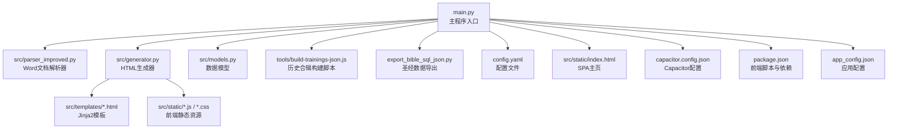
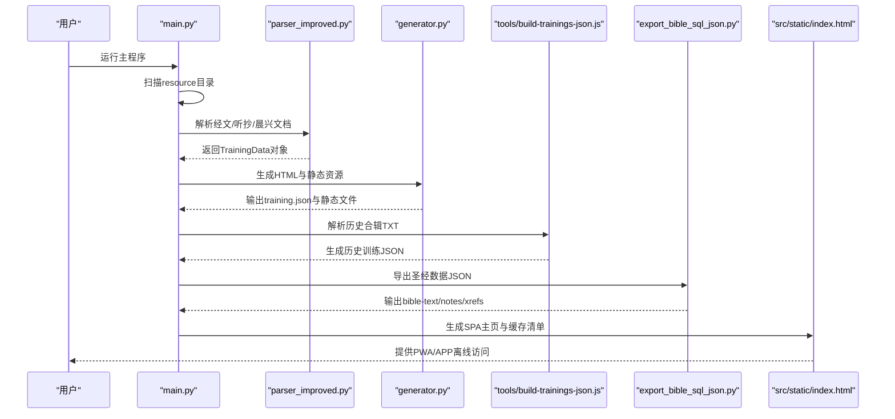
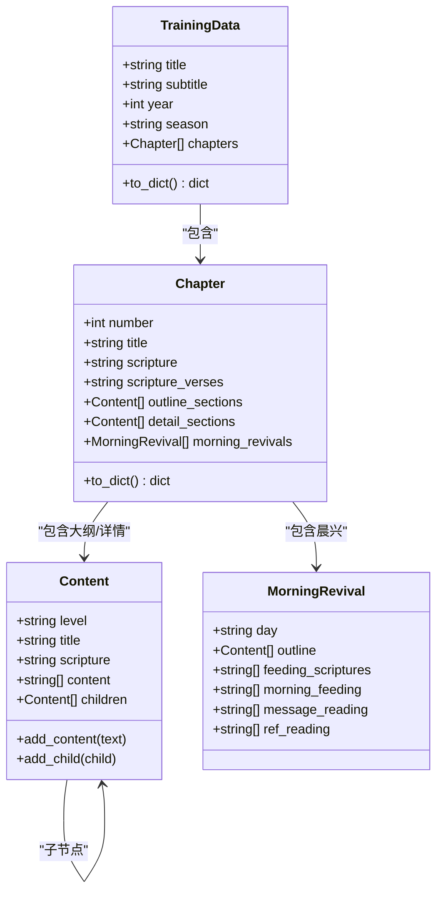
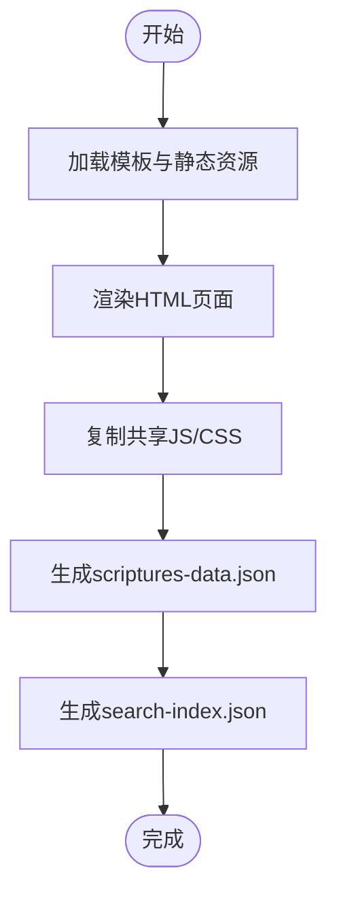
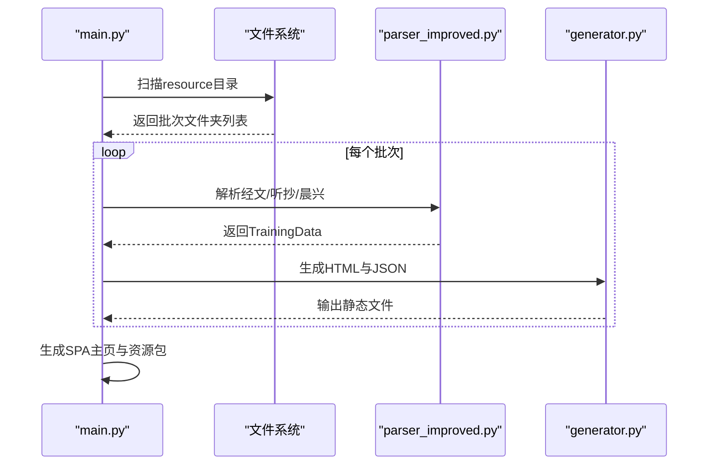
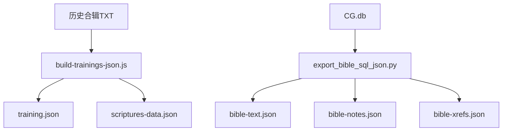
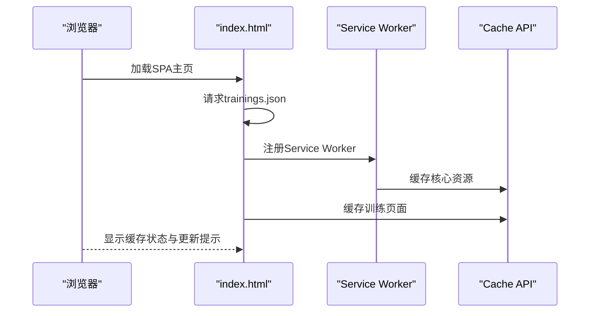
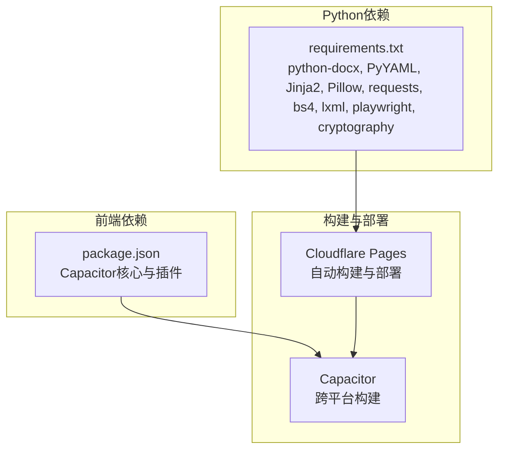

# 项目概述

<cite>
**本文档引用的文件**
- [README.md](file://README.md)
- [main.py](file://main.py)
- [src/parser_improved.py](file://src/parser_improved.py)
- [src/generator.py](file://src/generator.py)
- [src/models.py](file://src/models.py)
- [config.yaml](file://config.yaml)
- [package.json](file://package.json)
- [capacitor.config.json](file://capacitor.config.json)
- [src/static/index.html](file://src/static/index.html)
- [tools/build-trainings-json.js](file://tools/build-trainings-json.js)
- [export_bible_sql_json.py](file://export_bible_sql_json.py)
- [QUICK_START.md](file://QUICK_START.md)
- [requirements.txt](file://requirements.txt)
- [app_config.json](file://app_config.json)
- [DEPLOYMENT.md](file://DEPLOYMENT.md)
</cite>

## 目录
1. [简介](#简介)
2. [项目结构](#项目结构)
3. [核心组件](#核心组件)
4. [架构总览](#架构总览)
5. [详细组件分析](#详细组件分析)
6. [依赖关系分析](#依赖关系分析)
7. [性能考量](#性能考量)
8. [故障排查指南](#故障排查指南)
9. [结论](#结论)
10. [附录](#附录)

## 简介
CX项目是一个基于Python的Word文档批量处理与静态网站生成工具，专为特会信息内容而设计。项目支持从Word文档（.doc/.docx）中提取结构化内容，自动生成多页面静态网站，并提供移动端优先的响应式设计与离线访问能力。项目同时支持通过Cloudflare Pages进行云端部署，或使用Capacitor构建跨平台桌面/移动应用，满足多场景使用需求。

**更新** 项目已从"晨读应用"升级为"属灵资源多端分发平台"，体现了从单一阅读应用向综合性精神资源分发平台的演进。虽然移动应用仍保持"晨读"的应用名称，但整体平台描述已更新为更全面的资源分发解决方案。

业务价值：
- 自动化处理训练文档，显著降低人工整理成本
- 生成结构清晰、可搜索的静态网站，便于查阅与分享
- 支持离线缓存与PWA/安卓应用，保障无网络环境下的可用性
- 提供历史合辑的本地导入与资源包管理，提升内容复用效率
- 作为属灵资源多端分发平台，支持跨平台、跨设备的统一资源管理

技术选型理由：
- Python后端：强大的文档解析与数据处理能力，生态丰富，易于扩展
- JavaScript前端：现代化SPA体验，结合PWA与Capacitor实现跨平台部署
- Capacitor：统一的跨平台框架，兼顾Web与原生能力
- Jinja2模板引擎：简洁高效的HTML生成与静态资源管理

## 项目结构
项目采用"Python后端 + JavaScript前端 + Capacitor跨平台"的分层架构，核心目录与职责如下：
- src：Python源代码，包含数据模型、解析器、HTML生成器与模板
- resource：Word源文档与历史合辑TXT资源
- output：生成的静态HTML、JS/CSS、图片与JSON数据
- tools：Node.js构建脚本，处理历史合辑TXT并生成training.json
- src/static：前端静态资源（HTML、JS、CSS、图标）
- android：Capacitor Android工程（由Capacitor CLI生成）

**图表来源**
- [main.py:655-800](file://main.py#L655-L800)
- [src/parser_improved.py:1-120](file://src/parser_improved.py#L1-L120)
- [src/generator.py:22-50](file://src/generator.py#L22-L50)
- [src/models.py:9-232](file://src/models.py#L9-L232)
- [tools/build-trainings-json.js:1-120](file://tools/build-trainings-json.js#L1-L120)
- [export_bible_sql_json.py:1-120](file://export_bible_sql_json.py#L1-L120)
- [config.yaml:1-42](file://config.yaml#L1-L42)
- [src/static/index.html:1-120](file://src/static/index.html#L1-L120)
- [capacitor.config.json:1-10](file://capacitor.config.json#L1-L10)
- [package.json:1-30](file://package.json#L1-L30)
- [app_config.json:1-5](file://app_config.json#L1-L5)

**章节来源**
- [README.md:52-88](file://README.md#L52-L88)
- [config.yaml:1-42](file://config.yaml#L1-L42)

## 核心组件
- 数据模型（models.py）：定义篇章、内容节点、晨兴内容等数据结构，支持字典序列化与模板渲染
- 文档解析器（parser_improved.py）：支持.doc/.docx混合格式，自动识别样式与层级，提取经文、诗歌与标语
- HTML生成器（generator.py）：基于Jinja2模板生成静态页面，复制共享JS/CSS资源，生成搜索索引
- 主程序（main.py）：批量扫描资源目录，处理批次文档，生成SPA主页与历史资源包
- 历史合辑构建（tools/build-trainings-json.js）：解析TXT合辑，生成training.json与补充经文
- 圣经数据导出（export_bible_sql_json.py）：从SQLite导出bible-text/notes/xrefs JSON，供前端增强展示
- 前端SPA（src/static/index.html）：PWA/APP外壳，动态加载训练列表，提供缓存与更新机制
- 跨平台配置（capacitor.config.json、package.json）：定义应用ID、Web目录与Capacitor插件
- 应用配置（app_config.json）：定义应用名称、ID和版本信息

**章节来源**
- [src/models.py:9-232](file://src/models.py#L9-L232)
- [src/parser_improved.py:114-190](file://src/parser_improved.py#L114-L190)
- [src/generator.py:22-120](file://src/generator.py#L22-L120)
- [main.py:655-800](file://main.py#L655-L800)
- [tools/build-trainings-json.js:1-120](file://tools/build-trainings-json.js#L1-L120)
- [export_bible_sql_json.py:1-120](file://export_bible_sql_json.py#L1-L120)
- [src/static/index.html:1-120](file://src/static/index.html#L1-L120)
- [capacitor.config.json:1-10](file://capacitor.config.json#L1-L10)
- [package.json:1-30](file://package.json#L1-L30)
- [app_config.json:1-5](file://app_config.json#L1-L5)

## 架构总览
项目采用"批处理 + 静态生成 + SPA前端 + 跨平台部署"的整体架构。核心流程：
- 批量扫描resource目录下的批次文件夹
- 解析经文、听抄、晨兴等文档，生成training.json
- 生成SPA主页与静态资源，复制到output目录
- 历史合辑通过Node.js脚本解析TXT并生成training.json
- 圣经数据通过Python脚本导出JSON供前端增强
- 通过Cloudflare Pages或Capacitor进行部署与分发

**图表来源**
- [main.py:655-800](file://main.py#L655-L800)
- [src/parser_improved.py:366-743](file://src/parser_improved.py#L366-L743)
- [src/generator.py:382-425](file://src/generator.py#L382-L425)
- [tools/build-trainings-json.js:357-417](file://tools/build-trainings-json.js#L357-L417)
- [export_bible_sql_json.py:353-404](file://export_bible_sql_json.py#L353-L404)
- [src/static/index.html:269-407](file://src/static/index.html#L269-L407)

## 详细组件分析

### 数据模型与解析器
- 数据模型：使用dataclass定义Chapter、Content、MorningRevival等，支持层级结构与字典序列化
- 解析器：支持.doc/.docx混合格式，自动识别样式与层级，提取经文、诗歌与标语，处理"从略"占位符
- 经文处理：提供经文范围解析、半节标记补全、跨章节引用归一化

**图表来源**
- [src/models.py:9-232](file://src/models.py#L9-L232)

**章节来源**
- [src/models.py:9-232](file://src/models.py#L9-L232)
- [src/parser_improved.py:114-190](file://src/parser_improved.py#L114-L190)

### HTML生成器与模板
- 模板引擎：使用Jinja2加载模板目录，复制共享JS/CSS到根目录
- 资源管理：复制前端静态资源，生成scriptures-data.json补充经文
- 搜索索引：基于training.json生成search-index.json，支持全文检索

**图表来源**
- [src/generator.py:22-120](file://src/generator.py#L22-L120)
- [src/generator.py:382-425](file://src/generator.py#L382-L425)
- [src/generator.py:427-545](file://src/generator.py#L427-L545)

**章节来源**
- [src/generator.py:22-120](file://src/generator.py#L22-L120)
- [src/generator.py:382-425](file://src/generator.py#L382-L425)
- [src/generator.py:427-545](file://src/generator.py#L427-L545)

### 主程序与批量处理
- 批量扫描：扫描resource子目录，自动识别年份与季节，支持指定训练集合
- 文档查找：支持.doc/.docx混合格式，自动查找带编号的晨兴文档
- SPA主页：生成trainings.json、复制SPA shell与静态资源，注入远程配置

**图表来源**
- [main.py:134-157](file://main.py#L134-L157)
- [main.py:205-314](file://main.py#L205-L314)
- [main.py:317-547](file://main.py#L317-L547)

**章节来源**
- [main.py:134-157](file://main.py#L134-L157)
- [main.py:205-314](file://main.py#L205-L314)
- [main.py:317-547](file://main.py#L317-L547)

### 历史合辑与圣经数据
- 历史合辑：Node.js脚本解析TXT合辑，生成training.json与补充经文
- 圣经数据：Python脚本从SQLite导出bible-text/notes/xrefs JSON，供前端增强展示

**图表来源**
- [tools/build-trainings-json.js:1-120](file://tools/build-trainings-json.js#L1-L120)
- [export_bible_sql_json.py:353-404](file://export_bible_sql_json.py#L353-L404)

**章节来源**
- [tools/build-trainings-json.js:1-120](file://tools/build-trainings-json.js#L1-L120)
- [export_bible_sql_json.py:353-404](file://export_bible_sql_json.py#L353-L404)

### 前端SPA与离线缓存
- SPA主页：动态加载trainings.json，渲染训练卡片与导航
- 缓存策略：PWA通过Cache API缓存核心资源与训练页面，支持强制安装与更新提示
- 资源包：生成历史训练资源包，支持按10年分组下载

**图表来源**
- [src/static/index.html:269-407](file://src/static/index.html#L269-L407)
- [src/static/index.html:749-791](file://src/static/index.html#L749-L791)

**章节来源**
- [src/static/index.html:269-407](file://src/static/index.html#L269-L407)
- [src/static/index.html:749-791](file://src/static/index.html#L749-L791)

### 应用配置与跨平台支持
- 应用配置：app_config.json定义应用名称"TeHui"、应用ID和版本信息
- 跨平台配置：capacitor.config.json配置应用ID"com.tehui.offline"、应用名为"晨读"
- 包管理：package.json定义应用描述为"晨读信息合集 - 安卓应用"

**章节来源**
- [app_config.json:1-5](file://app_config.json#L1-L5)
- [capacitor.config.json:1-10](file://capacitor.config.json#L1-L10)
- [package.json:1-30](file://package.json#L1-L30)

## 依赖关系分析
- Python运行时：依赖python-docx、PyYAML、Jinja2、Pillow等库
- 前端构建：Capacitor CLI与Android构建链
- 云端部署：Cloudflare Pages自动构建与部署
- 可选工具：LibreOffice用于.doc格式转换

**图表来源**
- [requirements.txt:1-16](file://requirements.txt#L1-L16)
- [package.json:16-29](file://package.json#L16-L29)
- [QUICK_START.md:1-181](file://QUICK_START.md#L1-L181)

**章节来源**
- [requirements.txt:1-16](file://requirements.txt#L1-L16)
- [package.json:16-29](file://package.json#L16-L29)
- [QUICK_START.md:1-181](file://QUICK_START.md#L1-L181)

## 性能考量
- 批量处理：支持按时间窗口选择最新N个批次，控制打包体积与构建时间
- 资源压缩：生成JSON去缩进，减少体积
- 缓存策略：PWA按训练分缓存，核心资源集中缓存，支持增量更新
- 跨平台优化：Capacitor WebView禁用SW，直接填充Cache API，避免阻塞

## 故障排查指南
- .doc格式问题：项目已移除win32com依赖，建议使用LibreOffice转换或手动转换为.docx
- 部署失败：检查Cloudflare Pages构建命令、环境变量与GitHub Secrets配置
- 本地缓存异常：通过管理面板清理缓存与本地数据，重试安装流程
- 历史合辑重复：脚本内置同年重复检测，避免生成重复训练目录

**章节来源**
- [README.md:27-42](file://README.md#L27-L42)
- [QUICK_START.md:115-143](file://QUICK_START.md#L115-L143)

## 结论
CX项目通过Python后端与JavaScript前端的协同，实现了从Word文档到静态网站的自动化生产，并提供了PWA与Capacitor跨平台部署能力。其架构清晰、扩展性强，既适合云端部署，也能满足离线访问与多终端使用的需求。项目在文档解析、数据建模、静态生成与前端缓存等方面均体现了良好的工程实践。

**更新** 项目已演进为"属灵资源多端分发平台"，在保持原有功能基础上，进一步强化了跨平台资源分发能力，为用户提供更加全面的属灵资源获取与管理体验。

## 附录

### 快速开始指南
- 配置config.yaml，设置特会信息与文档路径
- 准备resource目录下的批次文档（支持.doc/.docx混合）
- 运行python main.py生成静态站点
- 通过Cloudflare Pages或Capacitor进行部署

**章节来源**
- [README.md:90-153](file://README.md#L90-L153)
- [QUICK_START.md:1-181](file://QUICK_START.md#L1-L181)
- [DEPLOYMENT.md:1-157](file://DEPLOYMENT.md#L1-L157)