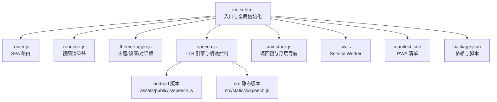
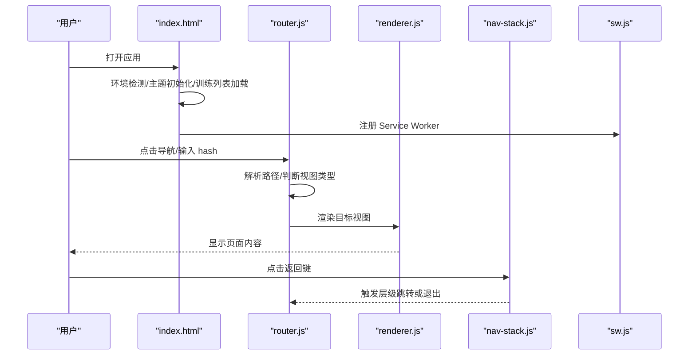
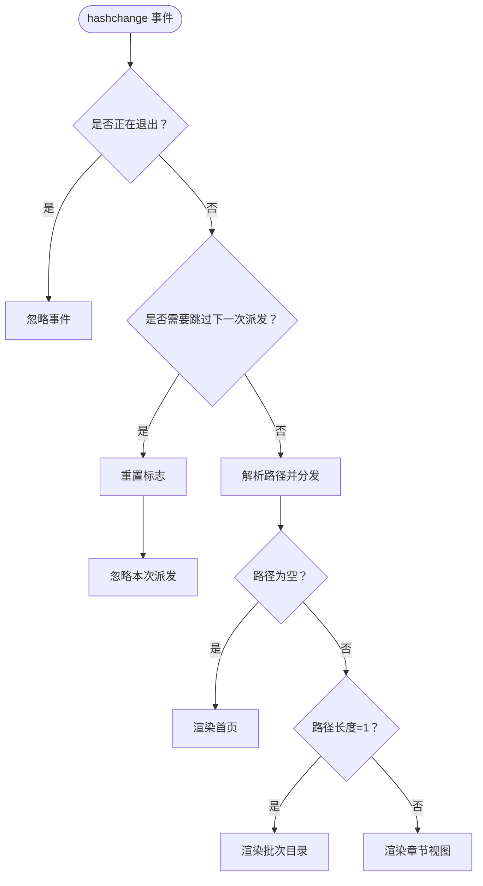
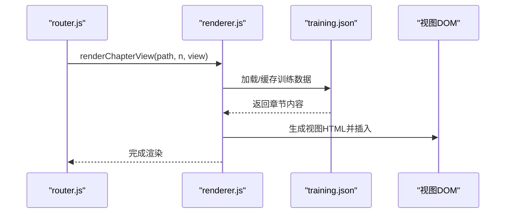
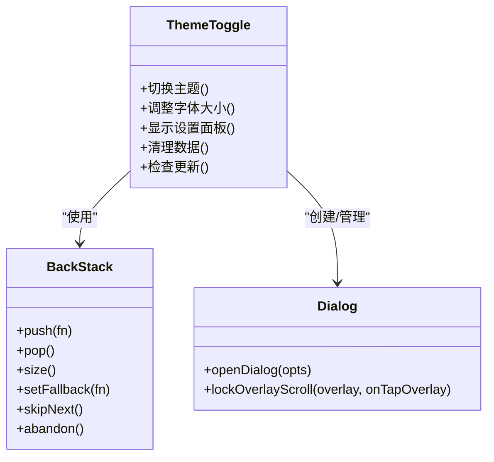
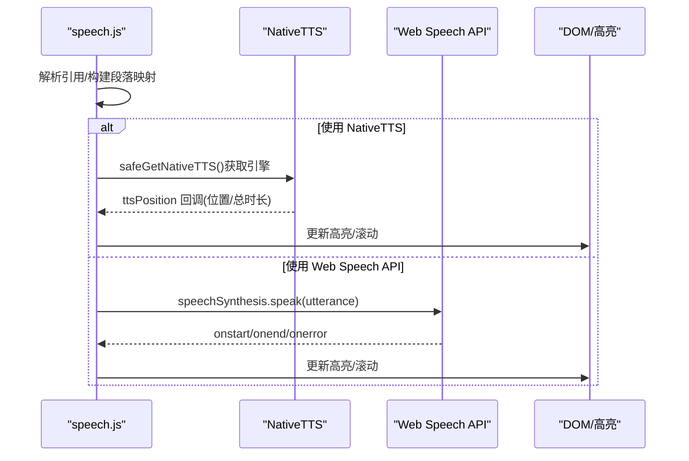
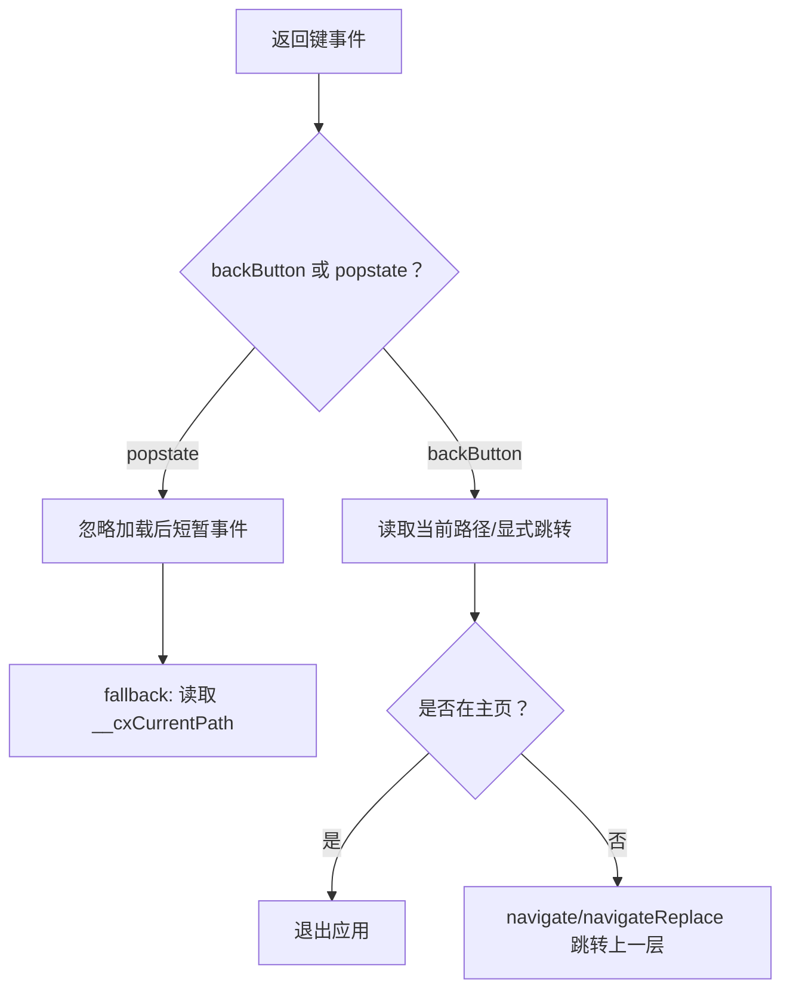
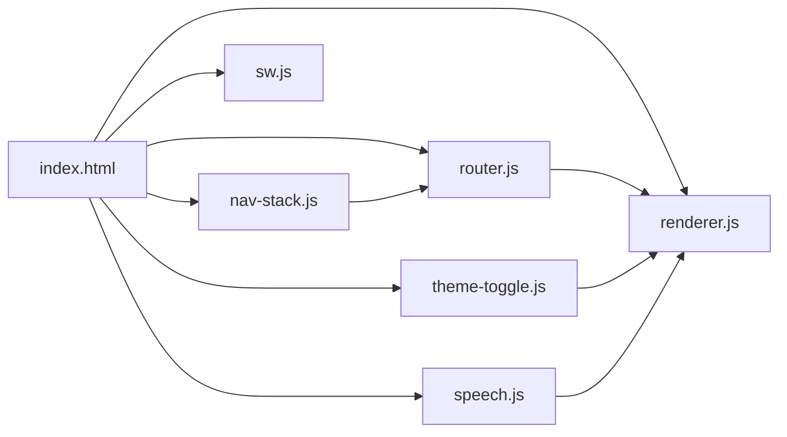

# 前端功能

<cite>
**本文档引用的文件**
- [index.html](file://android/app/src/main/assets/public/index.html)
- [router.js](file://android/app/src/main/assets/public/js/router.js)
- [theme-toggle.js](file://android/app/src/main/assets/public/js/theme-toggle.js)
- [speech.js](file://android/app/src/main/assets/public/js/speech.js)
- [speech.js](file://src/static/js/speech.js)
- [nav-stack.js](file://android/app/src/main/assets/public/js/nav-stack.js)
- [renderer.js](file://android/app/src/main/assets/public/js/renderer.js)
- [sw.js](file://android/app/src/main/assets/public/sw.js)
- [manifest.json](file://android/app/src/main/assets/public/manifest.json)
- [package.json](file://package.json)
</cite>

## 更新摘要
**变更内容**
- 新增了src/static/js/speech.js文件的详细分析，展示了与android/app/src/main/assets/public/js/speech.js的对比
- 更新了语音合成章节，重点介绍了safeGetNativeTTS()函数的引入和双机制恢复逻辑改进
- 添加了pause/resume功能增强的技术细节，包括_nativePositionHandle和_nativeProgressHandle的改进
- 更新了NativeTTS集成优化的相关内容

## 目录
1. [简介](#简介)
2. [项目结构](#项目结构)
3. [核心组件](#核心组件)
4. [架构总览](#架构总览)
5. [详细组件分析](#详细组件分析)
6. [依赖关系分析](#依赖关系分析)
7. [性能考虑](#性能考虑)
8. [故障排查指南](#故障排查指南)
9. [结论](#结论)

## 简介
本文件面向 CX 项目的前端功能，系统性梳理其 JavaScript 架构与实现要点，涵盖模块化设计、事件驱动与异步处理、路由系统、主题切换、语音合成、书签与阅读进度、离线缓存与 PWA、以及性能优化实践。文档既关注代码层面的实现细节，也提供可视化图表帮助理解组件间的关系与数据流。

## 项目结构
前端资源位于 Android 原生应用的 assets/public 目录中，采用单页应用（SPA）架构，配合 Capacitor 与 PWA 能力实现跨平台体验。核心文件包括：
- 入口与全局初始化：index.html
- 路由与导航：router.js、nav-stack.js
- 渲染器：renderer.js
- 主题与设置：theme-toggle.js
- 语音合成：speech.js（包含android版本和src静态版本）
- 离线与缓存：sw.js、manifest.json
- 依赖与构建：package.json

**图表来源**
- [index.html](file://android/app/src/main/assets/public/index.html)
- [router.js](file://android/app/src/main/assets/public/js/router.js)
- [renderer.js](file://android/app/src/main/assets/public/js/renderer.js)
- [theme-toggle.js](file://android/app/src/main/assets/public/js/theme-toggle.js)
- [speech.js](file://android/app/src/main/assets/public/js/speech.js)
- [speech.js](file://src/static/js/speech.js)
- [nav-stack.js](file://android/app/src/main/assets/public/js/nav-stack.js)
- [sw.js](file://android/app/src/main/assets/public/sw.js)
- [manifest.json](file://android/app/src/main/assets/public/manifest.json)
- [package.json](file://package.json)

**章节来源**
- [index.html](file://android/app/src/main/assets/public/index.html)
- [package.json](file://package.json)

## 核心组件
- 路由系统：基于 hash 的 SPA 路由，支持层级跳转与同章节视图切换的特殊处理。
- 渲染器：根据 training.json 数据动态渲染各视图（纲目、听抄、详情、晨读、诗歌、职事）。
- 主题与设置：深色/暖色/冷色主题、字体大小、安装到桌面、检查更新、清理数据等。
- 语音合成：NativeTTS（Capacitor）与 Web Speech API 双引擎，支持句子级高亮与循环播放。
- 导航栈：统一处理返回键（原生与 PWA），屏蔽浏览器历史条目噪声。
- 离线缓存：PWA Service Worker 与 Cache API，结合强制安装与缓存完整性校验。

**章节来源**
- [router.js](file://android/app/src/main/assets/public/js/router.js)
- [renderer.js](file://android/app/src/main/assets/public/js/renderer.js)
- [theme-toggle.js](file://android/app/src/main/assets/public/js/theme-toggle.js)
- [speech.js](file://android/app/src/main/assets/public/js/speech.js)
- [nav-stack.js](file://android/app/src/main/assets/public/js/nav-stack.js)
- [sw.js](file://android/app/src/main/assets/public/sw.js)

## 架构总览
前端采用"入口初始化 + 模块化 JS"的组织方式。index.html 负责环境检测、PWA 注册、训练列表加载、页面记忆与缓存策略；各功能模块通过 window 暴露接口协同工作。

**图表来源**
- [index.html](file://android/app/src/main/assets/public/index.html)
- [router.js](file://android/app/src/main/assets/public/js/router.js)
- [renderer.js](file://android/app/src/main/assets/public/js/renderer.js)
- [nav-stack.js](file://android/app/src/main/assets/public/js/nav-stack.js)
- [sw.js](file://android/app/src/main/assets/public/sw.js)

## 详细组件分析

### 路由系统（router.js）
- 路由格式：#/
  - #/：首页（训练列表）
  - #/{path}：批次目录（章节列表）
  - #/{path}/{n}/{view}：章节视图（cv/cx/h/ts/sg/zs）
- 核心能力：
  - start()：监听 hashchange 并首次派发
  - navigate(hashPath)：跨层级跳转新增历史条目
  - navigateReplace(hashPath)：同章节视图切换使用 replaceState，避免历史膨胀
  - back()：调用 history.back()
  - skipNextDispatch()：屏蔽 ghost 历史条目
- 与导航栈协作：在 hash 赋值时可能触发虚假 popstate，通过 backStack.skipNext() 屏蔽。

**图表来源**
- [router.js](file://android/app/src/main/assets/public/js/router.js)

**章节来源**
- [router.js](file://android/app/src/main/assets/public/js/router.js)

### 渲染器（renderer.js）
- 数据来源：training.json（本地导入或网络加载，原生 App 绕过缓存）
- 视图类型：
  - cv：纲目大纲（递归渲染）
  - h：听抄（消息内容 + 详情段落）
  - ts：详情（按段落渲染）
  - cx：晨读（按日分页，支持手势/键盘翻页）
  - sg：诗歌（图片展示）
  - zs：职事摘录（按段落渲染）
- 滚动位置记忆：按页面键保存/恢复，避免闪屏
- 搜索缓存：异步缓存训练数据，提升搜索性能

**图表来源**
- [renderer.js](file://android/app/src/main/assets/public/js/renderer.js)

**章节来源**
- [renderer.js](file://android/app/src/main/assets/public/js/renderer.js)

### 主题切换与设置（theme-toggle.js）
- 主题：cool/warm/dark，自动适配系统深色模式
- 字体大小：8 档位，持久化存储
- 设置面板：包含安装到桌面、检查更新、清理数据、资源管理、赞助等操作
- 对话框与返回键：统一通过 backStack 管理，支持 ESC 关闭
- 笔记备份：迁移至 IndexedDB 后的备份守卫，防止升级导致数据丢失
- 错误日志：收集同步/异步错误，版本变更时清理旧日志
- 原生崩溃日志：Capacitor 插件桥接，版本升级后清理

**图表来源**
- [theme-toggle.js](file://android/app/src/main/assets/public/js/theme-toggle.js)

**章节来源**
- [theme-toggle.js](file://android/app/src/main/assets/public/js/theme-toggle.js)

### 语音合成（speech.js）
- 引擎选择：NativeTTS（Capacitor Foreground Service，Android APK 背景安全）、Web Speech API（浏览器回退）
- 经文引用展开：将 data-refs 展开为完整书名/章节数，支持"至"压缩
- 句子级高亮：按句注入 <mark>，滚动对齐当前朗读位置
- 进度控制：拖动进度条支持 seek，MediaSession 支持系统控制
- 循环播放：支持循环，自然结束时自动重置
- 电池优化：引导用户将应用加入"不限制"名单
- **新增**：safeGetNativeTTS() 函数提供安全的 NativeTTS 获取机制，支持多种插件名称兼容
- **新增**：双机制恢复逻辑改进，包括 _nativePositionHandle 和 _nativeProgressHandle 的增强

**图表来源**
- [speech.js](file://android/app/src/main/assets/public/js/speech.js)
- [speech.js](file://src/static/js/speech.js)

**章节来源**
- [speech.js](file://android/app/src/main/assets/public/js/speech.js)
- [speech.js](file://src/static/js/speech.js)

### 导航栈与返回键（nav-stack.js）
- 原生（Capacitor）：backButton 事件，按层级显式跳转，必要时退出应用
- PWA：popstate 事件，忽略加载后短暂的虚假事件，fallback 实现层级跳转
- 浮动导航栏：内容页滚动隐藏，空白点击弹出，点击 tab 自动隐藏
- TTS 控制栏：与浮动导航联动，避免布局抖动

**图表来源**
- [nav-stack.js](file://android/app/src/main/assets/public/js/nav-stack.js)

**章节来源**
- [nav-stack.js](file://android/app/src/main/assets/public/js/nav-stack.js)

### 离线缓存与 PWA（sw.js、manifest.json、index.html）
- Service Worker：注册与更新，处理更新发现与控制器切换
- 缓存策略：核心资源 cx-main 与训练命名缓存 cx-{path}
- 强制安装：PWA 首次/版本变更时弹窗提示，支持重试与进度反馈
- 缓存完整性：启动时校验核心资源与训练缓存覆盖率
- Manifest：应用元信息、图标、显示模式、主题色
- 环境检测：区分 Capacitor 原生、PWA Standalone、浏览器

**图表来源**
- [index.html](file://android/app/src/main/assets/public/index.html)
- [sw.js](file://android/app/src/main/assets/public/sw.js)
- [manifest.json](file://android/app/src/main/assets/public/manifest.json)

**章节来源**
- [index.html](file://android/app/src/main/assets/public/index.html)
- [sw.js](file://android/app/src/main/assets/public/sw.js)
- [manifest.json](file://android/app/src/main/assets/public/manifest.json)

## 依赖关系分析
- 模块耦合：
  - router.js 与 renderer.js：路由驱动渲染
  - theme-toggle.js 与 renderer.js：设置面板影响渲染（主题、字体）
  - speech.js 与 renderer.js：视图内容提供朗读文本
  - nav-stack.js 与 router.js：返回键影响路由层级
  - index.html 与 sw.js：PWA 注册与缓存策略
- 外部依赖：
  - Capacitor 生态（App、StatusBar、NativeTTS）
  - Web Speech API（浏览器回退）
  - Cache Storage（PWA 缓存）

**图表来源**
- [index.html](file://android/app/src/main/assets/public/index.html)
- [router.js](file://android/app/src/main/assets/public/js/router.js)
- [renderer.js](file://android/app/src/main/assets/public/js/renderer.js)
- [theme-toggle.js](file://android/app/src/main/assets/public/js/theme-toggle.js)
- [speech.js](file://android/app/src/main/assets/public/js/speech.js)
- [nav-stack.js](file://android/app/src/main/assets/public/js/nav-stack.js)
- [sw.js](file://android/app/src/main/assets/public/sw.js)

**章节来源**
- [package.json](file://package.json)

## 性能考虑
- 代码组织与模块化：按功能拆分模块，减少全局作用域污染，便于按需加载与测试。
- 异步与缓存：
  - training.json 缓存（内存与 Cache Storage），避免重复请求
  - 搜索缓存异步构建，不阻塞首屏渲染
  - 原生 App 绕过 HTTP 缓存，确保资产最新
- 懒加载与滚动优化：
  - 浮动导航与 TTS 控制栏按需创建，避免常驻 DOM
  - 晨读分页器锁定滚动，减少隐式滚动带来的重排
- 事件与内存：
  - 事件监听器在路由切换时清理（如高亮清理、进度定时器）
  - 对话框与返回键栈统一管理，避免内存泄漏
- UI/UX：
  - 防止滚动穿透与点击穿透，提升交互稳定性
  - 进度条与高亮实时更新，降低感知延迟
- **新增**：NativeTTS 集成优化：
  - safeGetNativeTTS() 函数提供安全的插件获取，支持多种兼容性
  - 双机制恢复逻辑改进，提高暂停/恢复的可靠性
  - _nativePositionHandle 和 _nativeProgressHandle 的增强处理

## 故障排查指南
- 语音不可用：
  - 检查引擎检测结果（NativeTTS 插件可用性、Web Speech API 支持）
  - Android 电池优化：引导用户加入"不限制"
  - 句子级高亮：确认 DOM 注入与清理流程
  - **新增**：检查 safeGetNativeTTS() 函数的插件兼容性
- 路由异常：
  - hashchange 与 popstate 的 ghost 条目：确认 skipNextDispatch 使用
  - navigateReplace 与 navigate 的区别：视图切换 vs 层级跳转
- PWA 缓存问题：
  - 核心资源缺失：检查 cx-main 缓存键
  - 训练缓存缺失：检查 cx-{path} 缓存键
  - 强制安装弹窗：确认版本号变化与用户交互
- 返回键行为异常：
  - 原生 backButton 与 PWA popstate 的时机差异
  - fallback 逻辑与加载后短暂虚假事件的处理
- **新增**：NativeTTS 集成问题：
  - 插件名称兼容性：检查 NativeTTS 和 TTSPlugin 的支持
  - 双机制恢复：验证 _nativePositionHandle 和 _nativeProgressHandle 的正确处理
  - 暂停/恢复逻辑：确认暂停时的状态保存和恢复机制

**章节来源**
- [speech.js](file://android/app/src/main/assets/public/js/speech.js)
- [speech.js](file://src/static/js/speech.js)
- [router.js](file://android/app/src/main/assets/public/js/router.js)
- [nav-stack.js](file://android/app/src/main/assets/public/js/nav-stack.js)
- [index.html](file://android/app/src/main/assets/public/index.html)

## 结论
CX 项目的前端以模块化与事件驱动为核心，结合路由、渲染器、主题设置、语音合成与导航栈，形成完整的 SPA 体验，并通过 PWA 与 Capacitor 能力实现跨平台稳定运行。通过合理的缓存策略与性能优化手段，兼顾了离线可用性与交互流畅性。

**更新**：最新的语音合成模块包含了重要的安全性和可靠性改进，包括safeGetNativeTTS()函数的引入和双机制恢复逻辑的增强，显著提升了 NativeTTS 集成的稳定性和兼容性。这些改进确保了在不同版本和配置的设备上都能获得一致的语音朗读体验。

建议持续关注引擎兼容性、缓存完整性与用户反馈渠道，以进一步提升可靠性与可维护性。