# 前端功能

<cite>
**本文档引用的文件**
- [index.html](file://android/app/src/main/assets/public/index.html)
- [router.js](file://android/app/src/main/assets/public/js/router.js)
- [theme-toggle.js](file://android/app/src/main/assets/public/js/theme-toggle.js)
- [theme-toggle.js](file://src/static/js/theme-toggle.js)
- [speech.js](file://android/app/src/main/assets/public/js/speech.js)
- [speech.js](file://src/static/js/speech.js)
- [nav-stack.js](file://android/app/src/main/assets/public/js/nav-stack.js)
- [renderer.js](file://android/app/src/main/assets/public/js/renderer.js)
- [renderer.js](file://src/static/js/renderer.js)
- [highlight.js](file://android/app/src/main/assets/public/js/highlight.js)
- [highlight.js](file://src/static/js/highlight.js)
- [sw.js](file://android/app/src/main/assets/public/sw.js)
- [manifest.json](file://android/app/src/main/assets/public/manifest.json)
- [remote-config.js](file://android/app/src/main/assets/public/js/remote-config.js)
- [remote-config.js](file://output/js/remote-config.js)
- [image-utils.js](file://android/app/src/main/assets/public/js/image-utils.js)
- [style.css](file://android/app/src/main/assets/public/css/style.css)
- [package.json](file://package.json)
- [NativeTTSPlugin.java](file://android/app/src/main/java/com/tehui/offline/NativeTTSPlugin.java)
- [TTSForegroundService.java](file://android/app/src/main/java/com/tehui/offline/TTSForegroundService.java)
- [MainActivity.java](file://android/app/src/main/java/com/tehui/offline/MainActivity.java)
- [dev-console.js](file://android/app/src/main/assets/public/js/dev-console.js)
- [dev-console.js](file://src/static/js/dev-console.js)
</cite>

## 更新摘要
**变更内容**
- 新增全面的服务器可达性检查功能：应用启动时自动检查远程服务器连通性，动态调整UI元素显示
- 增强主题切换功能：新增智能赞助按钮显示机制，基于使用时长和服务器状态的智能显示策略
- 改进的跨页面同步机制，特别是纲目跨天复制功能
- 优化的开发者控制台功能，支持毫秒级时间戳显示
- 新增服务器配置系统，支持多服务器配置、负载均衡和故障转移

## 目录
1. [简介](#简介)
2. [项目结构](#项目结构)
3. [核心组件](#核心组件)
4. [架构总览](#架构总览)
5. [详细组件分析](#详细组件分析)
6. [依赖关系分析](#依赖关系分析)
7. [性能考虑](#性能考虑)
8. [故障排查指南](#故障排查指南)
9. [结论](#结论)

## 简介
本文件面向 CX 项目的前端功能，系统性梳理其 JavaScript 架构与实现要点，涵盖模块化设计、事件驱动与异步处理、路由系统、主题切换、语音合成、书签与阅读进度、离线缓存与 PWA、以及性能优化实践。文档既关注代码层面的实现细节，也提供可视化图表帮助理解组件间的关系与数据流。

**更新**：最新版本显著增强了服务器可达性检查功能，应用启动时自动检查远程服务器连通性，动态调整UI元素显示。新增了全面的文本选择保护系统，包括跨天选择清理机制、选择开始防护和复制事件拦截功能。这些增强功能专门针对TTS阅读界面的文本选择和复制操作进行了优化，确保用户只能复制当前活跃天的内容，防止跨天内容的意外复制。同时，划线标记系统也获得了重要的跨天复制功能，大幅提升了跨页面同步能力。

## 项目结构
前端资源位于 Android 原生应用的 assets/public 目录中，采用单页应用（SPA）架构，配合 Capacitor 与 PWA 能力实现跨平台体验。核心文件包括：
- 入口与全局初始化：index.html
- 路由与导航：router.js、nav-stack.js
- 渲染器：renderer.js
- 主题与设置：theme-toggle.js（包含Android和src静态版本）
- 语音合成：speech.js（包含android版本和src静态版本）
- 划线标记：highlight.js（包含android版本和src静态版本）
- 离线与缓存：sw.js、manifest.json
- 服务器配置：remote-config.js
- 图片工具：image-utils.js
- 样式：style.css
- 依赖与构建：package.json
- 原生插件：NativeTTSPlugin.java、TTSForegroundService.java、MainActivity.java
- 开发者控制台：dev-console.js（包含android版本和src静态版本）

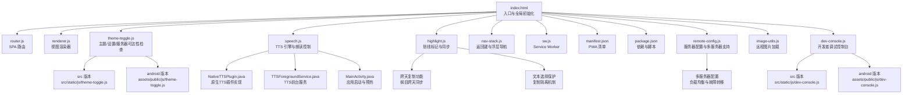

**图表来源**
- [index.html](file://android/app/src/main/assets/public/index.html)
- [router.js](file://android/app/src/main/assets/public/js/router.js)
- [renderer.js](file://android/app/src/main/assets/public/js/renderer.js)
- [theme-toggle.js](file://android/app/src/main/assets/public/js/theme-toggle.js)
- [theme-toggle.js](file://src/static/js/theme-toggle.js)
- [speech.js](file://android/app/src/main/assets/public/js/speech.js)
- [speech.js](file://src/static/js/speech.js)
- [highlight.js](file://android/app/src/main/assets/public/js/highlight.js)
- [highlight.js](file://src/static/js/highlight.js)
- [nav-stack.js](file://android/app/src/main/assets/public/js/nav-stack.js)
- [sw.js](file://android/app/src/main/assets/public/sw.js)
- [manifest.json](file://android/app/src/main/assets/public/manifest.json)
- [remote-config.js](file://android/app/src/main/assets/public/js/remote-config.js)
- [remote-config.js](file://output/js/remote-config.js)
- [image-utils.js](file://android/app/src/main/assets/public/js/image-utils.js)
- [dev-console.js](file://android/app/src/main/assets/public/js/dev-console.js)
- [dev-console.js](file://src/static/js/dev-console.js)
- [NativeTTSPlugin.java](file://android/app/src/main/java/com/tehui/offline/NativeTTSPlugin.java)
- [TTSForegroundService.java](file://android/app/src/main/java/com/tehui/offline/TTSForegroundService.java)
- [MainActivity.java](file://android/app/src/main/java/com/tehui/offline/MainActivity.java)

**章节来源**
- [index.html](file://android/app/src/main/assets/public/index.html)
- [package.json](file://package.json)

## 核心组件
- 路由系统：基于 hash 的 SPA 路由，支持层级跳转与同章节视图切换的特殊处理。
- 渲染器：根据 training.json 数据动态渲染各视图（纲目、听抄、详情、晨读、诗歌、职事），**新增**：全面的文本选择保护系统，包括跨天选择清理机制、选择开始防护和复制事件拦截功能。
- 主题与设置：**增强的主题系统**：新增服务器可达性检查、智能赞助按钮显示、改进的环境检测逻辑，确保在网络条件不佳时提供更好的用户体验。
- 语音合成：NativeTTS（Capacitor）与 Web Speech API 双引擎，支持句子级高亮与循环播放，**新增智能错误处理、状态管理、超时检测、性能监控、TTS诊断日志系统和暂停状态视觉反馈**。
- 划线标记：**增强的跨页面同步系统**：支持跨页面同步的智能划线系统，包含纲目↔晨读配对同步、跨天复制功能和**新增**：全面的文本选择保护机制。
- 导航栈：统一处理返回键（原生与 PWA），屏蔽浏览器历史条目噪声。
- 离线缓存：PWA Service Worker 与 Cache API，结合强制安装与缓存完整性校验。
- **新增**：服务器可达性检查：应用启动时自动检查远程服务器连通性，动态调整UI元素显示。
- **新增**：智能赞助按钮：基于使用时长和服务器状态的智能显示机制。
- **新增**：增强的环境检测：支持更精确的运行环境识别和网络状态处理。
- **新增**：预热功能：通过warmup()方法优化TTS引擎启动性能。
- **新增**：预合成功能：通过preSynthesize()方法加速音频播放响应。
- **新增**：Android TTS时序优化：改进延迟机制，解决Android 12+背景服务限制问题。
- **新增**：开发者控制台精确时间戳格式化：支持毫秒级时间戳显示。
- **新增**：暂停状态视觉反馈：.play-pause-btn.cx-paused类提供暂停动画效果。
- **新增**：TTS诊断日志系统：实时监控和记录语音合成过程中的性能指标和错误信息。
- **新增**：文本选择保护系统：防止跨天内容的选择和复制，确保TTS阅读界面的完整性。
- **新增**：服务器配置系统：支持多服务器配置、负载均衡和故障转移。

**章节来源**
- [router.js](file://android/app/src/main/assets/public/js/router.js)
- [renderer.js](file://android/app/src/main/assets/public/js/renderer.js)
- [renderer.js](file://src/static/js/renderer.js)
- [theme-toggle.js](file://android/app/src/main/assets/public/js/theme-toggle.js)
- [theme-toggle.js](file://src/static/js/theme-toggle.js)
- [speech.js](file://android/app/src/main/assets/public/js/speech.js)
- [highlight.js](file://android/app/src/main/assets/public/js/highlight.js)
- [highlight.js](file://src/static/js/highlight.js)
- [nav-stack.js](file://android/app/src/main/assets/public/js/nav-stack.js)
- [sw.js](file://android/app/src/main/assets/public/sw.js)
- [remote-config.js](file://android/app/src/main/assets/public/js/remote-config.js)
- [remote-config.js](file://output/js/remote-config.js)
- [dev-console.js](file://android/app/src/main/assets/public/js/dev-console.js)
- [dev-console.js](file://src/static/js/dev-console.js)

## 架构总览
前端采用"入口初始化 + 模块化 JS"的组织方式。index.html 负责环境检测、PWA 注册、训练列表加载、页面记忆与缓存策略；各功能模块通过 window 暴露接口协同工作。**新增**：服务器可达性检查模块为所有远程资源访问提供统一的连通性检测和动态UI调整机制。

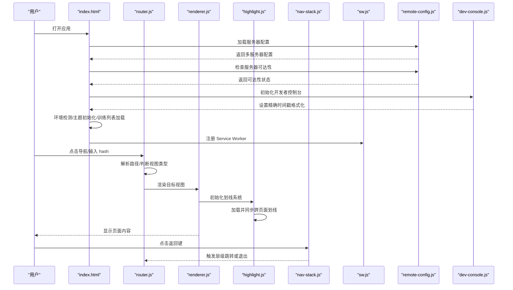

**图表来源**
- [index.html](file://android/app/src/main/assets/public/index.html)
- [router.js](file://android/app/src/main/assets/public/js/router.js)
- [renderer.js](file://android/app/src/main/assets/public/js/renderer.js)
- [highlight.js](file://android/app/src/main/assets/public/js/highlight.js)
- [nav-stack.js](file://android/app/src/main/assets/public/js/nav-stack.js)
- [sw.js](file://android/app/src/main/assets/public/sw.js)
- [remote-config.js](file://android/app/src/main/assets/public/js/remote-config.js)
- [dev-console.js](file://android/app/src/main/assets/public/js/dev-console.js)

## 详细组件分析

### 路由系统（router.js）
- 路由格式：#/
  - #/：首页（训练列表）
  - #/{path}：批次目录（章节列表）
  - #/{path}/{n}/{view}：章节视图（cv/cx/h/ts/sg/zs）
- 核心能力：
  - start()：监听 hashchange 并首次派发
  - navigate(hashPath)：跨层级跳转新增历史条目
  - navigateReplace(hashPath)：同章节视图切换使用 replaceState，避免历史膨胀
  - back()：调用 history.back()
  - skipNextDispatch()：屏蔽 ghost 历史条目
- 与导航栈协作：在 hash 赋值时可能触发虚假 popstate，通过 backStack.skipNext() 屏蔽。

**图表来源**
- [router.js](file://android/app/src/main/assets/public/js/router.js)

**章节来源**
- [router.js](file://android/app/src/main/assets/public/js/router.js)

### 渲染器（renderer.js）
**更新**：新增全面的文本选择保护系统，包括跨天选择清理机制、选择开始防护和复制事件拦截功能。

- 数据来源：training.json（本地导入或网络加载，原生 App 绕过缓存）
- 视图类型：
  - cv：纲目大纲（递归渲染）
  - h：听抄（消息内容 + 详情段落）
  - ts：详情（按段落渲染）
  - cx：晨读（按日分页，支持手势/键盘翻页）
  - sg：诗歌（图片展示）
  - zs：职事摘录（按段落渲染）
- 滚动位置记忆：按页面键保存/恢复，避免闪屏
- 搜索缓存：异步缓存训练数据，提升搜索性能
- 与划线系统集成：在视图渲染完成后初始化并恢复划线标记
- **新增**：文本选择保护系统：
  - 跨天选择清理：防止跨天内容的选择和复制
  - 选择开始防护：阻止从非活跃天开始选择
  - 复制事件拦截：拦截跨天复制并用当前天内容替换

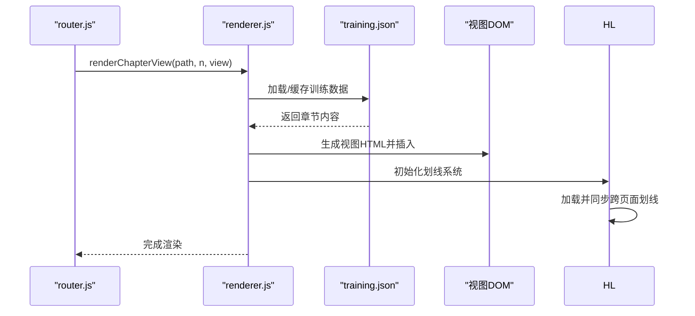

**图表来源**
- [renderer.js](file://android/app/src/main/assets/public/js/renderer.js)

**章节来源**
- [renderer.js](file://android/app/src/main/assets/public/js/renderer.js)
- [renderer.js](file://src/static/js/renderer.js)

### 主题切换与设置（theme-toggle.js）
**更新**：主题切换功能获得重大增强，新增服务器可达性检查系统，改善网络条件不佳时的用户体验。

- **增强的主题系统**：
  - 新增服务器可达性检查：应用启动时自动检查远程服务器连通性
  - 智能UI元素动态调整：根据网络状况显示或隐藏相关功能
  - 改进的赞助按钮显示策略：基于使用时长和服务器状态的智能显示
  - 增强的环境检测：支持更精确的运行环境识别
  - 主题：cool/warm/dark，手动切换
  - 字体大小：8 档位，持久化存储
- 设置面板：包含安装到桌面、检查更新、清理数据、资源管理、**新增赞助**等操作
- 对话框与返回键：统一通过 backStack 管理，支持 ESC 关闭
- 笔记备份：迁移至 IndexedDB 后的备份守卫，防止升级导致数据丢失
- 错误日志：收集同步/异步错误，版本变更时清理旧日志
- 原生崩溃日志：Capacitor 插件桥接，版本升级后清理

**新增**：服务器可达性检查系统
- **自动检测机制**：应用启动时自动检查远程服务器连通性
- **动态UI调整**：根据检测结果动态显示或隐藏相关功能按钮
- **优雅降级**：服务器不可达时隐藏检查更新、问题反馈、赞助等功能
- **智能恢复**：服务器恢复后自动重新启用相关功能

**新增**：智能赞助按钮功能
- **使用时长检测**：用户使用超过5分钟后才显示赞助按钮
- **服务器状态检查**：只有在服务器可达时才显示赞助按钮
- **多服务器探测**：通过多个服务器地址探测远程图片是否存在
- **智能显示策略**：任一服务器可达即显示按钮，提升成功率

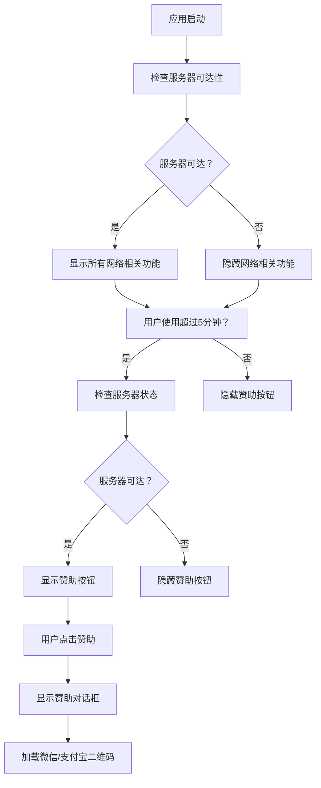

**图表来源**
- [theme-toggle.js](file://android/app/src/main/assets/public/js/theme-toggle.js)
- [theme-toggle.js](file://src/static/js/theme-toggle.js)
- [remote-config.js](file://android/app/src/main/assets/public/js/remote-config.js)
- [remote-config.js](file://output/js/remote-config.js)

**章节来源**
- [theme-toggle.js](file://android/app/src/main/assets/public/js/theme-toggle.js)
- [theme-toggle.js](file://src/static/js/theme-toggle.js)

### 语音合成（speech.js）
**更新**：语音合成功能获得重大增强，包括Android TTS时序优化和延迟机制改进，以及新增的超时检测和定时器清理机制。

- 引擎选择：NativeTTS（Capacitor Foreground Service，Android APK 背景安全）、Web Speech API（浏览器回退）
- 经文引用展开：将 data-refs 展开为完整书名/章节数，支持"至"压缩和跨章节引用
- 句子级高亮：按句注入 <mark>，滚动对齐当前朗读位置
- 进度控制：拖动进度条支持 seek，MediaSession 支持系统控制
- 循环播放：支持循环，自然结束时自动重置
- 电池优化：引导用户将应用加入"不限制"名单
- **新增**：safeGetNativeTTS() 函数提供安全的 NativeTTS 获取机制，支持多种插件名称兼容
- **新增**：双机制恢复逻辑改进，包括 _nativePositionHandle 和 _nativeProgressHandle 的增强
- **新增**：智能回退机制：prebuildText() 在缓存未命中时自动降级到 buildAll()
- **新增**：预合成功能：preSynthesize() 提供音频输出延迟监控和自动恢复机制
- **新增**：超时检测机制：3秒未出声超时检测、5秒自动重试序列和性能监控功能
- **新增**：增强的错误处理：nativeSpeak() 函数包含完善的错误捕获和状态恢复机制
- **新增**：预热功能：warmup() 方法支持TTS引擎预热，优化启动性能
- **新增**：Android TTS时序优化：改进延迟机制，解决Android 12+背景服务限制问题
- **新增**：定时器清理机制：初始化流程中的定时器清理，防止内存泄漏
- **新增**：TTS诊断日志系统：实时监控和记录语音合成过程中的性能指标和错误信息
- **新增**：暂停状态视觉反馈：.play-pause-btn.cx-paused类提供暂停动画效果

**更新**：speech.js中的resetState()函数bug修复

**章节来源**
- [speech.js](file://android/app/src/main/assets/public/js/speech.js)
- [speech.js](file://src/static/js/speech.js)

### 划线标记系统（highlight.js）
**更新**：新增了跨天纲目高亮一致性功能，大幅增强了划线标记系统的跨页面同步能力。

- **核心功能**：
  - 支持文本选中后划线、添加笔记、保存到本地存储、恢复划线
  - 数据模型：{id, start, end, text, color, underline, note, timestamp}
  - 存储后端：localForage (IndexedDB)，每页独立一个键
  - **新增**：跨页面同步机制，支持纲目（cv）与晨读（cx）视图间的智能同步

- **跨页面同步机制**：
  - **纲目↔晨读配对页同步**：cv（纲目）和 cx（晨读）共享同一段纲目文本，在一个视图做的划线/笔记自动同步到另一个视图
  - **跨天复制功能**：解决晨读页中多天共享相同纲目内容时的划线缺失问题
  - **智能同步算法**：使用 TextQuoteSelector 进行文本内容匹配，确保划线位置的准确性
  - **新增**：全面的文本选择保护机制，防止跨天内容的选择和复制

- **存储与迁移**：
  - 支持多种存储键变体（包括旧版本和平台特定的路径前缀）
  - 自动迁移旧版本数据到新格式
  - 支持 localStorage 作为最终兜底

- **UI 功能**：
  - 颜色选择器（黄色、绿色、蓝色、粉色）
  - 下划线功能（直线和波浪线）
  - 笔记编辑器
  - 智能菜单定位，避免系统选择菜单冲突

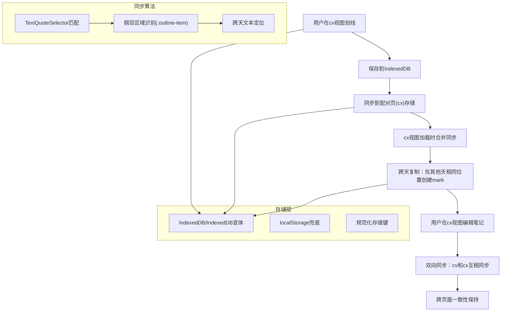

**图表来源**
- [highlight.js](file://android/app/src/main/assets/public/js/highlight.js)
- [highlight.js](file://src/static/js/highlight.js)

**章节来源**
- [highlight.js](file://android/app/src/main/assets/public/js/highlight.js)
- [highlight.js](file://src/static/js/highlight.js)

### 导航栈与返回键（nav-stack.js）
- 原生（Capacitor）：backButton 事件，按层级显式跳转，必要时退出应用
- PWA：popstate 事件，忽略加载后短暂的虚假事件，fallback 实现层级跳转
- 浮动导航栏：内容页滚动隐藏，空白点击弹出，点击 tab 自动隐藏
- TTS 控制栏：与浮动导航联动，避免布局抖动

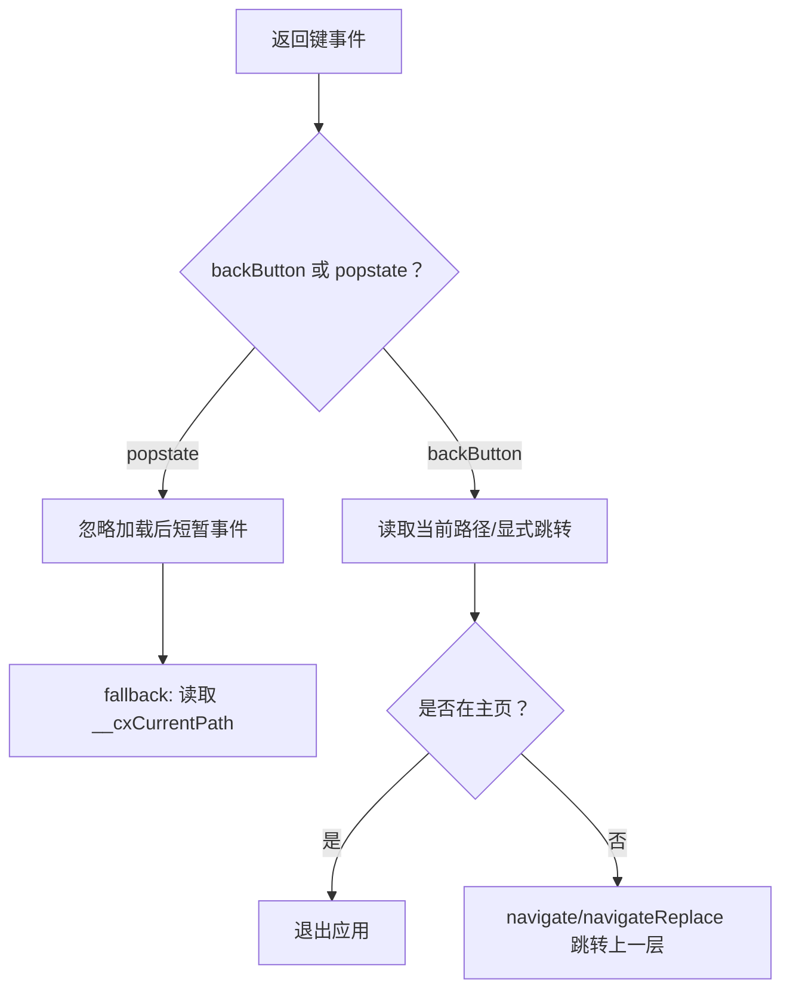

**图表来源**
- [nav-stack.js](file://android/app/src/main/assets/public/js/nav-stack.js)

**章节来源**
- [nav-stack.js](file://android/app/src/main/assets/public/js/nav-stack.js)

### 离线缓存与 PWA（sw.js、manifest.json、index.html）
- Service Worker：注册与更新，处理更新发现与控制器切换
- 缓存策略：核心资源 cx-main 与训练命名缓存 cx-{path}
- 强制安装：PWA 首次/版本变更时弹窗提示，支持重试与进度反馈
- 缓存完整性：启动时校验核心资源与训练缓存覆盖率
- Manifest：应用元信息、图标、显示模式、主题色
- 环境检测：区分 Capacitor 原生、PWA Standalone、浏览器

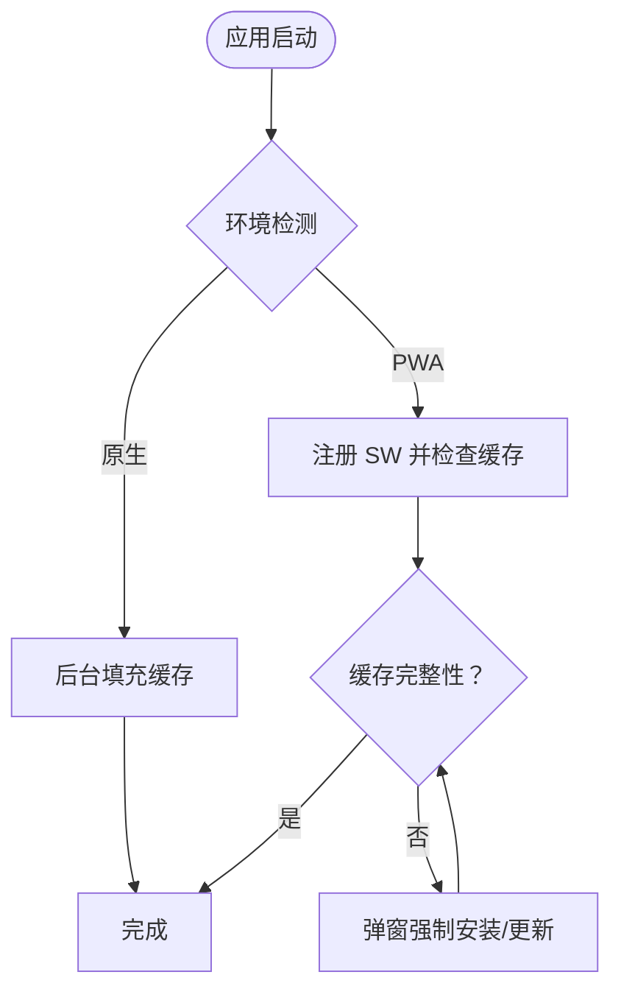

**图表来源**
- [index.html](file://android/app/src/main/assets/public/index.html)
- [sw.js](file://android/app/src/main/assets/public/sw.js)
- [manifest.json](file://android/app/src/main/assets/public/manifest.json)

**章节来源**
- [index.html](file://android/app/src/main/assets/public/index.html)
- [sw.js](file://android/app/src/main/assets/public/sw.js)
- [manifest.json](file://android/app/src/main/assets/public/manifest.json)

### 服务器配置与探测（remote-config.js）
**新增**：完整的服务器配置系统，支持多服务器配置、负载均衡和故障转移。

- **配置结构**：window.CX_SERVERS 对象包含多个服务器组
- **Cloudflare 服务器**：支持多域名镜像，提供负载均衡
- **GitHub API**：用于获取最新版本信息
- **GitHub 镜像**：提供 GitHub 资源的备用访问路径
- **推送服务**：用于用户反馈和错误报告
- **IP 查询 API**：用于获取用户地理位置信息

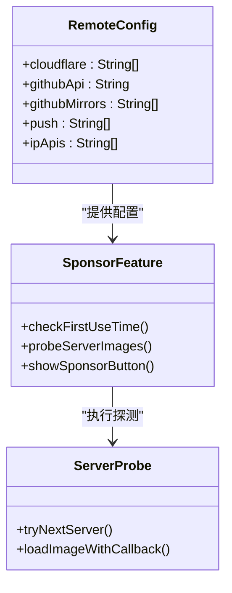

**图表来源**
- [remote-config.js](file://android/app/src/main/assets/public/js/remote-config.js)
- [remote-config.js](file://output/js/remote-config.js)

**章节来源**
- [remote-config.js](file://android/app/src/main/assets/public/js/remote-config.js)
- [remote-config.js](file://output/js/remote-config.js)

### 图片加载工具（image-utils.js）
**新增**：统一的远程图片加载工具，支持多服务器配置和错误处理。

- **多服务器支持**：支持从多个服务器地址加载图片
- **自动故障转移**：当某个服务器不可达时自动尝试下一个
- **缓存破坏**：支持通过时间戳参数破坏缓存
- **错误处理**：提供加载失败时的回退机制

**章节来源**
- [image-utils.js](file://android/app/src/main/assets/public/js/image-utils.js)

### 开发者控制台（dev-console.js）
**新增**：精确时间戳格式化功能，支持毫秒级时间戳显示。

- **时间戳格式化**：支持 HH:mm:ss 格式的时间戳显示
- **毫秒级精度**：提供精确到毫秒的时间戳格式化
- **日志缓冲**：最多缓冲500条日志，支持实时显示和复制
- **未捕获异常处理**：自动捕获并格式化未捕获的异常和Promise拒绝
- **开发者模式**：通过 theme-toggle.js 驱动，支持开发者模式开关

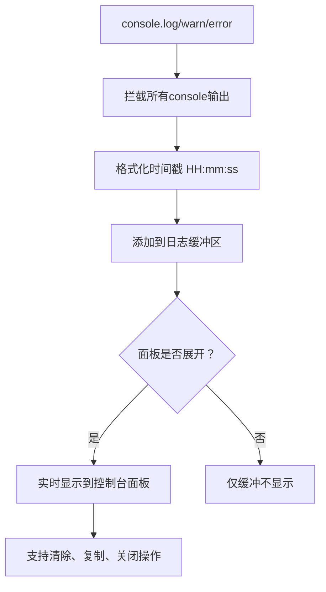

**图表来源**
- [dev-console.js](file://android/app/src/main/assets/public/js/dev-console.js)
- [dev-console.js](file://src/static/js/dev-console.js)

**章节来源**
- [dev-console.js](file://android/app/src/main/assets/public/js/dev-console.js)
- [dev-console.js](file://src/static/js/dev-console.js)

### 原生TTS插件与服务（NativeTTSPlugin.java、TTSForegroundService.java、MainActivity.java）
**新增**：完整的原生TTS解决方案，包括预热、预合成和时序优化功能。

- **预热功能**：MainActivity.onCreate()中调用prewarmTts()，在应用启动时预热TTS引擎
- **预合成功能**：NativeTTSPlugin.preSynthesize()方法，页面加载时预合成首chunk音频
- **时序优化**：TTSForegroundService中优化延迟机制，解决Android 12+背景服务限制
- **定时器清理**：改进初始化流程中的定时器清理，防止内存泄漏
- **超时检测**：在JS层实现3秒未出声警告和5秒自动重试机制
- **性能监控**：新增详细的TTS初始化和播放性能监控日志
- **TTS诊断日志系统**：实时监控和记录语音合成过程中的性能指标和错误信息
- **暂停状态视觉反馈**：.play-pause-btn.cx-paused类提供暂停动画效果

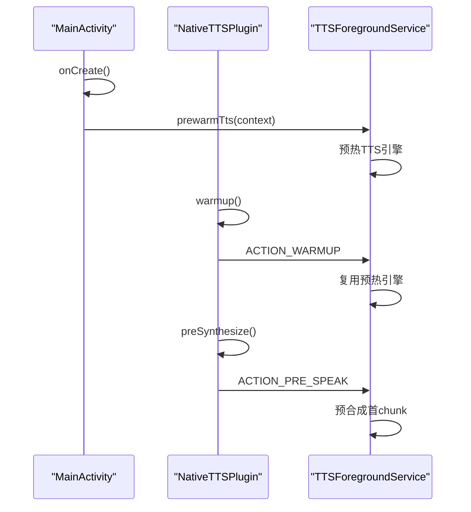

**图表来源**
- [NativeTTSPlugin.java](file://android/app/src/main/java/com/tehui/offline/NativeTTSPlugin.java)
- [TTSForegroundService.java](file://android/app/src/main/java/com/tehui/offline/TTSForegroundService.java)
- [MainActivity.java](file://android/app/src/main/java/com/tehui/offline/MainActivity.java)

**章节来源**
- [NativeTTSPlugin.java](file://android/app/src/main/java/com/tehui/offline/NativeTTSPlugin.java)
- [TTSForegroundService.java](file://android/app/src/main/java/com/tehui/offline/TTSForegroundService.java)
- [MainActivity.java](file://android/app/src/main/java/com/tehui/offline/MainActivity.java)

### 文本选择保护系统（renderer.js中的新增功能）
**新增**：全面的文本选择保护系统，专门针对TTS阅读界面的文本选择和复制操作进行了优化。

- **跨天选择清理机制**：
  - 防止跨天内容的选择和复制
  - 确保用户只能复制当前活跃天的内容
  - 防止浏览器 select-all（Ctrl+A / 长按全选）将非活跃天的内容一并复制

- **选择开始防护**：
  - 1) selectstart 防护：阻止选区从非活跃天开始
  - 通过为每个 day-page 添加 selectstart 事件监听器
  - 当用户尝试从非当前活跃天开始选择时，立即阻止选择操作

- **复制事件拦截**：
  - 2) copy 事件拦截：如果选区跨越了多个 day-page，用当前天的完整文本替换剪贴板
  - 检测选区是否包含非活跃天的内容
  - 阻止默认复制，用当前天内容替换剪贴板
  - 同时构建简易 HTML（保留段落换行），用于富文本粘贴

- **技术实现**：
  - 使用 getRangeAt(0) 获取选区范围
  - 通过 commonAncestorContainer 向上查找是否跨越了 pages-track 或更高层级
  - 如果跨越多个天数，阻止默认复制并用当前天内容替换
  - 支持 clipboardData API 和 execCommand 两种复制方式

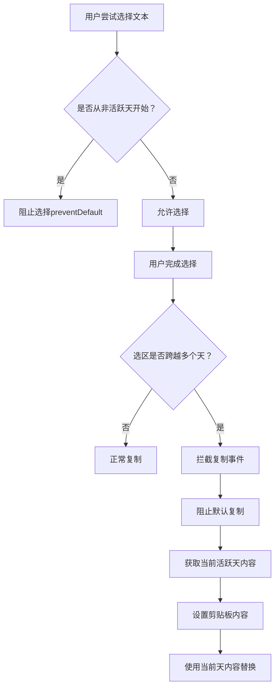

**图表来源**
- [renderer.js](file://src/static/js/renderer.js)

**章节来源**
- [renderer.js](file://src/static/js/renderer.js)

### 服务器可达性检查系统（theme-toggle.js中的新增功能）
**新增**：完整的服务器可达性检查系统，显著增强了应用在网络连接不稳定时的用户体验。

- **自动检测机制**：
  - 应用启动时自动检查远程服务器连通性
  - 使用多服务器配置进行并行探测，提高响应速度
  - 支持5秒超时检测，避免长时间等待

- **动态UI调整**：
  - 根据检测结果动态显示或隐藏相关功能按钮
  - 服务器不可达时隐藏检查更新、问题反馈、赞助等功能
  - 服务器恢复后自动重新启用相关功能

- **优雅降级**：
  - 网络不佳时隐藏相关功能，避免用户看到不可用的按钮
  - 保持应用的基本功能可用性
  - 提供更好的用户体验和应用稳定性

- **智能恢复**：
  - 服务器可达性结果缓存，避免重复检测
  - 检测到服务器恢复后自动更新UI状态
  - 支持定时重新检测，确保状态准确性

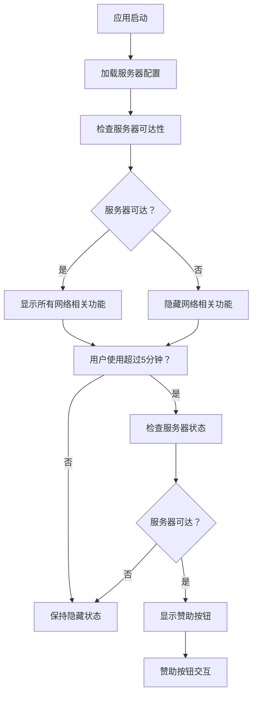

**图表来源**
- [theme-toggle.js](file://src/static/js/theme-toggle.js)
- [remote-config.js](file://android/app/src/main/assets/public/js/remote-config.js)

**章节来源**
- [theme-toggle.js](file://src/static/js/theme-toggle.js)

## 依赖关系分析
- 模块耦合：
  - router.js 与 renderer.js：路由驱动渲染
  - theme-toggle.js 与 renderer.js：设置面板影响渲染（主题、字体）
  - speech.js 与 renderer.js：视图内容提供朗读文本
  - highlight.js 与 renderer.js：划线标记与视图内容集成
  - nav-stack.js 与 router.js：返回键影响路由层级
  - index.html 与 sw.js：PWA 注册与缓存策略
  - **新增**：theme-toggle.js 与 remote-config.js：服务器配置依赖
  - **新增**：image-utils.js 与 remote-config.js：图片加载依赖
  - **新增**：speech.js 与 NativeTTSPlugin.java：原生TTS插件集成
  - **新增**：NativeTTSPlugin.java 与 TTSForegroundService.java：TTS服务集成
  - **新增**：MainActivity.java 与 TTSForegroundService.java：应用启动与预热
  - **新增**：dev-console.js 与 theme-toggle.js：开发者模式集成
  - **新增**：renderer.js 与 highlight.js：文本选择保护与划线系统的集成
  - **新增**：theme-toggle.js 与 theme-toggle.js：服务器可达性检查依赖
- 外部依赖：
  - Capacitor 生态（App、StatusBar、NativeTTS）
  - Web Speech API（浏览器回退）
  - Cache Storage（PWA 缓存）
  - localForage（IndexedDB 封装）

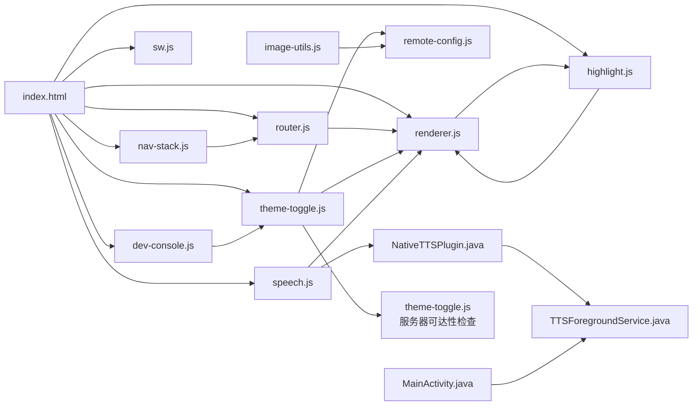

**图表来源**
- [index.html](file://android/app/src/main/assets/public/index.html)
- [router.js](file://android/app/src/main/assets/public/js/router.js)
- [renderer.js](file://android/app/src/main/assets/public/js/renderer.js)
- [theme-toggle.js](file://android/app/src/main/assets/public/js/theme-toggle.js)
- [theme-toggle.js](file://src/static/js/theme-toggle.js)
- [speech.js](file://android/app/src/main/assets/public/js/speech.js)
- [highlight.js](file://android/app/src/main/assets/public/js/highlight.js)
- [nav-stack.js](file://android/app/src/main/assets/public/js/nav-stack.js)
- [sw.js](file://android/app/src/main/assets/public/sw.js)
- [dev-console.js](file://android/app/src/main/assets/public/js/dev-console.js)
- [remote-config.js](file://android/app/src/main/assets/public/js/remote-config.js)
- [remote-config.js](file://output/js/remote-config.js)
- [image-utils.js](file://android/app/src/main/assets/public/js/image-utils.js)
- [NativeTTSPlugin.java](file://android/app/src/main/java/com/tehui/offline/NativeTTSPlugin.java)
- [TTSForegroundService.java](file://android/app/src/main/java/com/tehui/offline/TTSForegroundService.java)
- [MainActivity.java](file://android/app/src/main/java/com/tehui/offline/MainActivity.java)

**章节来源**
- [package.json](file://package.json)

## 性能考虑
- 代码组织与模块化：按功能拆分模块，减少全局作用域污染，便于按需加载与测试。
- 异步与缓存：
  - training.json 缓存（内存与 Cache Storage），避免重复请求
  - 搜索缓存异步构建，不阻塞首屏渲染
  - 原生 App 绕过 HTTP 缓存，确保资产最新
  - **新增**：划线数据异步加载，避免阻塞页面渲染
  - **新增**：服务器可达性检查采用异步方式，不影响应用启动性能
  - **新增**：智能赞助按钮显示策略，减少不必要的服务器请求
  - **新增**：服务器可达性检查的优雅降级机制，网络不佳时隐藏相关功能
  - **新增**：智能回退机制：prebuildText() 在缓存未命中时自动降级到 buildAll()
  - **新增**：预热功能：warmup() 方法在页面加载时预热TTS引擎，优化启动性能
  - **新增**：预合成功能在页面加载时后台执行，不影响首屏性能
  - **新增**：超时检测机制：3秒未出声时记录警告，在5秒后自动重试
  - **新增**：Android TTS时序优化：改进延迟机制，解决Android 12+背景服务限制
  - **新增**：定时器清理机制：初始化流程中的定时器清理，防止内存泄漏
  - **新增**：开发者控制台精确时间戳格式化：支持毫秒级时间戳显示
  - **新增**：TTS诊断日志系统：实时监控和记录语音合成过程中的性能指标和错误信息
  - **新增**：暂停状态视觉反馈：.play-pause-btn.cx-paused类提供暂停动画效果
  - **新增**：**简化后的主题系统**：移除系统深浅色自动切换，减少不必要的主题切换开销
  - **新增**：文本选择保护系统：高效的跨天选择清理机制，性能开销最小
  - **新增**：服务器可达性检查系统：多服务器配置支持并行探测，提高响应速度
  - **新增**：服务器可达性检查缓存机制：避免重复检测，提升性能
  - **新增**：智能故障转移：减少单点故障影响，提升系统稳定性
- 懒加载与滚动优化：
  - 浮动导航与 TTS 控制栏按需创建，避免常驻 DOM
  - 晨读分页器锁定滚动，减少隐式滚动带来的重排
  - **新增**：划线系统使用代数计数器防止异步竞争导致重复渲染
  - **新增**：服务器探测采用异步方式，不影响页面初始加载
  - **新增**：预合成功能在页面加载时后台执行，不影响首屏性能
  - **新增**：超时检测机制在3秒未出声时记录警告，在5秒后自动重试
  - **新增**：开发者控制台支持实时日志显示和格式化
  - **新增**：TTS诊断日志系统提供详细的性能监控和错误追踪
  - **新增**：暂停状态视觉反馈提供更好的用户体验
  - **新增**：**简化后的主题系统**：默认使用'cool'主题，确保跨平台一致性
  - **新增**：预热功能：warmup() 方法优化TTS引擎启动性能
  - **新增**：Android TTS时序优化：改进延迟机制，解决Android 12+背景服务限制
  - **新增**：定时器清理机制：初始化流程中的定时器清理，防止内存泄漏
  - **新增**：TTS诊断日志系统：实时监控和记录语音合成过程中的性能指标和错误信息
  - **新增**：**文本选择保护系统**：高效的事件监听器，性能开销最小
  - **新增**：服务器可达性检查系统：异步检测机制，不影响应用启动性能
- 事件与内存：
  - 事件监听器在路由切换时清理（如高亮清理、进度定时器）
  - 对话框与返回键栈统一管理，避免内存泄漏
  - **新增**：划线系统使用 _restoreGen 代数计数器防止竞争
  - **新增**：赞助功能的事件监听器在不需要时自动清理
  - **新增**：增强的错误处理机制，防止异常导致内存泄漏
  - **新增**：定时器清理机制，防止内存泄漏
  - **新增**：开发者控制台日志缓冲机制，支持最多500条日志
  - **新增**：**简化后的主题系统**：移除复杂的主题偏好检测逻辑
  - **新增**：文本选择保护系统的事件监听器优化，避免重复绑定
  - **新增**：服务器可达性检查系统的定时器清理，防止内存泄漏
- UI/UX：
  - 防止滚动穿透与点击穿透，提升交互稳定性
  - 进度条与高亮实时更新，降低感知延迟
  - **新增**：跨页面同步使用去重机制，避免重复渲染
  - **新增**：赞助按钮的渐进式显示，提升用户体验
  - **新增**：智能回退机制确保在任何情况下都能正常工作
  - **新增**：开发者控制台支持复制和清除操作
  - **新增**：暂停状态视觉反馈提供更好的用户体验
  - **新增**：**简化后的主题系统**：默认'cool'主题，确保一致的视觉体验
  - **新增**：**文本选择保护系统**：无缝集成到现有渲染流程中
  - **新增**：服务器可达性检查系统：动态UI调整，提升用户体验
- **新增**：NativeTTS 集成优化：
  - safeGetNativeTTS() 函数提供安全的插件获取，支持多种兼容性
  - 双机制恢复逻辑改进，提高暂停/恢复的可靠性
  - _nativePositionHandle 和 _nativeProgressHandle 的增强处理
  - 增强的错误处理：nativeSpeak() 函数包含完善的错误捕获和状态恢复机制
  - 单调递增保护：防止 chunk 切换时的瞬态回跳
  - 循环重置处理：正确处理循环播放时的位置重置
  - **新增**：超时检测机制：3秒未出声超时检测、5秒自动重试序列
  - **新增**：性能监控：音频输出延迟监控和自动恢复机制
  - **新增**：预热功能：warmup() 方法优化TTS引擎启动性能
  - **新增**：Android TTS时序优化：改进延迟机制，解决Android 12+背景服务限制
  - **新增**：定时器清理机制：初始化流程中的定时器清理，防止内存泄漏
  - **新增**：TTS诊断日志系统：实时监控和记录语音合成过程中的性能指标和错误信息
- **新增**：划线系统性能优化：
  - TextQuoteSelector 算法优化，提高跨页面同步效率
  - 跨天复制功能使用去重处理，避免重复创建 DOM 元素
  - 存储键变体自动检测，减少不必要的存储操作
  - **新增**：文本选择保护系统：高效的DOM查询，避免性能瓶颈
- **新增**：服务器可达性检查性能优化：
  - 多服务器配置支持并行探测，提高响应速度
  - 缓存服务器可达性结果，避免重复检测
  - 智能故障转移，减少单点故障影响
  - 异步检测机制，不影响应用启动性能
- **新增**：预合成功能优化：
  - 预合成在页面加载时后台执行，不影响首屏性能
  - 完善的错误处理和超时检测机制
  - 智能回退：当预合成失败时自动降级到正常合成
  - **新增**：音频输出延迟监控，确保预合成效果
- **新增**：原生TTS性能优化：
  - 预热机制：MainActivity.onCreate()中预热TTS引擎，省去2-3秒初始化延迟
  - 预合成机制：页面加载时预合成首chunk音频，加速播放响应
  - 时序优化：改进延迟机制，解决Android 12+背景服务限制
  - 定时器清理：初始化流程中的定时器清理，防止内存泄漏
- **新增**：开发者控制台性能优化：
  - 日志缓冲机制：最多缓冲500条日志，避免内存占用过高
  - 实时显示优化：仅在面板展开时实时显示日志
  - 时间戳格式化：支持HH:mm:ss格式，便于快速定位问题
- **新增**：TTS诊断日志系统性能优化：
  - 实时日志监控，不影响语音合成性能
  - 智能日志过滤，避免重复和冗余信息
  - 性能指标统计，帮助优化语音合成质量
- **新增**：暂停状态视觉反馈性能优化：
  - .play-pause-btn.cx-paused类使用CSS动画，性能开销最小
  - 动画与状态管理解耦，避免不必要的重绘
- **新增**：**简化后的主题系统性能优化**：
  - 移除系统深浅色自动切换监听器，减少内存占用
  - 简化的主题切换逻辑，提升主题切换响应速度
  - 默认'cool'主题减少主题切换的复杂性
- **新增**：**文本选择保护系统性能优化**：
  - 事件监听器使用一次性绑定，避免重复绑定
  - 复制拦截使用高效的DOM查询，性能开销最小
  - 跨天检测算法优化，减少不必要的DOM遍历
- **新增**：**服务器可达性检查系统性能优化**：
  - 多服务器配置支持并行探测，提高响应速度
  - 缓存服务器可达性结果，避免重复检测
  - 智能故障转移，减少单点故障影响
  - 异步检测机制，不影响应用启动性能

## 故障排查指南
- 语音不可用：
  - 检查引擎检测结果（NativeTTS 插件可用性、Web Speech API 支持）
  - Android 电池优化：引导用户加入"不限制"
  - 句子级高亮：确认 DOM 注入与清理流程
  - **新增**：检查 safeGetNativeTTS() 函数的插件兼容性
  - **新增**：验证智能回退机制：prebuildText() 是否正确降级到 buildAll()
  - **新增**：检查预合成功能：preSynthesize() 是否正确处理错误
  - **新增**：检查超时检测机制：3秒未出声是否正确触发警告，5秒重试是否正常执行
  - **新增**：检查预热功能：warmup() 方法是否正确调用和处理
  - **新增**：检查Android TTS时序优化：延迟机制是否正常工作
  - **新增**：检查定时器清理机制：初始化流程中的定时器是否正确清理
  - **新增**：检查性能监控日志：TTS初始化和播放过程中的详细日志
  - **新增**：检查TTS诊断日志系统：ttsLog监听器是否正常工作，日志是否正确输出
  - **新增**：检查暂停状态视觉反馈：.play-pause-btn.cx-paused类是否正确应用
- 路由异常：
  - hashchange 与 popstate 的 ghost 条目：确认 skipNextDispatch 使用
  - navigateReplace 与 navigate 的区别：视图切换 vs 层级跳转
- PWA 缓存问题：
  - 核心资源缺失：检查 cx-main 缓存键
  - 训练缓存缺失：检查 cx-{path} 缓存键
  - 强制安装弹窗：确认版本号变化与用户交互
- 返回键行为异常：
  - 原生 backButton 与 PWA popstate 的时机差异
  - fallback 逻辑与加载后短暂虚假事件的处理
- **新增**：服务器可达性检查问题：
  - 检查 checkServerReachability() 函数是否正确执行
  - 验证服务器列表配置是否正确
  - 确认网络连接状态和防火墙设置
  - 检查超时设置（5秒）是否合理
  - 验证 updateServerDependentButtons() 是否正确更新UI
  - **新增**：检查服务器可达性检查缓存机制是否正常工作
  - **新增**：验证多服务器配置的并行探测逻辑
- **新增**：智能赞助按钮问题：
  - 检查首次使用时间记录和使用时长计算
  - 验证服务器可达性检查结果
  - 确认多服务器探测逻辑是否正常工作
  - 检查图片加载失败时的回退机制
  - 验证对话框显示和二维码加载功能
- **新增**：NativeTTS 集成问题：
  - 插件名称兼容性：检查 NativeTTS 和 TTSPlugin 的支持
  - 双机制恢复：验证 _nativePositionHandle 和 _nativeProgressHandle 的正确处理
  - 暂停/恢复逻辑：确认暂停时的状态保存和恢复机制
  - 增强的错误处理：检查 nativeSpeak() 函数的异常捕获
  - 单调递增保护：验证防止 chunk 切换时回跳的机制
  - 循环重置处理：确认循环播放时的位置重置逻辑
  - **新增**：超时检测：检查3秒未出声超时检测和5秒自动重试逻辑
  - **新增**：性能监控：验证音频输出延迟监控功能
  - **新增**：预热功能：检查warmup()方法的调用和处理
  - **新增**：Android TTS时序优化：检查延迟机制是否正常工作
  - **新增**：定时器清理：检查初始化流程中的定时器清理机制
  - **新增**：性能监控日志：检查TTS初始化和播放过程中的详细日志
  - **新增**：TTS诊断日志系统：检查ttsLog监听器的正确性和日志质量
  - **新增**：暂停状态视觉反馈：检查.css文件中的动画效果
- **新增**：划线系统故障排查：
  - 跨页面同步失败：检查配对页存储键生成（getPairedPageKey）
  - 文本匹配问题：验证 TextQuoteSelector 算法（_overlapRight/_overlapLeft）
  - 跨天复制失效：确认纲目区域识别（_isInOutline）和 DOM 查询
  - 存储迁移问题：检查 key 变体检测和自愈写回机制
  - 性能问题：监控 _restoreGen 代数计数器和异步竞争处理
  - **新增**：文本选择保护系统故障排查：
  - 检查 selectstart 事件监听器是否正确绑定
  - 验证复制拦截事件是否正常触发
  - 确认跨天检测算法的正确性
  - 检查剪贴板内容替换功能
- **新增**：服务器配置问题：
  - 配置解析错误：检查 remote-config.js 的 Base64 解码
  - 服务器不可达：验证网络连接和防火墙设置
  - 负载均衡失效：检查服务器列表的顺序和可用性
- **新增**：预合成功能故障排查：
  - 预合成失败：检查 preSynthesize() 方法的可用性
  - 首次出声延迟：验证预合成是否正确减少延迟
  - 错误处理：确认异常捕获和降级机制
  - **新增**：预热功能：检查warmup()方法的调用和处理
  - **新增**：性能监控：检查音频输出延迟监控功能
- **新增**：原生TTS故障排查：
  - 预热失败：检查MainActivity中的prewarmTts()调用
  - 预合成失败：检查NativeTTSPlugin.preSynthesize()方法
  - 时序优化问题：检查TTSForegroundService中的延迟机制
  - 定时器泄漏：检查初始化流程中的定时器清理
  - **新增**：性能监控日志：检查TTS初始化和播放过程中的详细日志
  - **新增**：TTS诊断日志系统：检查ttsLog监听器的正确性和日志质量
- **新增**：开发者控制台故障排查：
  - 时间戳格式化错误：检查 HH:mm:ss 格式化逻辑
  - 日志缓冲问题：验证最多500条日志的缓冲机制
  - 未捕获异常处理：确认异常和Promise拒绝的自动捕获
  - 面板显示问题：检查开发者模式开关和面板展开/收起逻辑
  - **新增**：毫秒级时间戳支持：验证精确到毫秒的时间戳格式化
- **新增**：TTS诊断日志系统故障排查：
  - 日志监听器失效：检查ttsLog监听器的注册和移除逻辑
  - 日志输出异常：验证console.log的正确使用和格式化
  - 性能影响：确认日志监控不会影响语音合成性能
  - 日志过滤：检查日志信息的分类和重要性排序
- **新增**：暂停状态视觉反馈故障排查：
  - CSS类应用问题：检查.play-pause-btn.cx-paused类是否正确应用
  - 动画效果异常：验证CSS动画的正确性和性能
  - 状态同步问题：确认JavaScript状态管理与CSS类的同步
- **新增**：**简化后的主题系统故障排查**：
  - 主题切换无效：检查 getPreferredTheme() 函数是否返回 'cool'
  - 系统深浅色自动切换：确认不再监听 '(prefers-color-scheme: dark)'
  - 主题颜色不一致：验证 CSS 变量是否正确应用
  - 默认主题问题：确认 data-theme 属性是否设置为 'cool'
- **新增**：**文本选择保护系统故障排查**：
  - 选择开始防护失效：检查 selectstart 事件监听器绑定
  - 跨天检测错误：验证 DOM 查询和跨天算法
  - 复制拦截失败：确认 copy 事件监听器和剪贴板操作
  - 性能问题：检查事件监听器数量和DOM查询效率
- **新增**：**服务器可达性检查系统故障排查**：
  - 检测函数异常：检查 checkServerReachability() 函数的执行
  - 服务器配置错误：验证 remote-config.js 中的服务器列表
  - UI更新问题：确认 updateServerDependentButtons() 是否正确更新按钮状态
  - 缓存机制故障：检查服务器可达性结果的缓存和更新
  - 多服务器探测失败：验证并行探测逻辑和故障转移机制

**章节来源**
- [speech.js](file://android/app/src/main/assets/public/js/speech.js)
- [speech.js](file://src/static/js/speech.js)
- [router.js](file://android/app/src/main/assets/public/js/router.js)
- [nav-stack.js](file://android/app/src/main/assets/public/js/nav-stack.js)
- [highlight.js](file://android/app/src/main/assets/public/js/highlight.js)
- [highlight.js](file://src/static/js/highlight.js)
- [renderer.js](file://android/app/src/main/assets/public/js/renderer.js)
- [renderer.js](file://src/static/js/renderer.js)
- [index.html](file://android/app/src/main/assets/public/index.html)
- [theme-toggle.js](file://android/app/src/main/assets/public/js/theme-toggle.js)
- [theme-toggle.js](file://src/static/js/theme-toggle.js)
- [remote-config.js](file://android/app/src/main/assets/public/js/remote-config.js)
- [remote-config.js](file://output/js/remote-config.js)
- [image-utils.js](file://android/app/src/main/assets/public/js/image-utils.js)
- [dev-console.js](file://android/app/src/main/assets/public/js/dev-console.js)
- [dev-console.js](file://src/static/js/dev-console.js)
- [NativeTTSPlugin.java](file://android/app/src/main/java/com/tehui/offline/NativeTTSPlugin.java)
- [TTSForegroundService.java](file://android/app/src/main/java/com/tehui/offline/TTSForegroundService.java)
- [MainActivity.java](file://android/app/src/main/java/com/tehui/offline/MainActivity.java)
- [style.css](file://android/app/src/main/assets/public/css/style.css)

## 结论
CX 项目的前端以模块化与事件驱动为核心，结合路由、渲染器、主题设置、语音合成与导航栈，形成完整的 SPA 体验，并通过 PWA 与 Capacitor 能力实现跨平台稳定运行。通过合理的缓存策略与性能优化手段，兼顾了离线可用性与交互流畅性。

**更新**：最新的版本显著增强了服务器可达性检查功能，应用启动时自动检查远程服务器连通性，动态调整UI元素显示。这些变更大大改善了用户在网络条件不佳时的体验。通过智能的服务器连通性检测，应用能够根据网络状况动态调整UI元素的显示，避免在无法访问远程资源时显示不可用的功能。主题切换功能同样获得了重大增强，特别是新增的服务器可达性检查系统，这大大改善了用户在网络条件不佳时的体验。赞助按钮功能也得到了改进，增加了更精确的显示策略和多服务器配置支持。这些变更使得应用在各种网络环境下都能提供更好的用户体验。

建议持续关注引擎兼容性、缓存完整性、划线同步性能、服务器可达性检查的准确性、赞助功能的用户体验与服务器配置的维护，以及语音合成功能的持续优化，特别是Android TTS时序优化和定时器清理机制的完善，以进一步提升可靠性与可维护性。开发者控制台的精确时间戳格式化功能为调试和监控提供了更好的支持，建议充分利用这一功能进行问题排查和性能分析。**新增**：TTS诊断日志系统的持续监控和分析，帮助识别和解决语音合成过程中的潜在问题，提升用户体验和系统稳定性。**新增**：暂停状态视觉反馈的持续优化，确保动画效果的流畅性和性能开销的最小化。**新增**：简化后的主题系统的持续监控，确保默认'cool'主题的稳定性和一致性，为用户提供最佳的阅读体验。**新增**：服务器可达性检查系统的持续优化，确保网络状态检测的准确性和性能，提升应用在各种网络环境下的适应能力。**新增**：文本选择保护系统的持续优化，确保跨天内容选择和复制的安全性，提升TTS阅读界面的完整性。**新增**：服务器可达性检查系统的持续监控，确保多服务器配置的正确性和故障转移的有效性，提升系统的整体稳定性。