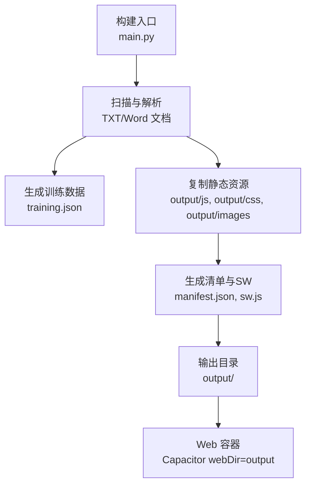
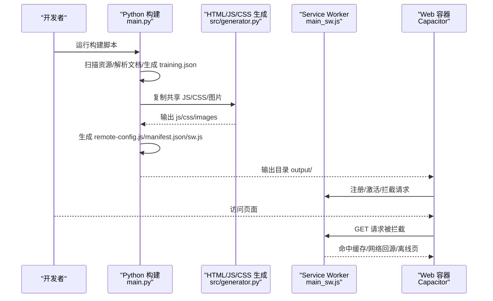
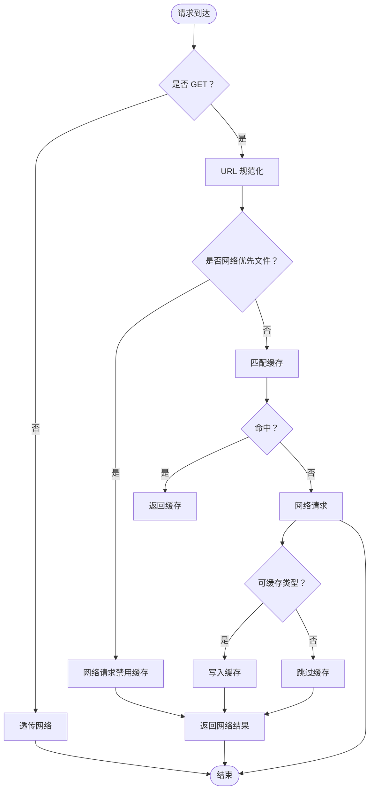
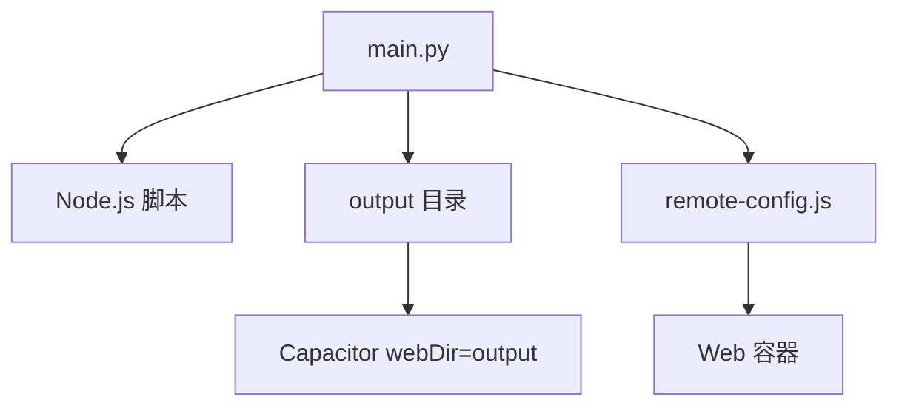

# 性能优化

<cite>
**本文引用的文件**
- [main.py](file://main.py)
- [package.json](file://package.json)
- [config.yaml](file://config.yaml)
- [capacitor.config.json](file://capacitor.config.json)
- [src/generator.py](file://src/generator.py)
- [src/parser_improved.py](file://src/parser_improved.py)
- [src/models.py](file://src/models.py)
- [src/templates/main_manifest.json](file://src/templates/main_manifest.json)
- [src/templates/main_sw.js](file://src/templates/main_sw.js)
</cite>

## 目录
1. [简介](#简介)
2. [项目结构](#项目结构)
3. [核心组件](#核心组件)
4. [架构总览](#架构总览)
5. [详细组件分析](#详细组件分析)
6. [依赖分析](#依赖分析)
7. [性能考量](#性能考量)
8. [故障排查指南](#故障排查指南)
9. [结论](#结论)
10. [附录](#附录)

## 简介
本文件面向 CX 项目的性能优化，围绕静态资源优化、资源包管理、页面加载优化、内存使用、移动端优化、缓存机制、性能监控与基准测试等方面，结合代码库现状给出可落地的策略与建议。目标是在保证功能完整性的同时，显著提升首屏渲染速度、降低资源体积、优化缓存命中率、减少内存占用，并增强离线体验与移动端交互流畅度。

## 项目结构
- 构建与打包
  - Python 主流程负责扫描资源、解析文档、生成训练数据与静态站点产物，同时复制共享 JS/CSS、生成清单与 Service Worker。
  - 前端静态资源位于 src/static，构建后复制到 output 目录的 js/css/images 等子目录，供 SPA 页面按相对路径引用。
- 配置与部署
  - config.yaml 定义输出目录、模板目录、远程服务器等全局参数。
  - package.json 定义构建脚本与依赖，Capacitor 配置指向 webDir=output。
  - Capacitor 配置指向 output 目录，允许混合内容，禁用 WebContents 调试。

图表来源
- [main.py:540-771](file://main.py#L540-L771)
- [config.yaml:10-13](file://config.yaml#L10-L13)
- [capacitor.config.json:4](file://capacitor.config.json#L4)

章节来源
- [main.py:540-771](file://main.py#L540-L771)
- [config.yaml:10-13](file://config.yaml#L10-L13)
- [capacitor.config.json:1-9](file://capacitor.config.json#L1-L9)

## 核心组件
- 文档解析与数据模型
  - ImprovedParser：解析经文、纲目、听抄、晨兴等文档，抽取结构化数据。
  - TrainingData/Chapter/Content/MorningRevival：数据模型，支撑前端渲染与搜索索引生成。
- HTML/JSON 导出与静态资源复制
  - HTMLGenerator：复制共享 JS/CSS、生成 scriptures-data.json、导出 training.json。
  - main.py：批量处理、生成 SPA 主页、复制图标与静态图片、生成 remote-config.js、Service Worker、清单文件。
- 缓存与离线
  - Service Worker（main_sw.js）：纯路由型 SW，拦截 GET 请求，按类型缓存，导航失败时返回离线页。
  - Manifest（main_manifest.json）：PWA 清单，声明图标与启动行为。

章节来源
- [src/parser_improved.py:115-800](file://src/parser_improved.py#L115-L800)
- [src/models.py:9-232](file://src/models.py#L9-L232)
- [src/generator.py:22-426](file://src/generator.py#L22-L426)
- [src/templates/main_sw.js:1-171](file://src/templates/main_sw.js#L1-L171)
- [src/templates/main_manifest.json:1-25](file://src/templates/main_manifest.json#L1-L25)

## 架构总览
从输入资源到最终输出的端到端流程如下：

图表来源
- [main.py:540-771](file://main.py#L540-L771)
- [src/generator.py:44-116](file://src/generator.py#L44-L116)
- [src/templates/main_sw.js:64-123](file://src/templates/main_sw.js#L64-L123)

## 详细组件分析

### 静态资源优化策略
- 图片压缩与格式选择
  - 现状：构建阶段复制静态图片到 output/images，未见自动压缩逻辑。
  - 建议：
    - 在构建链中引入图片压缩工具（如 tinypng、sharp），针对 PNG/JPG/JPEG 进行无损/有损压缩。
    - 优先采用现代格式（WebP/AVIF），为不支持的浏览器提供回退（自动检测或服务端协商）。
    - 对图标与首屏关键图片进行懒加载，非关键图片延迟加载。
- CSS 与 JavaScript 合并与压缩
  - 现状：共享 JS/CSS 从 src/static 复制到 output，未见合并与压缩步骤。
  - 建议：
    - 引入构建工具（如 esbuild/webpack/Vite）进行打包、Tree Shaking、代码分割与压缩。
    - 将 runtime 与 vendor 代码拆分，利用浏览器缓存长期不变的版本指纹。
    - 对 CSS 进行去重、移除未使用规则，必要时启用 CSS Modules。
- 版本控制与缓存策略
  - 现状：training.json 写入紧凑 JSON，remote-config.js 以 base64 存储并混淆；未见资源指纹。
  - 建议：
    - 为 JS/CSS/图片添加内容指纹（content hash），实现强缓存与失效更新。
    - 采用“先取缓存，再回源验证”的策略，缩短首屏等待时间。

章节来源
- [main.py:673-731](file://main.py#L673-L731)
- [src/generator.py:44-116](file://src/generator.py#L44-L116)
- [config.yaml:24-42](file://config.yaml#L24-L42)

### 资源包管理机制
- 按需加载与分包
  - 现状：共享 JS/CSS 复制到根目录，训练页面通过 ../js/ 与 ../css/ 引用；未见动态 import 或路由级分包。
  - 建议：
    - 将非首屏依赖的模块（如搜索、高亮、字体控制）按路由或视图拆分，实现按需加载。
    - 对历史训练资源包（ZIP）进行分组与版本化，避免一次性加载全部历史资源。
- 缓存策略
  - 现状：Service Worker 仅做路由拦截，未预缓存；manifest.json 声明图标。
  - 建议：
    - 为关键静态资源（index.html、manifest.json、核心 JS/CSS）建立预缓存清单。
    - 为训练页面与图片建立按训练维度的缓存命名空间，便于增量更新与清理。
- 版本控制
  - 现状：remote-config.js 以 base64 存储，混淆开关受环境变量控制。
  - 建议：
    - 为静态资源生成版本号或指纹，配合 ETag/Last-Modified 实现条件请求。
    - 在 training.json 中记录版本字段，用于前端灰度与回滚。

章节来源
- [main.py:673-731](file://main.py#L673-L731)
- [src/templates/main_manifest.json:1-25](file://src/templates/main_manifest.json#L1-L25)
- [src/templates/main_sw.js:17-24](file://src/templates/main_sw.js#L17-L24)

### 页面加载优化技术
- 首屏渲染
  - 现状：SPA 主页复制 index.html shell，注入默认缓存策略参数。
  - 建议：
    - 将关键 CSS 内联到 HTML，减少首次渲染阻塞。
    - 对首屏可见内容进行骨架屏或占位符渲染，提升感知性能。
- 延迟加载与预加载
  - 现状：未见懒加载或预加载策略。
  - 建议：
    - 使用 IntersectionObserver 实现图片与非关键模块的懒加载。
    - 对即将进入视口的训练卡片与图片使用 rel="prefetch/preconnect" 提前建立连接。
- 资源优先级
  - 建议：
    - 将核心 JS（路由、渲染器）标记为最高优先级，非关键 JS 延后加载。
    - 对字体资源使用 font-display: swap，避免阻塞文本绘制。

章节来源
- [main.py:619-640](file://main.py#L619-L640)

### 内存使用优化
- 垃圾回收与对象池
  - 现状：前端 JS 未见显式对象池实现。
  - 建议：
    - 对频繁创建/销毁的对象（如 DOM 节点、事件监听器）采用对象池复用。
    - 在渲染循环中及时释放闭包引用，避免闭包导致的内存泄漏。
- 内存泄漏预防
  - 建议：
    - 使用 WeakMap/WeakSet 存储与 DOM 关联的元数据，避免强引用导致的 DOM 泄漏。
    - 在组件卸载时统一移除事件监听器与定时器。
    - 对长列表渲染采用虚拟滚动，限制同时挂载的节点数量。

章节来源
- [src/generator.py:334-373](file://src/generator.py#L334-L373)

### 移动端性能优化
- 触摸响应
  - 建议：
    - 使用 passive 事件监听器优化滚动与手势事件。
    - 控制点击延迟（touch-action），确保按钮与链接即时响应。
- 电池续航
  - 建议：
    - 减少后台任务与高频定时器，避免不必要的唤醒。
    - 对动画与滚动使用 requestAnimationFrame，降低 CPU/GPU 占用。
- 网络效率
  - 建议：
    - 启用 HTTP/2 或 HTTP/3，开启连接复用与多路推送。
    - 对图片与媒体资源使用 CDN 与边缘缓存，缩短 RTT。

章节来源
- [src/templates/main_sw.js:64-123](file://src/templates/main_sw.js#L64-L123)

### 缓存机制实现
- 浏览器缓存
  - 建议：
    - 为静态资源设置长 TTL（如一年），并配合 ETag/Last-Modified。
    - 对 HTML 设置较短 TTL 或 no-store，确保内容更新及时。
- Service Worker
  - 现状：纯路由型 SW，拦截 GET 请求，按类型缓存，导航失败时返回离线页。
  - 建议：
    - 引入策略化缓存（如 Stale-While-Revalidate），平衡新鲜度与性能。
    - 为训练页面与图片建立独立缓存空间，支持增量清理。
- 离线存储
  - 建议：
    - 使用 Cache Storage 与 IndexedDB 组合，离线缓存关键页面与数据。
    - 提供“离线可用”提示与手动触发缓存更新的入口。

图表来源
- [src/templates/main_sw.js:64-123](file://src/templates/main_sw.js#L64-L123)

章节来源
- [src/templates/main_sw.js:17-24](file://src/templates/main_sw.js#L17-L24)
- [src/templates/main_sw.js:133-171](file://src/templates/main_sw.js#L133-L171)

### 性能监控与分析
- 监控指标
  - 建议采集：
    - 首屏时间（FCP/LCP）、交互时间（FID/CLS）、网络往返时间（RTT）。
    - 缓存命中率、离线可用率、资源体积分布。
- 工具与集成
  - 建议：
    - 在生产环境集成 Web Vitals 与自定义埋点，上报关键指标。
    - 在构建阶段输出 bundle 分析报告，指导代码分割与依赖优化。
- 基准测试与持续优化
  - 建议：
    - 设定性能基线（如 LCP < 2.5s），定期回归测试。
    - 将性能检查纳入 CI，对关键指标设置阈值告警。

章节来源
- [package.json:5-15](file://package.json#L5-L15)

## 依赖分析
- 构建与运行时依赖
  - Python 主流程依赖 YAML、JSON、文件系统与子进程调用 Node.js 脚本。
  - 前端依赖 Capacitor 核心与若干插件，构建产物输出到 output 目录。
- 外部集成
  - 远程服务器配置通过 config.yaml 注入，生成 remote-config.js，用于运行时选择最优源。

图表来源
- [main.py:24-51](file://main.py#L24-L51)
- [config.yaml:24-42](file://config.yaml#L24-L42)
- [capacitor.config.json:4](file://capacitor.config.json#L4)

章节来源
- [main.py:24-51](file://main.py#L24-L51)
- [package.json:16-29](file://package.json#L16-L29)
- [capacitor.config.json:1-9](file://capacitor.config.json#L1-L9)

## 性能考量
- 首屏与交互
  - 通过内联关键 CSS、拆分核心 JS、延迟加载非关键模块，缩短首屏时间。
- 资源体积
  - 引入压缩与指纹，减少传输体积；对图片采用现代格式与尺寸裁剪。
- 缓存与离线
  - 采用路由型 SW 与预缓存策略，结合训练维度缓存，提升离线可用性。
- 内存与电量
  - 优化渲染与事件处理，减少后台任务，提升移动端续航表现。

## 故障排查指南
- 构建失败
  - 现象：TXT 解析子进程异常、超时或返回非零退出码。
  - 排查：检查 Node.js 脚本是否存在、工作目录权限、超时阈值。
- Service Worker 未生效
  - 现象：导航请求未被拦截或离线页未显示。
  - 排查：确认 sw.js 已正确复制到输出目录，注册与激活流程无报错。
- 缓存清理与更新
  - 建议：通过 SW 消息通道发送 CLEAR_CACHE/CLEAR_ALL_CACHES，或在安装界面执行清理操作。

章节来源
- [main.py:290-320](file://main.py#L290-L320)
- [src/templates/main_sw.js:133-171](file://src/templates/main_sw.js#L133-L171)

## 结论
通过对构建流程、静态资源、缓存策略与前端渲染的系统性优化，CX 项目可在不牺牲功能的前提下显著提升性能与用户体验。建议优先实施图片压缩、JS/CSS 合并与指纹化、路由型 SW 与预缓存策略，并在移动端与离线场景下进一步细化缓存与交互细节。同时，建立性能监控与基准测试体系，确保持续改进。

## 附录
- 关键配置参考
  - 输出目录与模板目录：config.yaml
  - Capacitor Web 目录：capacitor.config.json
  - 构建脚本与依赖：package.json
- 生成物清单
  - training.json、manifest.json、sw.js、remote-config.js、共享 JS/CSS、图标与静态图片

章节来源
- [config.yaml:10-13](file://config.yaml#L10-L13)
- [capacitor.config.json:4](file://capacitor.config.json#L4)
- [package.json:5-15](file://package.json#L5-L15)
- [main.py:619-771](file://main.py#L619-L771)