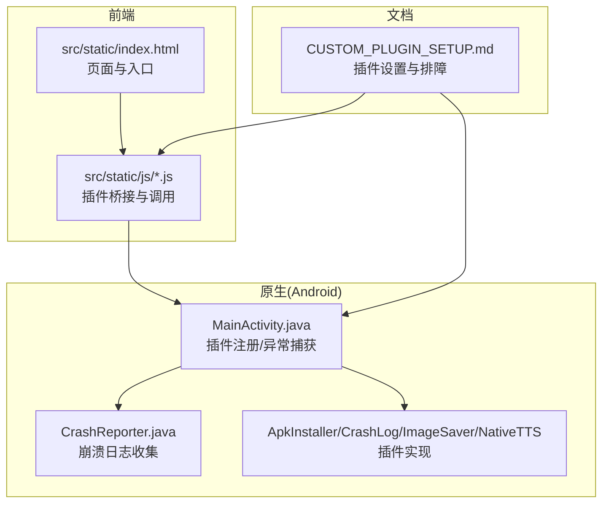
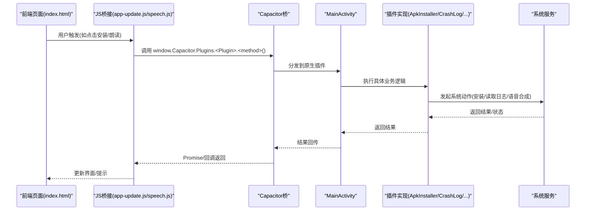
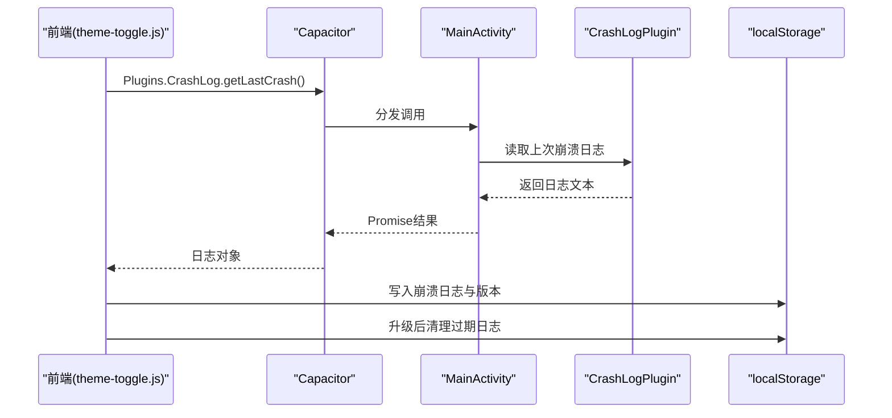
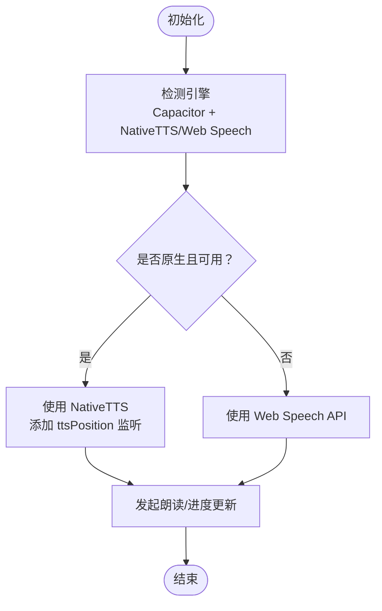
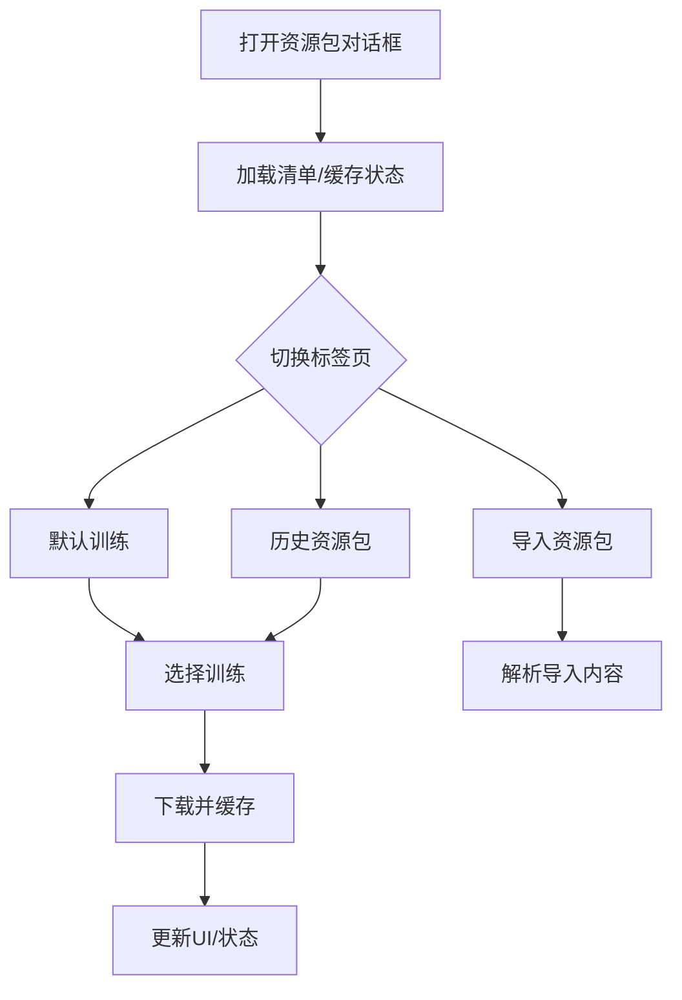
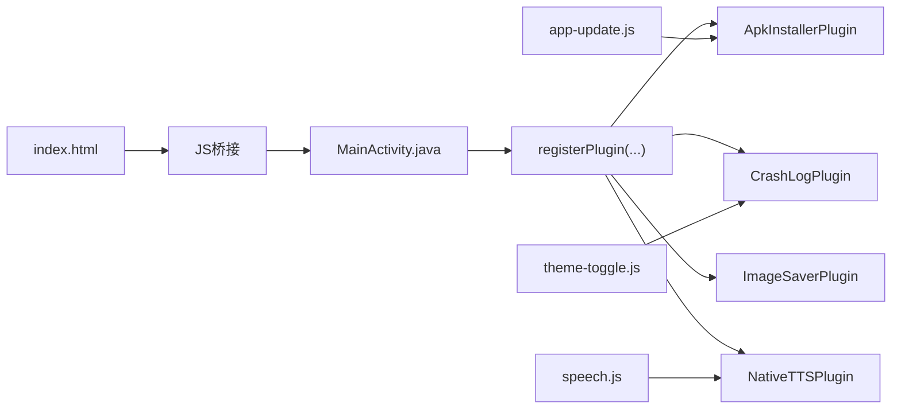

# 插件系统

<cite>
**本文引用的文件**
- [CUSTOM_PLUGIN_SETUP.md](file://CUSTOM_PLUGIN_SETUP.md)
- [MainActivity.java](file://android/app/src/main/java/com/tehui/offline/MainActivity.java)
- [CrashReporter.java](file://android/app/src/main/java/com/tehui/offline/CrashReporter.java)
- [app-update.js](file://src/static/js/app-update.js)
- [speech.js](file://src/static/js/speech.js)
- [theme-toggle.js](file://src/static/js/theme-toggle.js)
- [dev-console.js](file://src/static/js/dev-console.js)
- [index.html](file://src/static/index.html)
- [resource-pack.js](file://src/static/js/resource-pack.js)
</cite>

## 目录
1. [简介](#简介)
2. [项目结构](#项目结构)
3. [核心组件](#核心组件)
4. [架构总览](#架构总览)
5. [组件详解](#组件详解)
6. [依赖关系分析](#依赖关系分析)
7. [性能考量](#性能考量)
8. [故障排查指南](#故障排查指南)
9. [结论](#结论)
10. [附录](#附录)

## 简介
本文件系统性梳理 CX 项目的插件体系，重点覆盖 Android 平台的自定义 Capacitor 插件（ApkInstaller、CrashLog、ImageSaver、NativeTTS 等）及其在前端的集成方式。内容涵盖插件接口与生命周期、依赖注入与注册机制、自定义插件开发流程、现有插件的功能与实现、错误处理与资源管理策略、安装/配置/卸载流程、插件间通信与数据共享，以及面向 Web 与 Android 的差异化开发要点。

## 项目结构
围绕插件系统的关键目录与文件如下：
- Android 端：MainActivity.java 负责插件注册与全局异常捕获；CrashReporter.java 提供原生崩溃日志收集；各插件类位于同一包下。
- 前端静态资源：JavaScript 插件桥接与调用逻辑集中在 src/static/js 下，如 app-update.js、speech.js、theme-toggle.js、dev-console.js、resource-pack.js。
- 文档与配置：CUSTOM_PLUGIN_SETUP.md 提供自定义插件（尤其是 ApkInstaller）的完整设置说明与排障指南。



图表来源
- [MainActivity.java:12-31](file://android/app/src/main/java/com/tehui/offline/MainActivity.java#L12-L31)
- [CUSTOM_PLUGIN_SETUP.md:178-188](file://CUSTOM_PLUGIN_SETUP.md#L178-L188)

章节来源
- [MainActivity.java:12-31](file://android/app/src/main/java/com/tehui/offline/MainActivity.java#L12-L31)
- [CUSTOM_PLUGIN_SETUP.md:1-197](file://CUSTOM_PLUGIN_SETUP.md#L1-L197)

## 核心组件
- 插件注册与生命周期
  - MainActivity 在 onCreate 中尽早安装默认未捕获异常处理器，并在 super.onCreate 之前注册多个插件，确保插件可用性与早期异常覆盖。
- 插件接口与调用约定
  - 前端通过 window.Capacitor.Plugins.<PluginName> 访问插件方法，如 ApkInstaller.install、CrashLog.getLastCrash、NativeTTS.speak 等。
- 数据与状态管理
  - 崩溃日志通过原生侧写入本地存储并在下次启动时拉取，前端统一暴露获取与清理接口。
  - 资源包下载与缓存状态通过前端模块化管理，支持历史资源包与导入流程。

章节来源
- [MainActivity.java:14-23](file://android/app/src/main/java/com/tehui/offline/MainActivity.java#L14-L23)
- [theme-toggle.js:135-187](file://src/static/js/theme-toggle.js#L135-L187)
- [speech.js:209-231](file://src/static/js/speech.js#L209-L231)

## 架构总览
整体架构以 Capacitor 为桥梁，前端通过 JS API 调用原生插件，原生侧执行平台特定操作（如文件安装、系统服务、崩溃日志读取等）。MainActivity 作为入口负责插件注册与全局异常捕获，确保插件在应用生命周期早期可用。



图表来源
- [app-update.js:438-447](file://src/static/js/app-update.js#L438-L447)
- [speech.js:210-217](file://src/static/js/speech.js#L210-L217)
- [MainActivity.java:18-22](file://android/app/src/main/java/com/tehui/offline/MainActivity.java#L18-L22)

## 组件详解

### ApkInstaller 插件（APK 安装）
- 设计目标
  - 解决 Capacitor 6 缺失内置 APK 安装能力的问题，兼容 Android 7.0+ FileProvider 限制。
- 接口与调用
  - 前端调用：window.Capacitor.Plugins.ApkInstaller.install({ filePath })
  - 原生处理：根据 Android 版本选择 FileProvider 或 file:// URI，授予读取权限并启动系统安装界面。
- 生命周期与注册
  - 在 MainActivity.onCreate 中提前注册，保证插件在应用启动阶段即可用。
- 安装流程
  - 下载 APK -> 保存到文件系统 -> 调用插件 -> 打开系统安装器 -> 用户确认安装。

```mermaid
sequenceDiagram
participant FE as "前端(app-update.js)"
participant CAP as "Capacitor"
participant ACT as "MainActivity"
participant AI as "ApkInstallerPlugin"
participant AND as "Android系统"
FE->>CAP : Plugins.ApkInstaller.install({filePath})
CAP->>ACT : 分发调用
ACT->>AI : install(call)
AI->>AI : 解析路径/校验文件/构造URI
AI->>AND : ACTION_VIEW 安装意图
AND-->>AI : 安装界面
AI-->>ACT : 返回结果
ACT-->>CAP : Promise结果
CAP-->>FE : 完成/错误
```

图表来源
- [app-update.js:438-447](file://src/static/js/app-update.js#L438-L447)
- [CUSTOM_PLUGIN_SETUP.md:154-188](file://CUSTOM_PLUGIN_SETUP.md#L154-L188)
- [MainActivity.java:18-19](file://android/app/src/main/java/com/tehui/offline/MainActivity.java#L18-L19)

章节来源
- [CUSTOM_PLUGIN_SETUP.md:1-197](file://CUSTOM_PLUGIN_SETUP.md#L1-L197)
- [app-update.js:420-447](file://src/static/js/app-update.js#L420-L447)
- [MainActivity.java:18-19](file://android/app/src/main/java/com/tehui/offline/MainActivity.java#L18-L19)

### CrashLog 插件（崩溃日志）
- 设计目标
  - 在原生层收集崩溃日志，供前端一次性读取并持久化，便于反馈与诊断。
- 接口与调用
  - 前端调用：window.Capacitor.Plugins.CrashLog.getLastCrash()，返回包含日志文本的对象。
  - 前端逻辑：解析版本信息、写入本地存储、版本升级后清理过期日志。
- 生命周期与注册
  - 在 MainActivity 中注册，应用启动后尽快拉取上次崩溃日志。



图表来源
- [theme-toggle.js:143-187](file://src/static/js/theme-toggle.js#L143-L187)
- [MainActivity.java:22](file://android/app/src/main/java/com/tehui/offline/MainActivity.java#L22)

章节来源
- [theme-toggle.js:135-187](file://src/static/js/theme-toggle.js#L135-L187)
- [MainActivity.java:22](file://android/app/src/main/java/com/tehui/offline/MainActivity.java#L22)

### ImageSaver 插件（图片保存）
- 设计目标
  - 通过原生能力将图片保存至系统相册或外部存储，提升兼容性与成功率。
- 接口与调用
  - 前端通过 Capacitor.Plugins.ImageSaver 调用保存方法，原生侧处理权限与存储路径。
- 生命周期与注册
  - 在 MainActivity 中注册，确保前端可随时调用。

章节来源
- [MainActivity.java:20](file://android/app/src/main/java/com/tehui/offline/MainActivity.java#L20)

### NativeTTS 插件（原生语音合成）
- 设计目标
  - 在 Android 上提供前台服务驱动的 TTS，支持后台播放与进度回调。
- 接口与调用
  - 前端检测 Capacitor 环境与插件可用性，优先使用 NativeTTS；否则回退到 Web Speech API。
  - 支持添加 ttsPosition 回调，实现高亮与进度同步。
- 生命周期与注册
  - 在 MainActivity 中注册，前端在初始化阶段等待插件可用。



图表来源
- [speech.js:209-231](file://src/static/js/speech.js#L209-L231)
- [speech.js:561-587](file://src/static/js/speech.js#L561-L587)
- [MainActivity.java:21](file://android/app/src/main/java/com/tehui/offline/MainActivity.java#L21)

章节来源
- [speech.js:1-587](file://src/static/js/speech.js#L1-L587)
- [MainActivity.java:21](file://android/app/src/main/java/com/tehui/offline/MainActivity.java#L21)

### 资源包管理与下载（前端模块）
- 功能概述
  - 提供默认/历史/导入三标签页的资源包管理对话框，支持批量下载、恢复初始训练、清理缓存。
- 数据流
  - 从清单加载资源包列表 -> 用户选择 -> 下载与缓存 -> 更新 UI 状态。
- 与插件的关系
  - 该模块为纯前端逻辑，不直接依赖原生插件，但可与 ApkInstaller 等插件协同工作（例如更新时触发安装）。



图表来源
- [resource-pack.js:303-953](file://src/static/js/resource-pack.js#L303-L953)
- [index.html:654-669](file://src/static/index.html#L654-L669)

章节来源
- [resource-pack.js:297-953](file://src/static/js/resource-pack.js#L297-L953)
- [index.html:581-606](file://src/static/index.html#L581-L606)

## 依赖关系分析
- 前端对原生插件的依赖
  - app-update.js 依赖 ApkInstaller 插件进行 APK 安装。
  - speech.js 依赖 NativeTTS 插件进行朗读与进度回调。
  - theme-toggle.js 依赖 CrashLog 插件读取原生崩溃日志。
- 原生对前端的依赖
  - MainActivity 通过 addJavascriptInterface 注入 JS 接口，供前端页面就绪通知。
- 插件注册与耦合
  - MainActivity 集中注册多个插件，降低前端分散注册带来的风险；同时在 onCreate 早期安装异常处理器，提高稳定性。



图表来源
- [MainActivity.java:18-22](file://android/app/src/main/java/com/tehui/offline/MainActivity.java#L18-L22)
- [app-update.js:438-447](file://src/static/js/app-update.js#L438-L447)
- [speech.js:210-217](file://src/static/js/speech.js#L210-L217)
- [theme-toggle.js:145-146](file://src/static/js/theme-toggle.js#L145-L146)

章节来源
- [MainActivity.java:12-31](file://android/app/src/main/java/com/tehui/offline/MainActivity.java#L12-L31)
- [app-update.js:438-447](file://src/static/js/app-update.js#L438-L447)
- [speech.js:209-231](file://src/static/js/speech.js#L209-L231)
- [theme-toggle.js:135-187](file://src/static/js/theme-toggle.js#L135-L187)

## 性能考量
- 插件初始化时机
  - 在 MainActivity.onCreate 早期注册插件与安装异常处理器，减少首屏等待与异常漏网概率。
- 前端调用策略
  - 对于需要等待的插件（如 NativeTTS），前端采用轮询检测与延迟初始化，避免阻塞主线程。
- 资源包下载
  - 前端模块支持分批下载与缓存状态跟踪，降低网络与存储压力。
- 日志与调试
  - dev-console.js 全局拦截 console 输出并缓冲，便于定位问题；同时注意缓冲上限，避免内存占用过高。

章节来源
- [MainActivity.java:14-23](file://android/app/src/main/java/com/tehui/offline/MainActivity.java#L14-L23)
- [speech.js:247-260](file://src/static/js/speech.js#L247-L260)
- [dev-console.js:1-77](file://src/static/js/dev-console.js#L1-L77)

## 故障排查指南
- ApkInstaller 插件不可用
  - 症状：前端提示“插件不可用”
  - 排查：确认 MainActivity 中已注册 ApkInstallerPlugin；执行 npx cap sync android；重新构建 APK。
- 文件不存在
  - 症状：前端提示“文件不存在”
  - 排查：检查文件保存路径与格式；查看保存流程中的 alert 与错误日志。
- 安装时提示“未知来源”
  - 症状：系统阻止安装
  - 说明：Android 8.0+ 需要“安装未知应用”权限，系统会引导至设置页面，需用户手动允许。
- 崩溃日志未显示
  - 症状：反馈中缺少原生崩溃信息
  - 排查：确认 CrashLog 插件可用；检查前端是否在启动后拉取并写入本地存储；升级后是否清理了过期日志。
- NativeTTS 未就绪
  - 症状：前端显示“朗读插件未就绪”
  - 排查：等待插件初始化；确认 Capacitor 环境与插件注册；必要时回退到 Web Speech API。

章节来源
- [CUSTOM_PLUGIN_SETUP.md:114-153](file://CUSTOM_PLUGIN_SETUP.md#L114-L153)
- [theme-toggle.js:135-187](file://src/static/js/theme-toggle.js#L135-L187)
- [speech.js:247-260](file://src/static/js/speech.js#L247-L260)

## 结论
CX 项目的插件系统以 Capacitor 为核心，通过 MainActivity 集中注册与早期异常捕获保障稳定性；前端通过统一的 Capacitor.Plugins 接口访问原生能力，形成清晰的职责边界。现有插件覆盖安装、崩溃日志、图片保存与语音合成等关键场景，配合前端模块化的资源包管理与调试工具，构成完整的跨平台扩展框架。建议在新增插件时遵循统一的注册与调用规范，注重错误处理与性能优化，并完善文档与排障指引。

## 附录

### 插件开发最佳实践
- 接口设计
  - 方法命名与参数尽量简洁明确；对必填参数进行前置校验；返回统一的 Promise/回调结构。
- 生命周期
  - 在 MainActivity 中尽早注册插件；在应用启动阶段完成必要的初始化与异常捕获。
- 错误处理
  - 前端对插件可用性进行探测与降级；原生侧对文件/权限/系统行为进行健壮性判断。
- 资源管理
  - 控制日志与缓冲大小；避免频繁写盘；及时清理过期数据。
- 性能考虑
  - 异步处理耗时操作；合理使用缓存；避免阻塞主线程。

### 安装、配置与卸载流程
- 安装
  - 下载 APK -> 保存到文件系统 -> 调用 ApkInstaller.install -> 系统安装器弹窗 -> 用户确认。
- 配置
  - 确认 MainActivity 已注册所需插件；按文档配置 FileProvider 与权限；前端按需启用相关功能。
- 卸载
  - 通过系统设置卸载；前端可清理本地存储中的日志与临时数据。

章节来源
- [CUSTOM_PLUGIN_SETUP.md:43-72](file://CUSTOM_PLUGIN_SETUP.md#L43-L72)
- [app-update.js:420-447](file://src/static/js/app-update.js#L420-L447)

### 插件间通信与数据共享
- 崩溃日志共享
  - 原生侧写入本地存储，前端统一读取与清理，避免跨插件直接耦合。
- 事件与回调
  - NativeTTS 提供 ttsPosition 回调，前端据此更新高亮与进度，实现跨模块协作。
- 共享状态
  - 通过 localStorage 与全局变量（如 window.CX）承载跨模块状态，避免插件间直接依赖。

章节来源
- [theme-toggle.js:135-187](file://src/static/js/theme-toggle.js#L135-L187)
- [speech.js:561-587](file://src/static/js/speech.js#L561-L587)

### 不同平台开发要点
- Web/PWA
  - 优先使用 Web Speech API；对于文件下载/保存等能力，可通过 Capacitor Filesystem 与相关插件桥接。
- Android
  - 使用 FileProvider 处理 file:// URI 限制；在 MainActivity 中注册插件并尽早安装异常处理器；针对新版本系统权限进行适配。

章节来源
- [speech.js:209-231](file://src/static/js/speech.js#L209-L231)
- [MainActivity.java:14-23](file://android/app/src/main/java/com/tehui/offline/MainActivity.java#L14-L23)