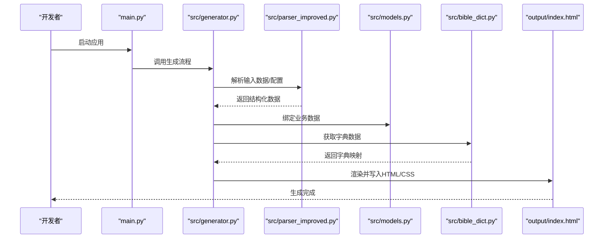
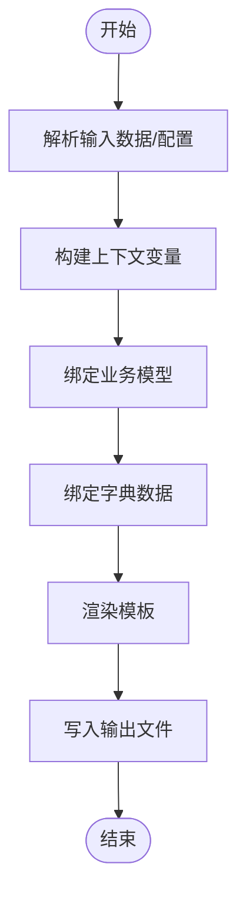
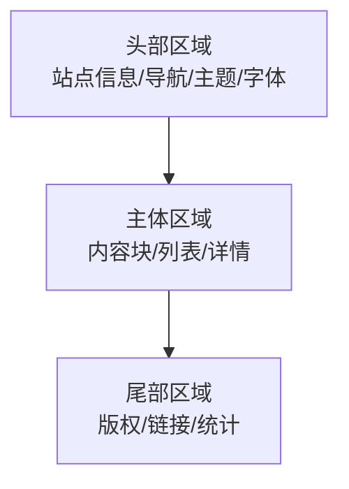
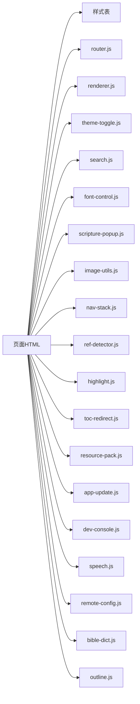
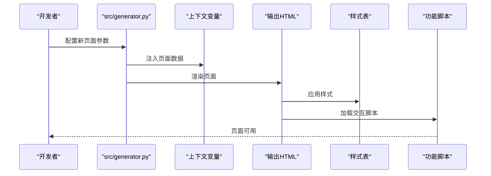
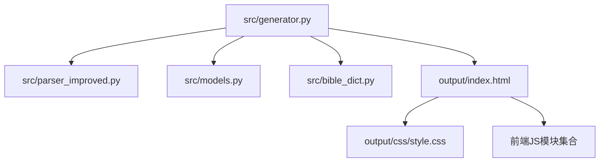

# 模板开发

<cite>
**本文引用的文件**
- [main.py](file://main.py)
- [src/generator.py](file://src/generator.py)
- [src/models.py](file://src/models.py)
- [src/parser_improved.py](file://src/parser_improved.py)
- [src/bible_dict.py](file://src/bible_dict.py)
- [android/app/src/main/assets/public/index.html](file://android/app/src/main/assets/public/index.html)
- [android/app/src/main/assets/public/css/style.css](file://android/app/src/main/assets/public/css/style.css)
- [android/app/src/main/assets/public/js/router.js](file://android/app/src/main/assets/public/js/router.js)
- [android/app/src/main/assets/public/js/renderer.js](file://android/app/src/main/assets/public/js/renderer.js)
- [android/app/src/main/assets/public/js/theme-toggle.js](file://android/app/src/main/assets/public/js/theme-toggle.js)
- [android/app/src/main/assets/public/js/search.js](file://android/app/src/main/assets/public/js/search.js)
- [android/app/src/main/assets/public/js/font-control.js](file://android/app/src/main/assets/public/js/font-control.js)
- [android/app/src/main/assets/public/js/scripture-popup.js](file://android/app/src/main/assets/public/js/scripture-popup.js)
- [android/app/src/main/assets/public/js/image-utils.js](file://android/app/src/main/assets/public/js/image-utils.js)
- [android/app/src/main/assets/public/js/nav-stack.js](file://android/app/src/main/assets/public/js/nav-stack.js)
- [android/app/src/main/assets/public/js/ref-detector.js](file://android/app/src/main/assets/public/js/ref-detector.js)
- [android/app/src/main/assets/public/js/highlight.js](file://android/app/src/main/assets/public/js/highlight.js)
- [android/app/src/main/assets/public/js/toc-redirect.js](file://android/app/src/main/assets/public/js/toc-redirect.js)
- [android/app/src/main/assets/public/js/resource-pack.js](file://android/app/src/main/assets/public/js/resource-pack.js)
- [android/app/src/main/assets/public/js/app-update.js](file://android/app/src/main/assets/public/js/app-update.js)
- [android/app/src/main/assets/public/js/dev-console.js](file://android/app/src/main/assets/public/js/dev-console.js)
- [android/app/src/main/assets/public/js/speech.js](file://android/app/src/main/assets/public/js/speech.js)
- [android/app/src/main/assets/public/js/remote-config.js](file://android/app/src/main/assets/public/js/remote-config.js)
- [android/app/src/main/assets/public/js/bible-dict.js](file://android/app/src/main/assets/public/js/bible-dict.js)
- [android/app/src/main/assets/public/js/outline.js](file://android/app/src/main/assets/public/js/outline.js)
- [output/index.html](file://output/index.html)
- [output/css/style.css](file://output/css/style.css)
</cite>

## 目录
1. [简介](#简介)
2. [项目结构](#项目结构)
3. [核心组件](#核心组件)
4. [架构总览](#架构总览)
5. [详细组件分析](#详细组件分析)
6. [依赖关系分析](#依赖关系分析)
7. [性能考虑](#性能考虑)
8. [故障排查指南](#故障排查指南)
9. [结论](#结论)
10. [附录](#附录)

## 简介
本文件面向CX项目的模板开发与静态资源管理，围绕Jinja2模板引擎在项目中的应用进行系统化说明。内容涵盖模板继承、宏定义、循环与条件渲染等核心概念；模板变量系统（上下文变量传递、数据绑定、动态内容生成）；模板布局结构（头部、主体、尾部）组织方式；静态资源引用机制（CSS、JavaScript、图片）；以及自定义模板开发的完整示例（新页面创建、样式定制、交互功能实现）。同时提供模板调试技巧与性能优化建议，帮助开发者高效构建与维护高质量的前端模板。

## 项目结构
从仓库可见，项目采用前后端混合架构：后端通过Python脚本生成HTML输出，前端静态资源位于Android资产目录中，最终产物可生成到output目录。模板系统的核心在于后端生成器与前端静态资源的协同工作。

```mermaid
graph TB
subgraph "后端"
M["main.py<br/>应用入口"]
G["src/generator.py<br/>模板生成器"]
P["src/parser_improved.py<br/>解析器"]
MD["src/models.py<br/>数据模型"]
BD["src/bible_dict.py<br/>圣经字典"]
end
subgraph "前端静态资源"
IDX["android/app/src/main/assets/public/index.html<br/>入口页"]
CSS["android/app/src/main/assets/public/css/style.css<br/>样式表"]
JS_ROUTER["router.js"]
JS_RENDERER["renderer.js"]
JS_THEME["theme-toggle.js"]
JS_SEARCH["search.js"]
JS_FONT["font-control.js"]
JS_POPUP["scripture-popup.js"]
JS_IMG["image-utils.js"]
JS_NAV["nav-stack.js"]
JS_REF["ref-detector.js"]
JS_HIGHLIGHT["highlight.js"]
JS_TOC["toc-redirect.js"]
JS_PACK["resource-pack.js"]
JS_UPDATE["app-update.js"]
JS_DEV["dev-console.js"]
JS_SPEECH["speech.js"]
JS_REMOTE["remote-config.js"]
JS_BIBLE["bible-dict.js"]
JS_OUTLINE["outline.js"]
end
subgraph "输出"
OUT_HTML["output/index.html"]
OUT_CSS["output/css/style.css"]
end
M --> G
G --> P
G --> MD
G --> BD
G --> OUT_HTML
G --> OUT_CSS
IDX --> CSS
CSS --> OUT_CSS
IDX --> JS_ROUTER
IDX --> JS_RENDERER
IDX --> JS_THEME
IDX --> JS_SEARCH
IDX --> JS_FONT
IDX --> JS_POPUP
IDX --> JS_IMG
IDX --> JS_NAV
IDX --> JS_REF
IDX --> JS_HIGHLIGHT
IDX --> JS_TOC
IDX --> JS_PACK
IDX --> JS_UPDATE
IDX --> JS_DEV
IDX --> JS_SPEECH
IDX --> JS_REMOTE
IDX --> JS_BIBLE
IDX --> JS_OUTLINE
```

图表来源
- [main.py](file://main.py)
- [src/generator.py](file://src/generator.py)
- [src/parser_improved.py](file://src/parser_improved.py)
- [src/models.py](file://src/models.py)
- [src/bible_dict.py](file://src/bible_dict.py)
- [android/app/src/main/assets/public/index.html](file://android/app/src/main/assets/public/index.html)
- [android/app/src/main/assets/public/css/style.css](file://android/app/src/main/assets/public/css/style.css)
- [android/app/src/main/assets/public/js/router.js](file://android/app/src/main/assets/public/js/router.js)
- [android/app/src/main/assets/public/js/renderer.js](file://android/app/src/main/assets/public/js/renderer.js)
- [output/index.html](file://output/index.html)
- [output/css/style.css](file://output/css/style.css)

章节来源
- [main.py](file://main.py)
- [src/generator.py](file://src/generator.py)
- [android/app/src/main/assets/public/index.html](file://android/app/src/main/assets/public/index.html)

## 核心组件
- 模板生成器：负责读取模板、注入上下文变量、执行渲染逻辑并输出HTML/CSS文件。
- 解析器：处理输入数据或配置，为模板提供结构化数据。
- 数据模型：封装业务数据，供模板渲染时绑定使用。
- 圣经字典：提供特定数据集以支持模板中的动态内容。
- 前端静态资源：样式与脚本文件，作为模板渲染后的静态资产被引用。

章节来源
- [src/generator.py](file://src/generator.py)
- [src/parser_improved.py](file://src/parser_improved.py)
- [src/models.py](file://src/models.py)
- [src/bible_dict.py](file://src/bible_dict.py)

## 架构总览
模板系统采用“后端生成 + 前端静态资源”的模式。后端根据配置与数据生成HTML页面，前端静态资源（CSS/JS）在页面中按需加载，形成完整的用户界面。

图表来源
- [main.py](file://main.py)
- [src/generator.py](file://src/generator.py)
- [src/parser_improved.py](file://src/parser_improved.py)
- [src/models.py](file://src/models.py)
- [src/bible_dict.py](file://src/bible_dict.py)
- [output/index.html](file://output/index.html)

## 详细组件分析

### 模板变量系统与上下文传递
- 上下文变量：由解析器与数据模型共同提供，包含页面标题、导航项、内容块、元数据等。
- 数据绑定：模板通过变量名访问上下文，实现动态内容生成。
- 动态内容：根据运行时数据（如当前页面、用户状态、配置开关）决定显示内容与样式。

图表来源
- [src/generator.py](file://src/generator.py)
- [src/parser_improved.py](file://src/parser_improved.py)
- [src/models.py](file://src/models.py)
- [src/bible_dict.py](file://src/bible_dict.py)

章节来源
- [src/generator.py](file://src/generator.py)
- [src/parser_improved.py](file://src/parser_improved.py)
- [src/models.py](file://src/models.py)
- [src/bible_dict.py](file://src/bible_dict.py)

### 模板布局结构（头部/主体/尾部）
- 头部：包含站点信息、导航入口、主题切换、字体控制等。
- 主体：承载页面主要内容，支持条件渲染与循环展示。
- 尾部：版权信息、辅助链接、统计脚本等。

图表来源
- [android/app/src/main/assets/public/index.html](file://android/app/src/main/assets/public/index.html)

章节来源
- [android/app/src/main/assets/public/index.html](file://android/app/src/main/assets/public/index.html)

### 静态资源引用机制（CSS/JS/图片）
- CSS：通过样式表统一管理UI风格，支持主题切换与响应式设计。
- JavaScript：按功能拆分模块（路由、渲染、主题、搜索、字体、弹窗、图片工具、导航栈、引用检测、高亮、目录跳转、资源包、更新、开发控制台、语音、远程配置、圣经字典、大纲），在页面中按需加载。
- 图片：通过图片工具模块处理缩放、懒加载与缓存策略。

图表来源
- [android/app/src/main/assets/public/index.html](file://android/app/src/main/assets/public/index.html)
- [android/app/src/main/assets/public/css/style.css](file://android/app/src/main/assets/public/css/style.css)
- [android/app/src/main/assets/public/js/router.js](file://android/app/src/main/assets/public/js/router.js)
- [android/app/src/main/assets/public/js/renderer.js](file://android/app/src/main/assets/public/js/renderer.js)
- [android/app/src/main/assets/public/js/theme-toggle.js](file://android/app/src/main/assets/public/js/theme-toggle.js)
- [android/app/src/main/assets/public/js/search.js](file://android/app/src/main/assets/public/js/search.js)
- [android/app/src/main/assets/public/js/font-control.js](file://android/app/src/main/assets/public/js/font-control.js)
- [android/app/src/main/assets/public/js/scripture-popup.js](file://android/app/src/main/assets/public/js/scripture-popup.js)
- [android/app/src/main/assets/public/js/image-utils.js](file://android/app/src/main/assets/public/js/image-utils.js)
- [android/app/src/main/assets/public/js/nav-stack.js](file://android/app/src/main/assets/public/js/nav-stack.js)
- [android/app/src/main/assets/public/js/ref-detector.js](file://android/app/src/main/assets/public/js/ref-detector.js)
- [android/app/src/main/assets/public/js/highlight.js](file://android/app/src/main/assets/public/js/highlight.js)
- [android/app/src/main/assets/public/js/toc-redirect.js](file://android/app/src/main/assets/public/js/toc-redirect.js)
- [android/app/src/main/assets/public/js/resource-pack.js](file://android/app/src/main/assets/public/js/resource-pack.js)
- [android/app/src/main/assets/public/js/app-update.js](file://android/app/src/main/assets/public/js/app-update.js)
- [android/app/src/main/assets/public/js/dev-console.js](file://android/app/src/main/assets/public/js/dev-console.js)
- [android/app/src/main/assets/public/js/speech.js](file://android/app/src/main/assets/public/js/speech.js)
- [android/app/src/main/assets/public/js/remote-config.js](file://android/app/src/main/assets/public/js/remote-config.js)
- [android/app/src/main/assets/public/js/bible-dict.js](file://android/app/src/main/assets/public/js/bible-dict.js)
- [android/app/src/main/assets/public/js/outline.js](file://android/app/src/main/assets/public/js/outline.js)

章节来源
- [android/app/src/main/assets/public/index.html](file://android/app/src/main/assets/public/index.html)
- [android/app/src/main/assets/public/css/style.css](file://android/app/src/main/assets/public/css/style.css)
- [android/app/src/main/assets/public/js/router.js](file://android/app/src/main/assets/public/js/router.js)
- [android/app/src/main/assets/public/js/renderer.js](file://android/app/src/main/assets/public/js/renderer.js)
- [android/app/src/main/assets/public/js/theme-toggle.js](file://android/app/src/main/assets/public/js/theme-toggle.js)
- [android/app/src/main/assets/public/js/search.js](file://android/app/src/main/assets/public/js/search.js)
- [android/app/src/main/assets/public/js/font-control.js](file://android/app/src/main/assets/public/js/font-control.js)
- [android/app/src/main/assets/public/js/scripture-popup.js](file://android/app/src/main/assets/public/js/scripture-popup.js)
- [android/app/src/main/assets/public/js/image-utils.js](file://android/app/src/main/assets/public/js/image-utils.js)
- [android/app/src/main/assets/public/js/nav-stack.js](file://android/app/src/main/assets/public/js/nav-stack.js)
- [android/app/src/main/assets/public/js/ref-detector.js](file://android/app/src/main/assets/public/js/ref-detector.js)
- [android/app/src/main/assets/public/js/highlight.js](file://android/app/src/main/assets/public/js/highlight.js)
- [android/app/src/main/assets/public/js/toc-redirect.js](file://android/app/src/main/assets/public/js/toc-redirect.js)
- [android/app/src/main/assets/public/js/resource-pack.js](file://android/app/src/main/assets/public/js/resource-pack.js)
- [android/app/src/main/assets/public/js/app-update.js](file://android/app/src/main/assets/public/js/app-update.js)
- [android/app/src/main/assets/public/js/dev-console.js](file://android/app/src/main/assets/public/js/dev-console.js)
- [android/app/src/main/assets/public/js/speech.js](file://android/app/src/main/assets/public/js/speech.js)
- [android/app/src/main/assets/public/js/remote-config.js](file://android/app/src/main/assets/public/js/remote-config.js)
- [android/app/src/main/assets/public/js/bible-dict.js](file://android/app/src/main/assets/public/js/bible-dict.js)
- [android/app/src/main/assets/public/js/outline.js](file://android/app/src/main/assets/public/js/outline.js)

### 自定义模板开发示例
- 新页面创建：在生成器中新增页面配置，指定模板路径与上下文变量集合。
- 样式定制：在样式表中扩展类名或新增样式规则，确保与主题切换兼容。
- 交互功能实现：在对应JS模块中添加事件监听与DOM操作，确保与路由与渲染器协同工作。

图表来源
- [src/generator.py](file://src/generator.py)
- [output/index.html](file://output/index.html)
- [output/css/style.css](file://output/css/style.css)
- [android/app/src/main/assets/public/js/router.js](file://android/app/src/main/assets/public/js/router.js)
- [android/app/src/main/assets/public/js/renderer.js](file://android/app/src/main/assets/public/js/renderer.js)

章节来源
- [src/generator.py](file://src/generator.py)
- [output/index.html](file://output/index.html)
- [output/css/style.css](file://output/css/style.css)
- [android/app/src/main/assets/public/js/router.js](file://android/app/src/main/assets/public/js/router.js)
- [android/app/src/main/assets/public/js/renderer.js](file://android/app/src/main/assets/public/js/renderer.js)

## 依赖关系分析
- 生成器依赖解析器与数据模型，用于构建上下文。
- 生成器依赖字典模块，用于提供特定数据集。
- 输出HTML依赖样式表与脚本模块，形成完整的页面体验。
- 前端模块之间存在协作关系（如路由与渲染器、主题与字体控制等）。

图表来源
- [src/generator.py](file://src/generator.py)
- [src/parser_improved.py](file://src/parser_improved.py)
- [src/models.py](file://src/models.py)
- [src/bible_dict.py](file://src/bible_dict.py)
- [output/index.html](file://output/index.html)
- [output/css/style.css](file://output/css/style.css)

章节来源
- [src/generator.py](file://src/generator.py)
- [src/parser_improved.py](file://src/parser_improved.py)
- [src/models.py](file://src/models.py)
- [src/bible_dict.py](file://src/bible_dict.py)
- [output/index.html](file://output/index.html)
- [output/css/style.css](file://output/css/style.css)

## 性能考虑
- 模板渲染：尽量减少复杂嵌套与重复计算，将静态内容固化，动态部分按需渲染。
- 资源加载：合并与压缩CSS/JS，按需异步加载非关键脚本，利用浏览器缓存。
- DOM操作：批量更新DOM，避免频繁重排与重绘；对高频交互使用事件委托。
- 数据绑定：对大数据集采用分页或虚拟滚动，降低一次性渲染压力。
- 缓存策略：对静态资源设置长缓存，对动态内容设置合理过期时间。

## 故障排查指南
- 模板变量缺失：检查生成器上下文构建逻辑，确认变量名与模板引用一致。
- 样式不生效：核对样式表路径与主题切换逻辑，确保样式优先级正确。
- 交互异常：检查对应JS模块是否正确加载，事件绑定是否在DOM就绪后执行。
- 资源404：确认静态资源路径与打包输出目录一致，检查CDN或本地服务器配置。
- 性能问题：使用浏览器性能面板定位瓶颈，优化渲染与脚本执行。

## 结论
CX项目的模板开发以Jinja2为核心，结合后端生成器与前端静态资源，实现了清晰的职责分离与高效的页面交付。通过规范的上下文变量传递、模块化的静态资源管理与可扩展的交互脚本体系，开发者可以快速创建高质量的页面并持续优化性能与用户体验。

## 附录
- 模板继承：在模板中定义基础布局与块占位，子模板覆盖相应块以实现差异化展示。
- 宏定义：将常用UI片段封装为宏，提升复用性与一致性。
- 循环与条件：基于上下文数据进行列表渲染与条件分支，增强页面动态性。
- 调试技巧：启用模板调试日志、断点调试JS、使用浏览器开发者工具分析网络与渲染性能。
- 最佳实践：保持模板简洁、变量命名规范、资源路径统一、模块职责单一、持续性能监控与优化。