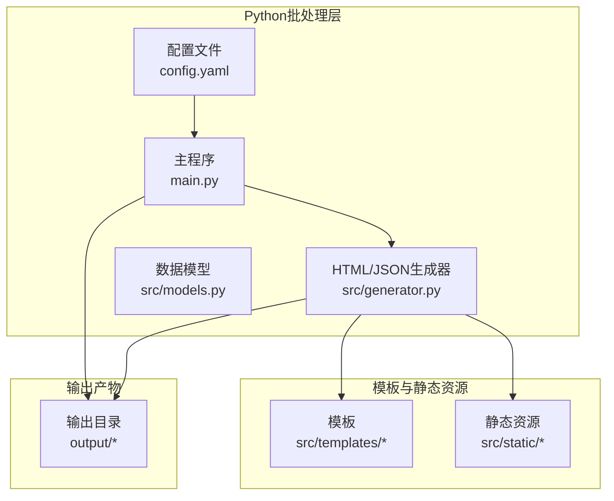
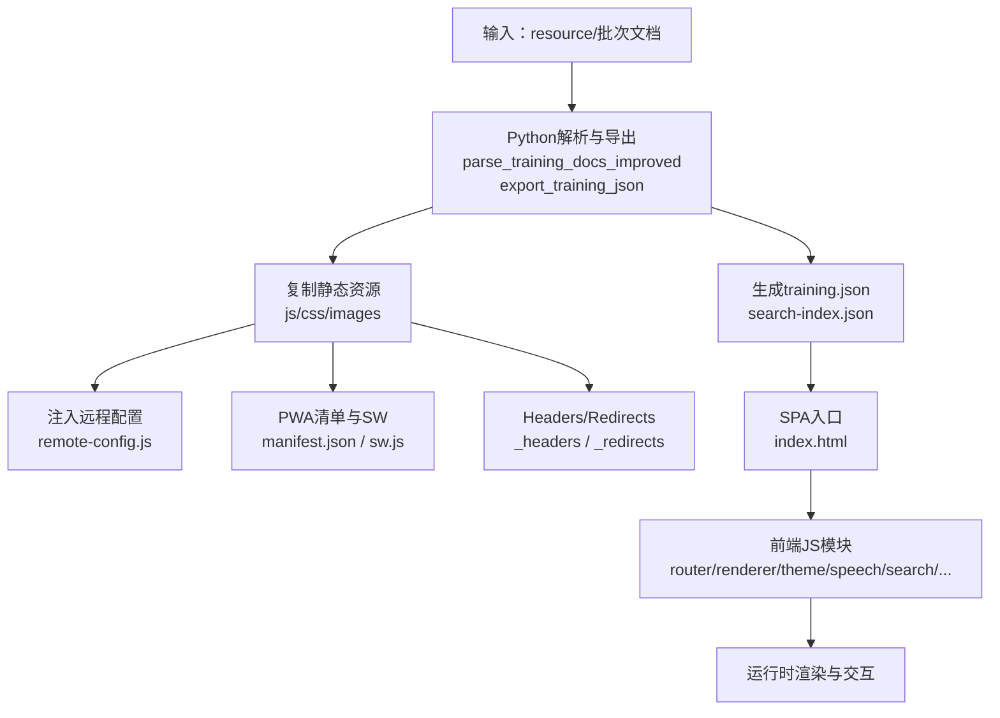
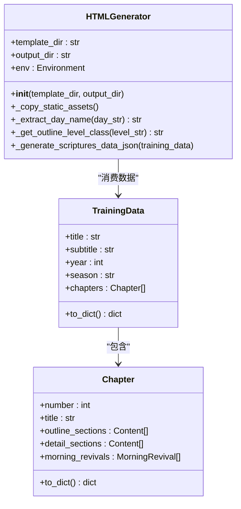
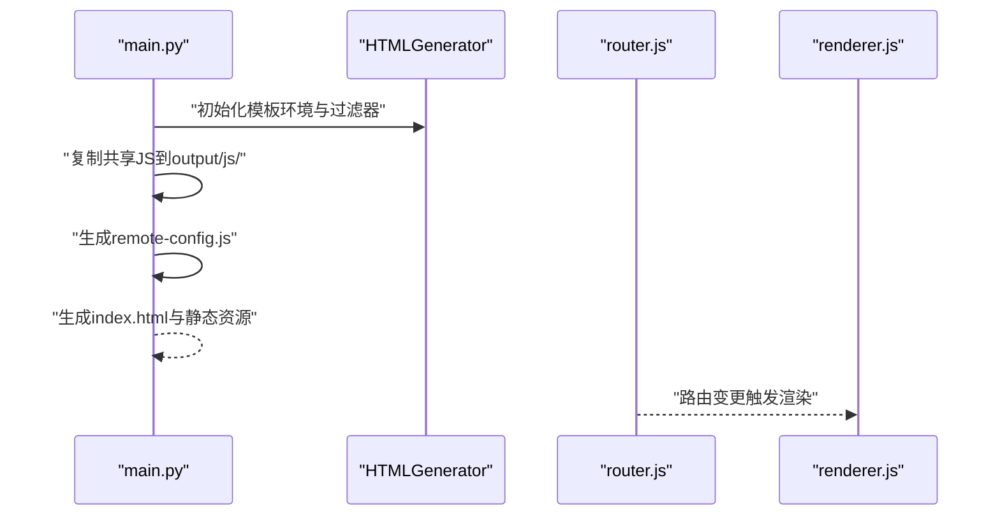
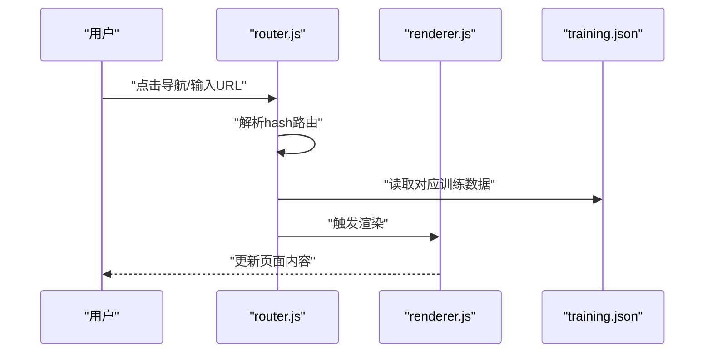
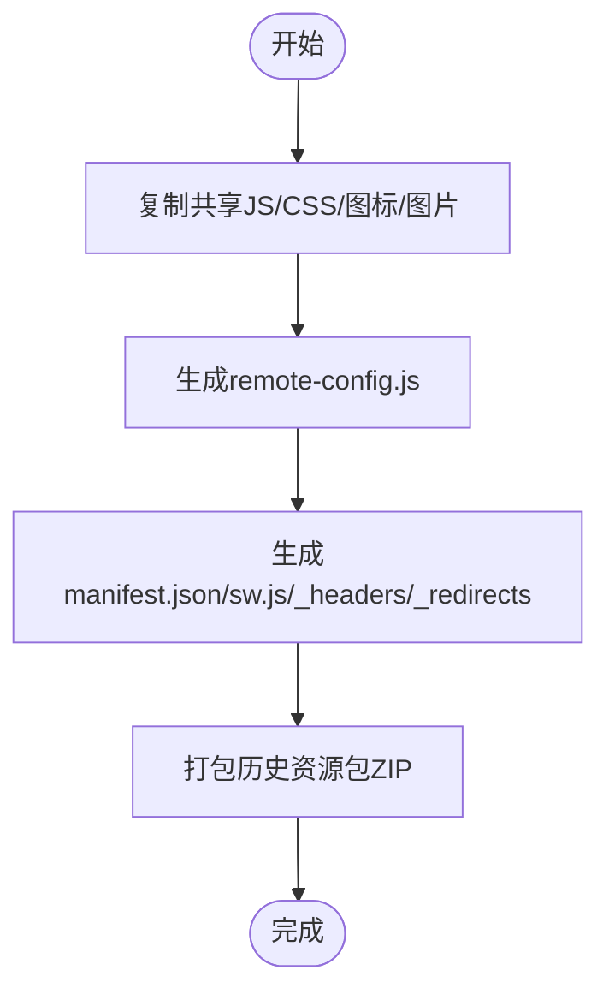
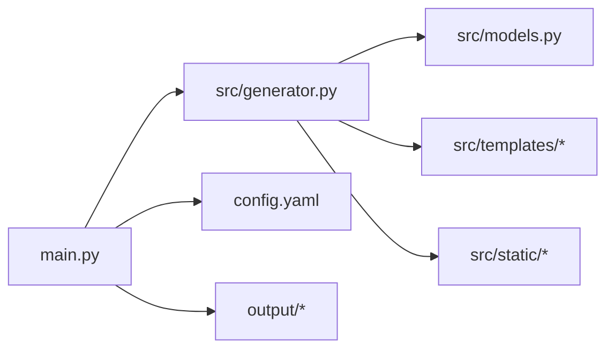

# 高级功能

<cite>
**本文引用的文件**
- [main.py](file://main.py)
- [config.yaml](file://config.yaml)
- [src/generator.py](file://src/generator.py)
- [src/models.py](file://src/models.py)
- [app_config.json](file://app_config.json)
- [src/static/js/theme-toggle.js](file://src/static/js/theme-toggle.js)
- [src/static/js/speech.js](file://src/static/js/speech.js)
- [src/static/js/router.js](file://src/static/js/router.js)
- [src/static/js/renderer.js](file://src/static/js/renderer.js)
- [src/static/js/search.js](file://src/static/js/search.js)
- [src/static/js/ref-detector.js](file://src/static/js/ref-detector.js)
- [src/static/js/toc-redirect.js](file://src/static/js/toc-redirect.js)
- [src/static/js/font-control.js](file://src/static/js/font-control.js)
- [src/static/js/image-utils.js](file://src/static/js/image-utils.js)
- [src/static/js/nav-stack.js](file://src/static/js/nav-stack.js)
- [src/static/js/highlight.js](file://src/static/js/highlight.js)
- [src/static/js/outline.js](file://src/static/js/outline.js)
- [src/static/js/scripture-popup.js](file://src/static/js/scripture-popup.js)
- [src/static/js/app-update.js](file://src/static/js/app-update.js)
- [src/static/js/resource-pack.js](file://src/static/js/resource-pack.js)
- [src/static/js/bible-dict.js](file://src/static/js/bible-dict.js)
- [src/static/js/dev-console.js](file://src/static/js/dev-console.js)
- [src/static/js/training-enricher.js](file://src/static/js/training-enricher.js)
- [src/static/js/txt-importer.js](file://src/static/js/txt-importer.js)
- [src/static/js/vendor/localforage.min.js](file://src/static/js/vendor/localforage.min.js)
- [src/static/js/vendor/…](file://src/static/js/vendor/…)
- [src/static/css/style.css](file://src/static/css/style.css)
- [src/templates/main_manifest.json](file://src/templates/main_manifest.json)
- [src/templates/main_sw.js](file://src/templates/main_sw.js)
- [src/templates/_headers](file://src/templates/_headers)
- [src/templates/_redirects](file://src/templates/_redirects)
- [tools/build-trainings-json.js](file://tools/build-trainings-json.js)
- [tools/split-combined-txt.js](file://tools/split-combined-txt.js)
- [worker-get/worker.js](file://worker-get/worker.js)
- [down_resource.py](file://down_resource.py)
- [encrypt_app_update.py](file://encrypt_app_update.py)
- [export_bible_sql_json.py](file://export_bible_sql_json.py)
- [generate_version.py](file://generate_version.py)
- [package.json](file://package.json)
- [capacitor.config.json](file://capacitor.config.json)
</cite>

## 目录
1. [简介](#简介)
2. [项目结构](#项目结构)
3. [核心组件](#核心组件)
4. [架构总览](#架构总览)
5. [详细组件分析](#详细组件分析)
6. [依赖关系分析](#依赖关系分析)
7. [性能考量](#性能考量)
8. [故障排查指南](#故障排查指南)
9. [结论](#结论)
10. [附录](#附录)

## 简介
本文件面向希望深度定制与扩展CX项目的开发者，系统性阐述以下高级能力：
- 自定义模板开发：基于Jinja2模板引擎的模板变量体系、条件渲染与过滤器扩展
- 插件系统扩展机制：如何开发与集成自定义插件（当前仓库以“共享JS模块”形式实现功能扩展）
- 前端JavaScript高级特性：路由系统、主题切换、语音合成、搜索、导航栈、经文弹窗、字体控制等
- 静态资源管理与优化：复制策略、混淆与压缩、PWA清单与Service Worker、CDN/镜像配置
- 性能优化与最佳实践：批量处理策略、增量更新、缓存与预取、资源打包与分发
- 安全与隐私：远程服务器配置的Base64编码与运行时解码、更新与推送通道的安全建议
- 功能定制与二次开发：通过配置驱动与模块化JS实现灵活扩展

## 项目结构
项目采用“Python批处理 + Jinja2模板 + 前端静态资源”的混合架构：
- Python层负责文档解析、数据导出、SPA清单生成、静态资源复制与混淆
- 前端层提供SPA路由、渲染、搜索、主题、语音、导航等交互能力
- 模板与静态资源位于src/templates与src/static，最终产物输出至output目录

**图表来源**
- [main.py:1-120](file://main.py#L1-L120)
- [src/generator.py:1-120](file://src/generator.py#L1-L120)
- [config.yaml:1-42](file://config.yaml#L1-L42)

**章节来源**
- [main.py:1-120](file://main.py#L1-L120)
- [config.yaml:1-42](file://config.yaml#L1-L42)

## 核心组件
- 批处理与主流程：扫描资源、解析文档、生成training.json、复制静态资源、生成PWA清单与SW、打包历史资源包
- 模板与Jinja2：Environment加载模板目录，注册过滤器，渲染SPA入口与静态资产
- 数据模型：TrainingData/Chapter/MorningRevival/Content，统一导出为JSON供前端渲染
- 前端JS模块：路由、渲染器、主题、语音、搜索、导航栈、经文弹窗、字体控制、应用更新、资源包下载等
- 配置驱动：config.yaml集中管理批量策略、输出目录、远程服务器、默认训练参数

**章节来源**
- [main.py:200-540](file://main.py#L200-L540)
- [src/generator.py:20-120](file://src/generator.py#L20-L120)
- [src/models.py:9-232](file://src/models.py#L9-L232)
- [config.yaml:1-42](file://config.yaml#L1-L42)

## 架构总览
整体架构围绕“批处理生成 + SPA渲染 + 模块化前端”的思路展开：

**图表来源**
- [main.py:317-540](file://main.py#L317-L540)
- [src/generator.py:380-425](file://src/generator.py#L380-L425)
- [src/generator.py:427-545](file://src/generator.py#L427-L545)

## 详细组件分析

### 模板系统与Jinja2扩展
- 模板加载：通过Environment与FileSystemLoader加载模板目录
- 过滤器扩展：内置过滤器示例包括“提取星期”“纲目层级映射”等，便于在模板中进行条件渲染与样式映射
- 模板变量：训练数据以JSON形式提供，前端通过router/renderer读取并渲染；模板侧可结合过滤器实现动态样式与布局

**图表来源**
- [src/generator.py:22-120](file://src/generator.py#L22-L120)
- [src/models.py:9-232](file://src/models.py#L9-L232)

**章节来源**
- [src/generator.py:22-120](file://src/generator.py#L22-L120)
- [src/models.py:9-232](file://src/models.py#L9-L232)

### 插件系统扩展机制
- 当前实现：通过“共享JS模块”实现功能扩展，如router.js、renderer.js、theme-toggle.js、speech.js等
- 扩展点：可在HTMLGenerator中新增过滤器或在main.py中扩展静态资源复制逻辑
- 集成方式：将新模块复制到output/js/并在index.html中按需引入；或在模板中通过变量控制加载

**图表来源**
- [main.py:450-520](file://main.py#L450-L520)
- [src/generator.py:44-115](file://src/generator.py#L44-L115)

**章节来源**
- [main.py:450-520](file://main.py#L450-L520)
- [src/generator.py:44-115](file://src/generator.py#L44-L115)

### 前端JavaScript高级特性

#### 路由系统与SPA渲染
- 路由：基于URL hash的SPA路由，支持训练、篇章、视图类型（听抄/纲目/晨兴/职事摘录）定位
- 渲染：renderer.js根据training.json动态渲染内容，支持上下文计算与高亮
- 导航栈：nav-stack.js维护浏览历史，支持返回与前进

**图表来源**
- [src/static/js/router.js](file://src/static/js/router.js)
- [src/static/js/renderer.js](file://src/static/js/renderer.js)
- [src/static/js/nav-stack.js](file://src/static/js/nav-stack.js)

**章节来源**
- [src/static/js/router.js](file://src/static/js/router.js)
- [src/static/js/renderer.js](file://src/static/js/renderer.js)
- [src/static/js/nav-stack.js](file://src/static/js/nav-stack.js)

#### 主题切换与字体控制
- 主题切换：theme-toggle.js切换明暗主题，配合CSS变量实现全局样式切换
- 字体控制：font-control.js调整字号与行高，提升阅读体验

**章节来源**
- [src/static/js/theme-toggle.js](file://src/static/js/theme-toggle.js)
- [src/static/js/font-control.js](file://src/static/js/font-control.js)

#### 语音合成与经文弹窗
- 语音合成：speech.js提供朗读功能，支持经文与段落朗读
- 经文弹窗：scripture-popup.js展示经文详情与交叉引用，ref-detector.js识别经文引用

**章节来源**
- [src/static/js/speech.js](file://src/static/js/speech.js)
- [src/static/js/scripture-popup.js](file://src/static/js/scripture-popup.js)
- [src/static/js/ref-detector.js](file://src/static/js/ref-detector.js)

#### 搜索与高亮
- 搜索：search.js基于search-index.json进行全文检索，支持类型与训练筛选
- 高亮：highlight.js在结果中高亮关键词

**章节来源**
- [src/static/js/search.js](file://src/static/js/search.js)
- [src/static/js/highlight.js](file://src/static/js/highlight.js)

#### 导航与工具
- 目录重定向：toc-redirect.js在章节内跳转时保持URL稳定
- 大纲与层级：outline.js根据纲目层级生成不同样式类名
- 图片工具：image-utils.js处理图片懒加载与缩放
- 开发控制台：dev-console.js提供调试信息
- 应用更新：app-update.js检查更新并提示安装
- 资源包：resource-pack.js下载历史资源包，降低首次加载压力

**章节来源**
- [src/static/js/toc-redirect.js](file://src/static/js/toc-redirect.js)
- [src/static/js/outline.js](file://src/static/js/outline.js)
- [src/static/js/image-utils.js](file://src/static/js/image-utils.js)
- [src/static/js/dev-console.js](file://src/static/js/dev-console.js)
- [src/static/js/app-update.js](file://src/static/js/app-update.js)
- [src/static/js/resource-pack.js](file://src/static/js/resource-pack.js)

### 静态资源管理与优化
- 复制策略：main.py将共享JS/CSS/图标/图片复制到output目录，SPA入口与清单由模板生成
- 混淆：在CI环境下对JS进行混淆（可通过环境变量控制），降低源码暴露风险
- 压缩：生成的JSON（如bible-text.json）去除空白字符，减小体积
- PWA：生成manifest.json与sw.js，_headers与_redirects用于Cloudflare Pages的MIME与重定向
- 历史资源包：按10年分组打包历史训练（不含图片），生成resource-packs.json清单

**图表来源**
- [main.py:450-540](file://main.py#L450-L540)
- [main.py:548-653](file://main.py#L548-L653)

**章节来源**
- [main.py:450-540](file://main.py#L450-L540)
- [main.py:548-653](file://main.py#L548-L653)

### 安全与隐私
- 远程服务器配置：以Base64存储于remote-config.js，运行时atob()解码，避免明文泄露
- 更新与推送：通过push数组配置推送通道，建议在生产环境启用HTTPS与访问控制
- 版本与签名：generate_version.py生成版本文件，encrypt_app_update.py可对更新包进行混淆

**章节来源**
- [main.py:19-51](file://main.py#L19-L51)
- [generate_version.py](file://generate_version.py)
- [encrypt_app_update.py](file://encrypt_app_update.py)

### 功能定制与二次开发
- 配置驱动：通过config.yaml调整批量策略、输出目录、默认训练参数与远程服务器
- 模板扩展：在src/templates中新增或修改模板，利用过滤器实现条件渲染
- JS模块扩展：在src/static/js新增模块，复制到output/js并在index.html中引入
- 历史资源：tools/build-trainings-json.js与tools/split-combined-txt.js处理历史合辑
- Capacitor集成：capacitor.config.json与android工程集成，支持PWA与原生能力

**章节来源**
- [config.yaml:1-42](file://config.yaml#L1-L42)
- [tools/build-trainings-json.js](file://tools/build-trainings-json.js)
- [tools/split-combined-txt.js](file://tools/split-combined-txt.js)
- [capacitor.config.json](file://capacitor.config.json)

## 依赖关系分析

**图表来源**
- [main.py:14-16](file://main.py#L14-L16)
- [src/generator.py:9-11](file://src/generator.py#L9-L11)

**章节来源**
- [main.py:14-16](file://main.py#L14-L16)
- [src/generator.py:9-11](file://src/generator.py#L9-L11)

## 性能考量
- 批量处理策略：仅处理最新N个训练（max_latest_trainings），控制打包体积
- 增量更新：生成search-index.json，前端按需渲染，减少全量加载
- 缓存与预取：PWA SW与localforage（vendor）实现离线与缓存加速
- 资源压缩：JSON去空白字符、JS混淆、图片懒加载
- CDN/镜像：remote_servers配置多源，提高可用性与速度

**章节来源**
- [main.py:720-751](file://main.py#L720-L751)
- [src/generator.py:427-545](file://src/generator.py#L427-L545)
- [src/static/js/vendor/localforage.min.js](file://src/static/js/vendor/localforage.min.js)

## 故障排查指南
- 配置问题：确认config.yaml中batch_processing.enabled与输出目录正确
- 模板缺失：检查src/templates是否存在main_manifest.json/main_sw.js/_headers/_redirects
- 远程配置：remote-config.js生成失败时检查config.yaml中的remote_servers字段
- 历史资源：tools/build-trainings-json.js执行失败时检查Node环境与依赖
- 更新混淆：CI环境未混淆时检查OBFUSCATE_JS或CI/GITHUB_ACTIONS环境变量

**章节来源**
- [config.yaml:1-42](file://config.yaml#L1-L42)
- [main.py:470-495](file://main.py#L470-L495)
- [tools/build-trainings-json.js](file://tools/build-trainings-json.js)

## 结论
CX项目通过Python批处理与Jinja2模板实现高效的数据导出与静态站点生成，前端以模块化JS提供丰富的SPA交互能力。通过配置驱动与模块化扩展，项目具备良好的可定制性与可维护性。建议在生产环境中启用HTTPS、访问控制与监控，持续优化资源体积与加载性能。

## 附录
- 应用配置：app_config.json提供应用名称、ID与版本
- 包管理：package.json定义Node依赖
- Capacitor配置：capacitor.config.json定义应用元数据与平台配置
- 资源下载：down_resource.py用于资源下载
- Worker：worker-get/worker.js提供网络请求代理

**章节来源**
- [app_config.json:1-5](file://app_config.json#L1-L5)
- [package.json](file://package.json)
- [capacitor.config.json](file://capacitor.config.json)
- [down_resource.py](file://down_resource.py)
- [worker-get/worker.js](file://worker-get/worker.js)