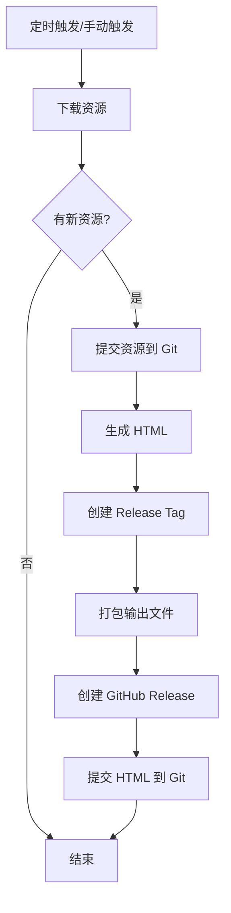

# GitHub Actions 自动化说明

## 功能概述

此 GitHub Actions 工作流实现了以下自动化功能：

1. **定时下载资源** - 每天北京时间早上 8 点自动运行
2. **检测更新** - 智能检测是否有新资源
3. **自动提交** - 将新资源提交到 Git 仓库
4. **生成 HTML** - 自动运行主程序生成 HTML 页面
5. **打包发布** - 创建 Release 并上传压缩包

## 配置步骤

### 1. 设置 NOTION_TOKEN

在 GitHub 仓库中设置 Secret：

1. 进入仓库 Settings → Secrets and variables → Actions
2. 点击 "New repository secret"
3. 名称: `NOTION_TOKEN`
4. 值: 您的 Notion token_v2（从浏览器 Cookie 中获取）

### 2. 启用 GitHub Actions

确保仓库的 Actions 功能已启用：
- Settings → Actions → General
- 选择 "Allow all actions and reusable workflows"

### 3. 设置工作流权限

确保工作流有足够的权限：
- Settings → Actions → General → Workflow permissions
- 选择 "Read and write permissions"
- 勾选 "Allow GitHub Actions to create and approve pull requests"

## 工作流程



## 触发方式

### 自动触发
- **定时**: 每天 UTC 00:00 (北京时间 08:00)
- **Cron 表达式**: `0 0 * * *`

### 手动触发
1. 进入 Actions 标签页
2. 选择 "Auto Download Resources" 工作流
3. 点击 "Run workflow"

## 输出内容

### Git 提交
- **资源提交**: `🤖 Auto-update: Download new resources YYYY-MM-DD HH:MM`
- **HTML 提交**: `🎨 Auto-update: Generate HTML YYYY-MM-DD HH:MM`

### GitHub Release
- **Tag 格式**: `release-YYYYMMDD-HHMMSS`
- **文件**: `cx-output-release-YYYYMMDD-HHMMSS.tar.gz`
- **包含内容**: 完整的 output 目录（所有生成的 HTML 和资源）

## 修改定时时间

编辑 `.github/workflows/auto-download.yml` 中的 cron 表达式：

```yaml
schedule:
  - cron: '0 0 * * *'  # UTC 时间
```

### 常用时间示例
- `0 0 * * *` - 每天 00:00 UTC (北京时间 08:00)
- `0 12 * * *` - 每天 12:00 UTC (北京时间 20:00)
- `0 0,12 * * *` - 每天 00:00 和 12:00 UTC
- `0 0 * * 1` - 每周一 00:00 UTC

## 监控和调试

### 查看运行日志
1. 进入 Actions 标签页
2. 点击具体的工作流运行记录
3. 查看每个步骤的详细日志

### 常见问题

#### 1. Playwright 安装失败
- 原因: 依赖包缺失
- 解决: 工作流已包含 `playwright install-deps`

#### 2. NOTION_TOKEN 未设置
- 原因: Secret 未配置或名称错误
- 解决: 检查 Secret 名称是否为 `NOTION_TOKEN`

#### 3. 推送失败 (403)
- 原因: 工作流权限不足
- 解决: 检查 Workflow permissions 设置

#### 4. 没有检测到新资源
- 原因: Notion 页面没有更新
- 解决: 正常情况，说明资源已是最新

## 成本和限制

### GitHub Actions 配额
- **公开仓库**: 无限制
- **私有仓库**: 每月 2000 分钟免费

### 预计使用时间
- 每次运行约 5-15 分钟
- 每天运行一次
- 每月约 150-450 分钟

## 禁用自动化

如需暂停自动下载：

### 方法 1: 禁用工作流
1. Actions → 选择工作流
2. 点击 "···" → "Disable workflow"

### 方法 2: 删除定时触发
编辑 `.github/workflows/auto-download.yml`，注释掉：
```yaml
# schedule:
#   - cron: '0 0 * * *'
```

保留 `workflow_dispatch` 可继续手动触发。

## 高级配置

### 只在工作日运行
```yaml
schedule:
  - cron: '0 0 * * 1-5'  # 周一到周五
```

### 添加通知
可以添加邮件或 Slack 通知步骤：
```yaml
- name: Send notification
  if: steps.check_changes.outputs.has_changes == 'true'
  run: |
    # 发送通知的代码
```

### 多时区支持
如需支持不同时区，可以添加多个 cron 表达式：
```yaml
schedule:
  - cron: '0 0 * * *'   # UTC 00:00
  - cron: '0 12 * * *'  # UTC 12:00
```

## 安全建议

1. **保护 NOTION_TOKEN**: 不要在代码或日志中暴露
2. **限制权限**: 只授予必要的工作流权限
3. **审查代码**: 定期检查工作流文件的改动
4. **监控活动**: 关注 Actions 运行记录

## 相关文档

- [GitHub Actions 官方文档](https://docs.github.com/en/actions)
- [Cron 表达式参考](https://crontab.guru/)
- [Playwright CI 配置](https://playwright.dev/docs/ci)
